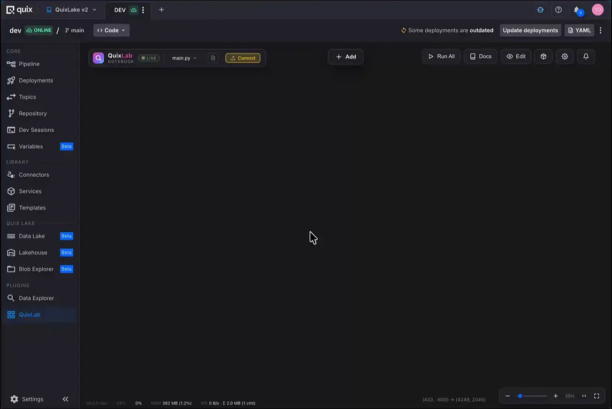
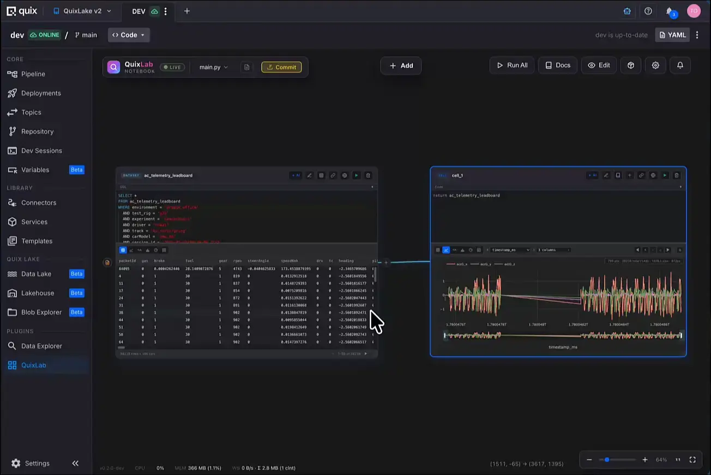
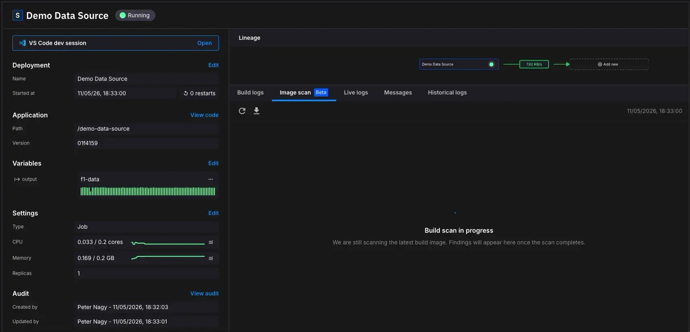
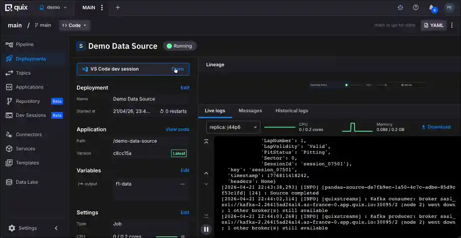
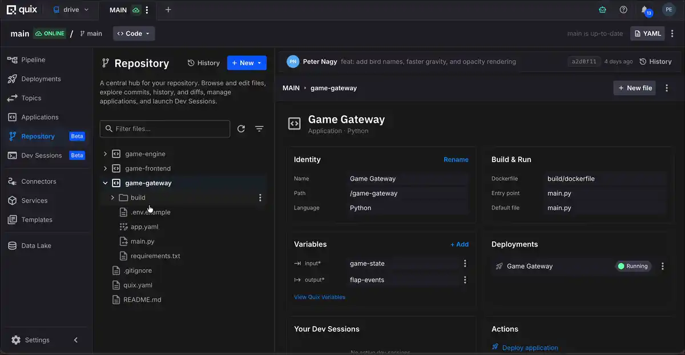
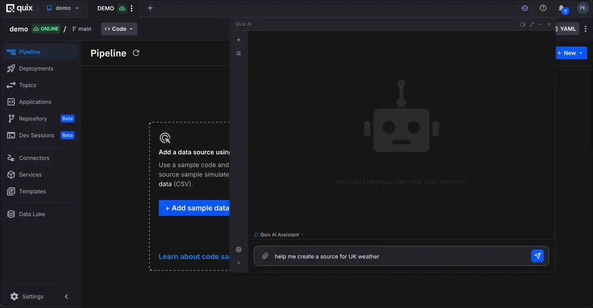

# Quix Cloud changelog

This is the Quix Cloud changelog for the current year.

## 2026-06-quix-lake | 02 JUL 2026

`NEW FEATURES`

- **Quix Lake — managed data lakehouse**: Quix Lake is now integrated and part of the platform. Persist your streaming topics into a managed, columnar lakehouse and query the data back without standing up any infrastructure of your own. The release includes a **Blob Storage Explorer** for browsing, searching and downloading lake data (including whole folders as a zip), an **Arrow Flight SQL** gateway for high-throughput access from connectors and notebooks, and a streaming query endpoint. Persisting a topic to the lakehouse is now a first-class option in the pipeline, with clearer persist settings and a dedicated **Quix Lake** menu in the environment.

    See the [Quix Lake documentation](https://quix.io/docs/quix-cloud/quix-lake/overview.html) for more details.

    

- **Quix Lab — reactive notebooks for your data**: Quix Lab is Quix's official notebook environment, now available as a new **Dev Session** type alongside VS Code and Marimo. It pairs a **reactive** notebook — change any input and everything downstream re-runs — with an infinite, Miro-style **canvas**, so you build and connect your analysis visually instead of scrolling a single linear file. Quix Lab is wired straight into your data: query **Quix Lake** with `ql.sql(...)`, tap a **live Kafka topic** with `ql.topic(...)`, and read or write **blob storage** as ordinary variables — no credentials to set up, they're injected for you. Parameterise cells with interactive widgets and visualise results inline as tables, charts and Plotly/Matplotlib figures. Notebooks are saved as plain, Git-friendly Python files and persist across restarts, all embedded directly in the Portal.

    

- **Storage Access Gateway**: A new gateway secures access to your **Quix Lake** data with **per-user and per-workspace authorization**. Every read and query is scoped to the caller's permissions, credentials are provisioned and issued automatically, and a new Storage permissions UI lets you manage who can reach what.

    See the [Storage Access Gateway documentation](https://quix.io/docs/quix-cloud/quix-lake/secure-storage-access.html) for more details.

- **Project Variables**: A single source of truth for any pipeline value that varies between environments (such as `develop` vs `production`) or has to be kept private (such as API keys and database passwords). Project Variables replace the previous **YAML Variables** and **Secrets Management** features, consolidating environment-specific configuration and secrets into one panel. Define a value once at the project level with optional **per-environment overrides**, and reference it either as a `{{ }}` template substitution in `quix.yaml` or bind it straight into a container as an environment variable. Mark a variable as **secret** to encrypt it at rest and keep it out of the rendered YAML and Git entirely.

    See the [Project Variables documentation](https://quix.io/docs/quix-cloud/deployments/project-variables.html) for more details.

- **Global Variable Groups (Beta)**: Manage configuration that is shared across many projects from one place at the **organisation level**. Bundle related values — for example a Redis host, port and password — into a named **variable group**, and give it **value sets** for each environment (`DEV`, `PROD`, …). Projects assign a group as a project-wide default and can override it per environment, and a deployment pulls in the entire resolved value set with a single `quix.yaml` reference. Rotating a shared credential becomes one edit instead of repeating it in every project: affected environments are flagged out of sync and redeploy with the updated values automatically.

    See the [Global Variable Groups documentation](https://quix.io/docs/quix-cloud/deployments/global-variables.html) for more details.

`ENHANCEMENTS`

- Quix AI (Preview):
    - **Embedded in empty environments** — Quix AI is now embedded directly in the empty-pipeline experience, so you can describe what you want to build and have it scaffolded from a blank environment.
- Deployments:
    - **Blob storage binding** — bind blob storage (Quix Lake) to deployments and dev sessions directly from the UI.
- Pipeline:
    - **Default pipeline filter** — the pipeline group filter now defaults to **All** instead of **Default**.
    - **Topic menu** — added **Replay data** and **Persist topic** entries to the topic menu.
    - The pipeline **minimap** is now hidden on narrow screens to keep the view usable.
- Navigation & UI:
    - **Recent projects** dropdown added to the organisation overview search.
    - The dev-session **application info panel** is now resizable.
    - The environment sidenav now scrolls as a whole with edge-scroll cues.
    - Repository icons sizes are now aligned with the font sizes.
- Repository:
    - **Download a folder as a zip** from the repository browser.
    - **Editable git SSH URL** — update a project's git SSH URL in place, the same way tokens are already editable.
    - **Clearer YAML error state** for applications with an invalid app.yaml.
- Cluster Metrics:
    - **Historical metrics for retired nodes** — nodes that have since been rolled out are now included in historical cluster metrics, and all resource-reservation types are shown correctly.

`BUG FIXES`

- Variables & Sync:
    - Fixed several **false "out of sync" / "Variables have changed"** reports that blocked first deployments in new environments, including phantom `replicas` and `[hash]` diffs.
    - Fixed the diff viewer **crashing** on `{ {` / `} }` sequences in quix.yaml.
- Quix Lake:
    - Fixed **Lakehouse Query 403** errors caused by auth tokens leaking as inline ciphertext on deployment updates.
    - Lakehouse database now **self-heals a torn write-ahead log** when restoring from a backup, and reconciles its Postgres password to the current secret on boot.
- Dev Sessions:
    - Fixed dev sessions **reserving 4× the intended CPU/memory**.
    - Fixed dev sessions and the Repository view not reloading on **workspace switch**.
    - Fixed the **VS Code preview** not following the selected theme.
    - Fixed terminating multiple dev sessions not refreshing the list.
- Environments:
    - Fixed the **pipeline empty state** not appearing for environments that contain only topics, plus empty-state flicker and a stray AI panel opening on load.
    - Fixed the **browser freezing** when leaving the workspace-create page via Back or Cancel button.
    - Fixed the **Repository** section not refreshing after an application upload.
    - Fixed the plugin **sidebar** not refreshing when plugins are created or deleted.
    - Fixed a failure when **creating an environment**.
    - Fixed a missing **environment query parameter** in some URLs.
    - A **Replay** is no longer added to an unwanted environment — it now opens in the host environment.
- Deployments:
    - Fixed being unable to **clear a deployment's desired status**.
    - **Container registry** password-only updates now persist instead of silently reporting success.
- Repository:
    - Fixed a **git service error** when the upstream returned an empty response.
- Authentication & Connectivity:
    - Fixed **SignalR / WebSocket** connections not picking up refreshed tokens; connections are now aborted cleanly on token expiry instead of failing silently.
    - Fixed an unexpected **Keycloak logout** prompt on an expired refresh token.
- Streaming:
    - Fixed **unsubscribing from one topic** unsubscribing from all topics in the Streaming Reader.

## 2026-05-scan | 12 MAY 2026

`NEW FEATURES`

- **Image scanning for builds**: Container images built on the platform are now **scanned for vulnerabilities** as part of the build. Findings are surfaced in a new **Image Scan tab** in the Deployment details, so you can review them in context before deploying.

    

`ENHANCEMENTS`

- Projects:
    - **Cascading project deletion** — you can now delete a project in a single step, even if it still contains environments. The deletion runs asynchronously: environments are cleaned up automatically and the project's status reflects the in-progress operation, so you no longer have to delete environments one by one first.
- Deployments:
    - **Better handling of missing applications** — when a deployment references an application that no longer exists, YAML sync no longer fails, the deployment shows a clear **Missing** badge, and you can relink it to another application from the Edit Deployment dialog.
- Quix AI (Preview):
    - Improved **Knowledge Base error messages** so authentication and repository-not-found failures are surfaced clearly instead of as a generic clone error.

`BUG FIXES`

- Pipeline:
    - Fixed **connection waypoints** not rendering in the Pipeline view.
    - Fixed **linked project navigation** — clicking (and right-clicking, to open in a new tab) a linked project node in the Pipeline view again navigates to the linked environment.
- Cluster Metrics:
    - Fixed **cluster summary cards** showing CPU/Memory **Usage** instead of **Committed**, now matching the rest of the cluster metrics views.
    - Fixed **cluster summary cards** showing incorrect values for dedicated clusters.
    - Fixed **unassigned projects, environments, and deployments** not being represented correctly in cluster metrics charts.
    - **System pods** are now included in the node overview metrics again.
- Quix AI (Preview):
    - Fixed an exception when querying the built-in (static) knowledge base.

## 2026-04-devsessions | 21 APR 2026

`NEW FEATURES`

- **Dev Sessions (Beta)**: Spin up a browser-based IDE for any app in one click — no local setup, no installs. Choose a **VS Code** session or a **Marimo notebook** depending on how you want to work. Sessions come pre-loaded with the app's code and environment, so you can edit, experiment, and commit back to git without leaving the Portal. Dev Sessions are the successor to the current **IDE Sessions** and will replace them entirely in the next release, when IDE Sessions will be removed. The new editor is a full VS Code, so you get the complete debugging toolkit, and you have much more control over how sessions are created and how their resources are managed. VS Code sessions also ship with **Claude Code preconfigured with Quix AI keys**, ready to use for AI-assisted coding and agentic workflows the moment your session starts — no API keys or local setup required.     See the [Dev Sessions documentation](https://quix.io/docs/quix-cloud/applications/dev-sessions/overview.html) for more details.

    

- **Repository (Beta)**: A new file-browser-centric way to work with your project. The Repository view replaces the **Applications** option (now deprecated), showing your entire project as a unified file tree instead of a table of apps. Browse and edit any file directly in the browser, create/upload/delete/download files and folders from the context menu, and rename in place. Every application action you had before — **deploy, duplicate, download, delete** — is still available, just now triggered from the folder itself. A full **git history** explorer is built in, scoped to the whole repo, a folder, or a single file, with side-by-side commit diffs and searchable commit messages. Active **Dev Sessions** show up as chips on the relevant folder, and you can launch or jump into a Dev Session for any folder or file in one click.

    

`PREVIEW`

Preview features are **disabled by default** and available **on request** — contact your Quix account manager to enable them for your organisation. They are early access to capabilities heading for general availability in a future release.

- **Quix AI (Preview)**: Chat with an AI assistant directly inside the Portal. A new **right-side panel** sits alongside the application, so you can ask questions or have the assistant take actions without leaving the page you're on. For more involved tasks, Quix AI **delegates to specialised agents** (planning, investigation, code changes) and keeps the conversation going across sessions, retries, and handovers. Organisation admins get a dedicated **AI settings** page to upload **Knowledge Base files** (so answers are grounded in your own docs), connect **MCP tools** via a per-agent allowlist, **bring their own LLM key** with per-user and per-org usage tracking, and monitor quota. A built-in **quix-patterns Knowledge Base** ships with the release so the assistant already understands Quix-specific concepts out of the box.

    

`ENHANCEMENTS`

- YAML / Synchronization:
    - **YAML 2.0 is now the default descriptor version** for new projects. With **`quix.yaml` 2.0**, variables declared in `app.yaml` are now **inherited**, so deployments only need to spell out the values they actually override — significantly reducing the size of your `quix.yaml`. The **Sync dialog** highlights inherited vs overridden values so it's clear what's coming from where. Existing projects keep their current version — no migration required.
    - **Replica count** defaults to 1 when not specified in YAML, preventing zero-replica deployments.
- Pipeline:
    - The pipeline **filter panel is now draggable**, so users can move it out of the way of the nodes they're working on.
- Deployments / Library:
    - **Deployment dialog** port field is clearer and now pre-fills existing values when editing.
    - Library items with **build errors** can now still be customised instead of blocking you from opening them.
- Cluster Metrics:
    - Cluster charts now support **GroupBy Deployment and Replica** (enabled once a matching Environment/Deployment filter is active).
- Other:
    - **Icon Picker** is faster and easier to search, with better handling of synonyms and common icons.
    - **Notifications** display and dismiss now more smoothly.

`BUG FIXES`

- Pipeline:
    - Fixed **Edit Layout mode** persisting across navigation instead of resetting when leaving the pipeline page.
    - Fixed **Edit Layout** getting stuck in the services-only view.
    - Fixed **Data Lake API** incorrectly appearing in unrelated workspaces' Pipeline/Deployments views.
- YAML / Synchronization:
    - Fixed automatic updates to `quix.yaml` (e.g. topic deletion) rewriting **templated values** like `version: {{VERSION}}` to a resolved value.
    - Fixed **NullReferenceException** during sync when the descriptor has no `resources` section.
- Topics / Visualization:
    - Fixed **Topics Metrics, Waveform and Table views** freezing after network disruptions or long-running sessions — visualisations now recover automatically without requiring a page refresh.
- Library:
    - **Deploy from library** now keeps the deployment settings from the original library item, so apps saved from a sample deploy with the sample's intended configuration.
- Authentication / Users:
    - Fixed users occasionally stuck in a **logout/login loop**.
    - **Keycloak tokens now refresh** automatically instead of expiring silently.
    - Several **Auth0 fixes**: refresh tokens now work correctly, invitation links no longer require a second click to apply the email, logout and login-callback flows hardened against race conditions.
    - Fixed **token revocation** occasionally failing under race conditions, leaving revoked tokens valid indefinitely.
    - Fixed **project manager** being unable to create an environment when not an organisation manager.
- Library / Samples:
    - Fixed **input Options** not being copied from a template/sample `template.yaml` to the deployed `app.yaml`.
    - Fixed library deployments colliding on **service name** when the user has no control over naming — unique names are now generated automatically.
- Cluster Metrics:
    - Fixed **Deployments dropdown** not refreshing when Project/Environment filters changed in cluster metrics.
- Plugins:
    - Global plugins in **disabled environments** are now correctly treated as non-existent and hidden from the UI.

## 2026-03-pipeline-view | 11 MAR 2026

`NEW FEATURES`

- **Customisable Pipeline Layout**: The Pipeline view now supports manual layout customisation. Users can reposition deployments, adjust connections, control topic visibility, and change layout orientation to better organise their pipelines. The layout is saved per workspace so teams can maintain their preferred visual structure.

    

- **Enhanced Cluster Metrics**: Cluster monitoring now includes a node-based view for dedicated clusters, providing a clearer breakdown of resource usage across nodes. Metrics charts offer additional perspectives—including Usage, Request, Limit, and Committed. A new Storage metrics section provides a breakdown per deployment in the cluster, with drill-down access to per-deployment PVC usage percentage and prediction.

    

    
    &nbsp;
    
    &nbsp;
    
    

- **Files Browser**: The Documentation section has been replaced with a more flexible Files browser, enabling users to navigate and edit repository files directly from the platform. It includes syntax highlighting, markdown and image previews, and built-in commit or cancel actions for streamlined editing workflows.

`ENHANCEMENTS`

- Replay:
    - Included an optional data density histogram that visualises where data exists within the replay time range, helping users understand what is being replayed.
- Plugins:
    - Improved icon picker to expose all available icons.

`BUG FIXES`

- Deployments:
    - Fixed disk metrics returning "Shared node groups are not supported" error for shared clusters.
    - Fixed corrupted build recovery not triggering due to error message string mismatch and wrong loop variable, causing deployments to fail indefinitely when ACR images went missing.
- Replay:
    - Replay notifications now correctly display "Replay" instead of "Deployment" with clickable navigation links.
- Users / Permissions:
    - Fixed Viewer role being incorrectly treated as Operator.
- Authentication:
    - Fixed legacy auth config backward compatibility causing the site to not load when Auth0 was configured in the old format.
- Cluster metrics:
    - Fixed missing region shown as "undefined" — now omitted when no region is defined.

## 2026-02-refinements | 17 FEB 2026

`NEW FEATURES`

- **Options Input Type for Applications & Deployments**: Applications and Deployments now support an **Options input type**, allowing variables to be configured using predefined dropdown selections. Options are defined in `app.yaml`, and can be edited from IDE Sessions. During deployment creation and updates, the user can select the variable values from a dropdown list.

- **Cluster Disk Metrics**: The cluster monitoring UI now displays disk usage summaries and historical disk metrics, providing better visibility into storage consumption over time.

`ENHANCEMENTS`

- Deployment Experience:
    - Deployment state handling is now available for Job-type deployments in the UI, aligning their behavior with Service deployments.
    - Managed Service deployments can now be modified using the generic edit dialog, laying the foundation for safer and more consistent configuration changes.
    - Deployments no longer have a restart limit enforced by the platform.
- State Management:
    - State volumes can now be mounted at custom paths (instead of only `/app/state`), enabling more flexible application layouts and SDK integrations.
- DataLake:
    - DataLake storage has been restructured under a dedicated `data-lake` hierarchy, organizing datasets into isolated, per-application folders for raw data and metadata.
    - DuckDB now supports air-gapped and network-restricted environments, allowing extensions to be preinstalled or bundled locally and eliminating the need for runtime downloads.

`BUG FIXES`

- Plugins:
    - Sidebar plugin enable/disable actions now apply immediately without requiring a page refresh.
    - Fixed sidebar scrolling issues so long plugin lists are fully accessible without layout problems.
- Portal:
    - Fixed race conditions on login causing some users to have to log in more than once.
    - Fixed users getting redirected to login.quix.io rather than the portal after logging in.
- Deployments:
    - Fixed a scenario when deployment could not start.
- Other:
    - Fixed an issue where unsubscribing from a single topic could remove clients from all subscriptions, preventing unintended message delivery failures.

## 2026-01-global-plugins-3 | 26 JAN 2026

`BUG FIXES`

- Other:
    - Fixed an issue where Secrets were mandatory when using Library items, but the item variable was marked as non-required
    - Fixed a bug where Annotated Tags were not detected properly by the Git services
    - Fixed an issue where updating a deployment to a non-existent version was not failing during YAML synchronization. Now we always validate the version when updating a deployment (API or YAML).

## 2026-01-global-plugins-2 | 16 JAN 2026

`BUG FIXES`

- Other:
    - Fixed an issue with Url redirections when using a workspace parameter on portal urls
    - Fixed an issue that was not allowing to remove completely plugins section from the edit deployment dialog
    - Fixed a UrlPrefix conflict issue when deploying library items

## 2026-01-global-plugins | 15 JAN 2026

`NEW FEATURES`

- **Global Plugins**: Introducing Global Plugins for organization-wide plugin management. Plugins can now be configured at the organization level and shared across all workspaces. The system includes a new Advanced tab in Deployments dialog to setup all the available Plugin options.

`ENHANCEMENTS`

- Projects:
    - Introduced a new project dropdown selector that highlights recently used projects, making navigation faster and more intuitive.
- App Library:
    - Added plugin section setup to `library.json` for configuring plugins in library items.
    - Library items now include build failure details in the UI with proper error feedback.
- Replay:
    - The Replay Service now supports ISO 8601 date format for `from` and `to` timestamps in YAML configuration, making replay definitions more readable. Backward compatible with existing millisecond timestamps.
    - Added warning for JSON key transformations when suffix keys are selected to prevent data corruption.
- Other:
    - Improved Help menu UX with a cleaner design.
    - Notifications can now be stacked for better visibility when multiple notifications occur simultaneously.
    - Added syntax highlighting support in markdown and code editor for several new languages, including YAML syntax.

`BUG FIXES`

- Library:
    - Fixed Git lock errors in Portal Library by implementing stale lock file cleanup with age checks and retry logic.
    - Fixed Portal Library continuous polling and verbose build update logging.
    - Reduced verbose user-facing error messages by suppressing file-not-found exceptions and returning proper 404 responses.
- IDE / Online Editor:
    - Fixed 400 exception when removing DefaultValue property on app.yaml variables.
    - Fixed Monaco language client errors when leaving the editor.
- App Library:
    - Fixed wheel file corruption caused by UTF-8 encoding issues during binary content placeholder replacement on Library items.
- YAML / Synchronization:
    - Fixed secrets validation not detecting inherited secrets in variable simplification.
- DataLake:
    - Fixed authentication errors appearing in Replay logs by improving exception handling for missing organization scenarios.
    - Fixed the "Workspace was not found" error while using Azure BlobStorage in DataLake.
- Streaming Reader:
    - Fixed index out of range errors by improving partition bounds handling.
- Environments:
    - Fixed broker sorting not working as expected in the Environments list.
- Other:
    - Fixed console errors from unhandled promises.
    - Fixed project templates not clearing the name field when switching back to Blank after selecting a template.

## Changelog archives

Changelogs for previous years can be found here:

* [2025](./changelogs/2025-archive.md)
* [2024](./changelogs/2024-archive.md)
* [2023](./changelogs/2023-archive.md)
* [2022](./changelogs/2022-archive.md)
