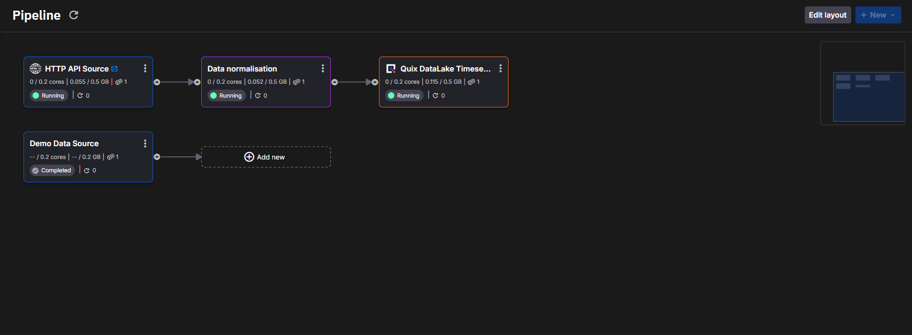
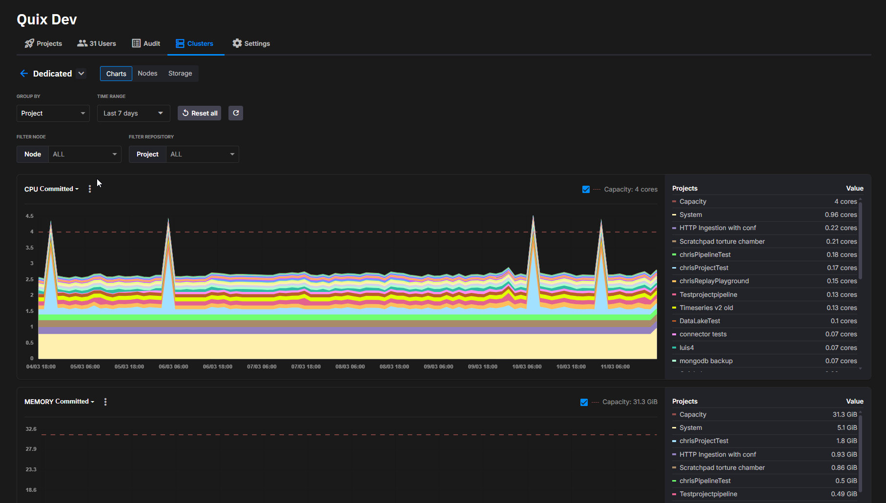
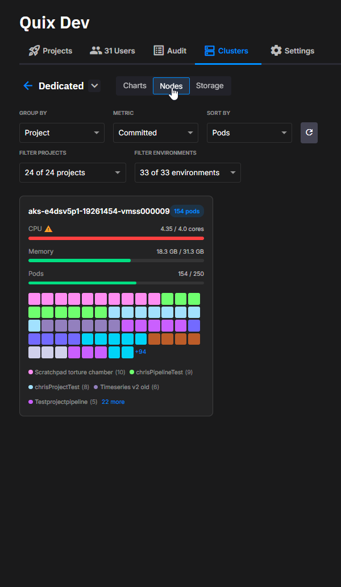
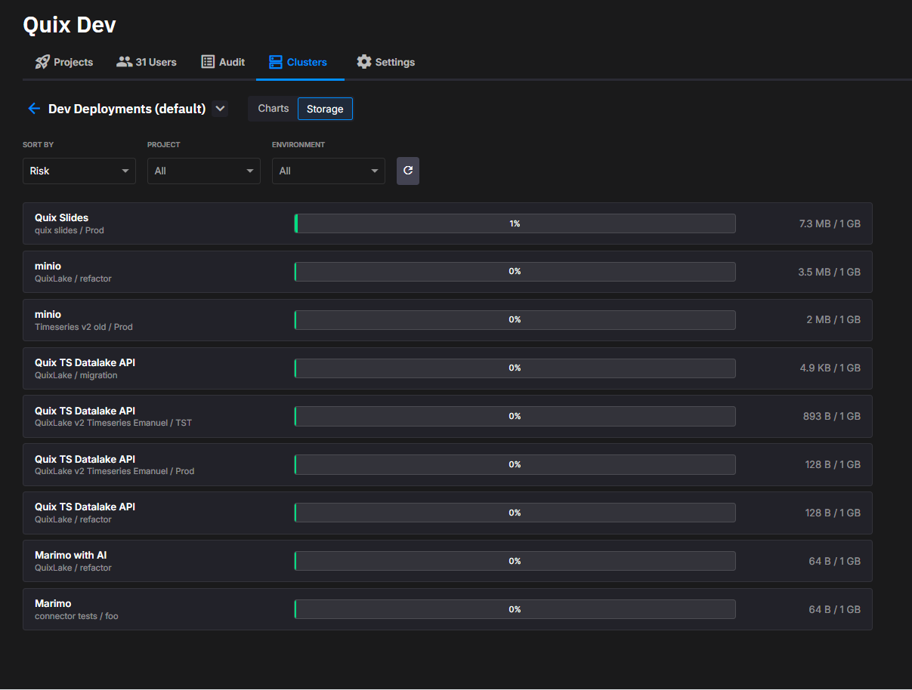

# Quix Cloud changelog

This is the Quix Cloud changelog for the current year.

## 2026-03-pipeline-view | 11 MAR 2026

`NEW FEATURES`

- **Customisable Pipeline Layout**: The Pipeline view now supports manual layout customisation. Users can reposition deployments, adjust connections, control topic visibility, and change layout orientation to better organise their pipelines. The layout is saved per workspace so teams can maintain their preferred visual structure.

    

 

- **Enhanced Cluster Metrics**: Cluster monitoring now includes a node-based view for dedicated clusters, providing a clearer breakdown of resource usage across nodes. Metrics charts offer additional perspectives—including Usage, Request, Limit, and Committed. A new Storage metrics section provides a breakdown per deployment in the cluster, with drill-down access to per-deployment PVC usage percentage and prediction.

    

    
    
    
    

 

- **Files Browser**: The Documentation section has been replaced with a more flexible Files browser, enabling users to navigate and edit repository files directly from the platform. It includes syntax highlighting, markdown and image previews, and built-in commit or cancel actions for streamlined editing workflows.

`ENHANCEMENTS`

- Replay:
    - Included an optional data density histogram that visualises where data exists within the replay time range, helping users understand what is being replayed.
- Plugins:
    - Improved icon picker to expose all available icons.

`BUG FIXES`

- Deployments:
    - Fixed disk metrics returning "Shared node groups are not supported" error for shared clusters.
    - Fixed corrupted build recovery not triggering due to error message string mismatch and wrong loop variable, causing deployments to fail indefinitely when ACR images went missing.
- Replay:
    - Replay notifications now correctly display "Replay" instead of "Deployment" with clickable navigation links.
- Users / Permissions:
    - Fixed Viewer role being incorrectly treated as Operator.
- Authentication:
    - Fixed legacy auth config backward compatibility causing the site to not load when Auth0 was configured in the old format.
- Cluster metrics:
    - Fixed missing region shown as "undefined" — now omitted when no region is defined.

## 2026-02-refinements | 17 FEB 2026

`NEW FEATURES`

- **Options Input Type for Applications & Deployments**: Applications and Deployments now support an **Options input type**, allowing variables to be configured using predefined dropdown selections. Options are defined in `app.yaml`, and can be edited from IDE Sessions. During deployment creation and updates, the user can select the variable values from a dropdown list.

- **Cluster Disk Metrics**: The cluster monitoring UI now displays disk usage summaries and historical disk metrics, providing better visibility into storage consumption over time.

`ENHANCEMENTS`

- Deployment Experience:
    - Deployment state handling is now available for Job-type deployments in the UI, aligning their behavior with Service deployments.
    - Managed Service deployments can now be modified using the generic edit dialog, laying the foundation for safer and more consistent configuration changes.
    - Deployments no longer have a restart limit enforced by the platform.
- State Management:
    - State volumes can now be mounted at custom paths (instead of only `/app/state`), enabling more flexible application layouts and SDK integrations.
- DataLake:
    - DataLake storage has been restructured under a dedicated `data-lake` hierarchy, organizing datasets into isolated, per-application folders for raw data and metadata.
    - DuckDB now supports air-gapped and network-restricted environments, allowing extensions to be preinstalled or bundled locally and eliminating the need for runtime downloads.

`BUG FIXES`

- Plugins:
    - Sidebar plugin enable/disable actions now apply immediately without requiring a page refresh.
    - Fixed sidebar scrolling issues so long plugin lists are fully accessible without layout problems.
- Portal:
    - Fixed race conditions on login causing some users to have to log in more than once.
    - Fixed users getting redirected to login.quix.io rather than the portal after logging in.
- Deployments:
    - Fixed a scenario when deployment could not start.
- Other:
    - Fixed an issue where unsubscribing from a single topic could remove clients from all subscriptions, preventing unintended message delivery failures.

## 2026-01-global-plugins-3 | 26 JAN 2026

`BUG FIXES`

- Other:
    - Fixed an issue where Secrets were mandatory when using Library items, but the item variable was marked as non-required
    - Fixed a bug where Annotated Tags were not detected properly by the Git services
    - Fixed an issue where updating a deployment to a non-existent version was not failing during YAML synchronization. Now we always validate the version when updating a deployment (API or YAML).

## 2026-01-global-plugins-2 | 16 JAN 2026

`BUG FIXES`

- Other:
    - Fixed an issue with Url redirections when using a workspace parameter on portal urls
    - Fixed an issue that was not allowing to remove completely plugins section from the edit deployment dialog
    - Fixed a UrlPrefix conflict issue when deploying library items

## 2026-01-global-plugins | 15 JAN 2026

`NEW FEATURES`

- **Global Plugins**: Introducing Global Plugins for organization-wide plugin management. Plugins can now be configured at the organization level and shared across all workspaces. The system includes a new Advanced tab in Deployments dialog to setup all the available Plugin options.

`ENHANCEMENTS`

- Projects:
    - Introduced a new project dropdown selector that highlights recently used projects, making navigation faster and more intuitive.
- App Library:
    - Added plugin section setup to `library.json` for configuring plugins in library items.
    - Library items now include build failure details in the UI with proper error feedback.
- Replay:
    - The Replay Service now supports ISO 8601 date format for `from` and `to` timestamps in YAML configuration, making replay definitions more readable. Backward compatible with existing millisecond timestamps.
    - Added warning for JSON key transformations when suffix keys are selected to prevent data corruption.
- Other:
    - Improved Help menu UX with a cleaner design.
    - Notifications can now be stacked for better visibility when multiple notifications occur simultaneously.
    - Added syntax highlighting support in markdown and code editor for several new languages, including YAML syntax.

`BUG FIXES`

- Library:
    - Fixed Git lock errors in Portal Library by implementing stale lock file cleanup with age checks and retry logic.
    - Fixed Portal Library continuous polling and verbose build update logging.
    - Reduced verbose user-facing error messages by suppressing file-not-found exceptions and returning proper 404 responses.
- IDE / Online Editor:
    - Fixed 400 exception when removing DefaultValue property on app.yaml variables.
    - Fixed Monaco language client errors when leaving the editor.
- App Library:
    - Fixed wheel file corruption caused by UTF-8 encoding issues during binary content placeholder replacement on Library items.
- YAML / Synchronization:
    - Fixed secrets validation not detecting inherited secrets in variable simplification.
- DataLake:
    - Fixed authentication errors appearing in Replay logs by improving exception handling for missing organization scenarios.
    - Fixed the "Workspace was not found" error while using Azure BlobStorage in DataLake.
- Streaming Reader:
    - Fixed index out of range errors by improving partition bounds handling.
- Environments:
    - Fixed broker sorting not working as expected in the Environments list.
- Other:
    - Fixed console errors from unhandled promises.
    - Fixed project templates not clearing the name field when switching back to Blank after selecting a template.

## Changelog archives

Changelogs for previous years can be found here:

* [2025](./changelogs/2025-archive.md)
* [2024](./changelogs/2024-archive.md)
* [2023](./changelogs/2023-archive.md)
* [2022](./changelogs/2022-archive.md)
