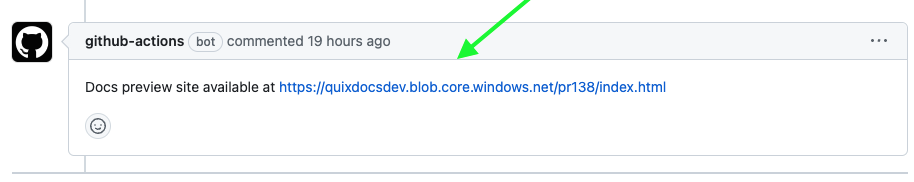

# Quix Developer Documentation

This repository is the source content for the Quix documentation that is published on the web at https://quix.io/docs. The source files for the documentation are in GitHub-flavoured Markdown, with the additions supported by our tooling, [Material for MkDocs](https://squidfunk.github.io/mkdocs-material/).

To get a free Quix account, [sign up](https://portal.platform.quix.io/self-sign-up).

## Docs releases

You can find detailed information on docs releases in the [docs repo Wiki page](https://github.com/quixio/quix-docs/wiki/Docs-Releases).

## Contributing

If you would like to contribute to the docs, there are two main ways:

1. **Create a GitHub issue** - Create a GitHub issue and describe the bug or change you would like to see in the docs.
2. **Create a GitHub Pull Request (PR)** - This would contain the patch you would like to apply to the docs.

> **IMPORTANT:** All docs PRs should be raised against the `dev` branch.

Your PR will be reviewed by a member of the Quix Docs team, and from that point on the standard GitHub workflow is applied. A member of the team will possibly suggest changes, but if everything is OK the PR will be approved and merged for you.

### Docs preview site

If you create a PR on the docs `dev` branch, a docs preview site consisting of a complete rendered docs build is created automatically for you, so you can see your changes there. 

> **NOTE:** Currently, to rebuild the docs after pushing up any further changes, you need to close and reopen your PR.

To access the preview site follow the link generated for you on the PR, as shown in the following screenshot:

### Contribution guides

If you plan to make more than basic changes to the documentation, you should become familiar with our contribution guides. There are three main guides in addition to this README:

1. [Contribution Guide](./CONTRIBUTING.md) - more detailed notes on how to contribute through a GitHub issue or PR.
2. [Writing Style Guide](./WRITING-STYLE.md) - this covers our documentation writing style in detail. Generally you should write in the second person, present tense, active voice, using International English. Try to use simple, directive language. Further details are contained in the guide.
3. [Best Practice Guide](./BEST-PRACTICE.md) - this covers our general aproach to technical writing, which is to use topic-based writing, with effective incremental search, and structured navigation. You don't need to be familiar with this to contribute, but it's a useful resource if you're interested in making more in-depth contributions.

### Running docs locally

If you are part of the Quix technical writing team, or you contribute frequently, and want to check your docs PR locally before pushing up, please read our guide on [running the docs locally](./RUNNING-DOCS-LOCALLY.md). Otherwise, the simplest approach is to refer to the documentation preview site that is created automatically for you, when you push up a PR on the `dev` branch.

## Getting in touch

If you need any help, please sign up to the [Quix community](https://quix.io/slack-invite).

Thanks!
