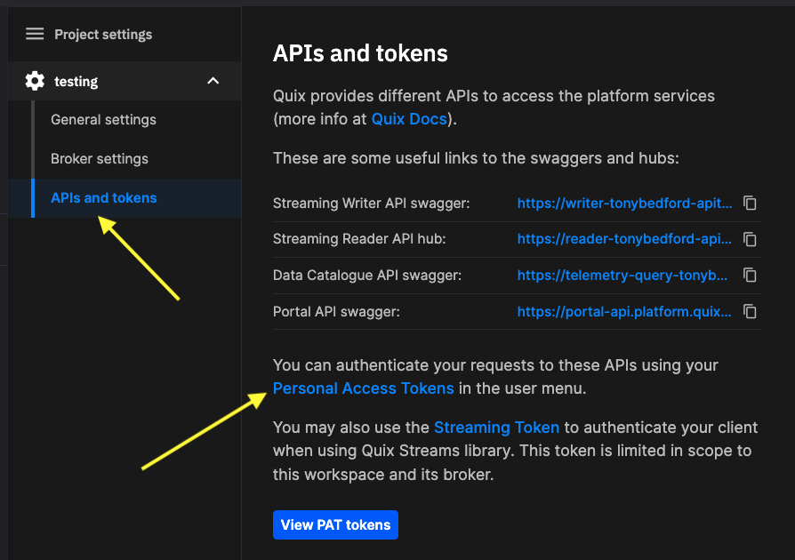

# Setup

To use the APIs you'll typically need the following:

1. [Sign up to Quix](https://portal.platform.quix.io/self-sign-up).

2. Obtain a Personal Access Token - you need this to authenticate requests.

3. Get your environment ID - you need this for request URLs.

4. View the API reference documentation.

5. If you intend to use WebSockets, and the API supports it, you'll need to install SignalR.

Each of these is described in the following sections.

## Project settings

Useful information can also be found in the settings panels for your environment:

1. Click `Settings` in the bottom left corner of the UI.

2. From `Project settings` select the environment you are working with.

3. Click `APIs and tokens`.

You are now presented with a very useful panel. From here you have useful links to items such as API documentation (rendered with Swagger), as well as your Personal Access Tokens (PATs):

{width=80%}

## Personal access token (PAT)

Personal Access Tokens, or PATs, are bearer tokens that can be used to authenticate the various Quix APIs, such as the Portal API.

To obtain a PAT, log in to Quix, and click on your profile icon in the top right corner, then click `Personal Access Tokens`. You can then generate a PAT with a lifetime suitable for your use case.

Alternatively, log in to Quix, and click `Settings` in the main left-hand navigation. Then, for a specific environment, click `APIs and tokens`.

In the `APIs and tokens` dialog, you can click `Personal Access Tokens` to generate PATs, or a Streaming Token (SDK Token) for use with the Quix Streams client library.

## Get environment ID

When using APIs you’ll need to obtain an ID based on a specific environment. For example, endpoints for the [Query API](../../apis/query-api/overview.md) use a domain with the following pattern:

    https://telemetry-query-${environment-id}.platform.quix.io/

The environment ID is a combination of your organization and environment names, converted to URL friendly values. 

### Obtain your environment ID from the URL

1.  Go to the [Portal home](https://portal.platform.quix.io/){target=_blank}.

2.  Locate the environment you’re interested in and open it.

3.  At this point, take note of the URL. It will be in the form:

    https://portal.platform.quix.io/home?workspace={environment-id}

### Obtain environment ID from settings

You can also get the environment ID from Settings. Click `Settings` in the bottom-left corner of the portal, select the environment of interest. You can then copy the environment ID (previously known as the workspace ID) from the settings panel, as shown in the following screenshot:

{width=80%}

### Example environment ID

Given the following URL for the environment:

```
https://portal.platform.quix.io/pipeline?workspace=joeengland-apitests-testing
```

The environment ID is:

```
joeengland-apitests-testing
```

The components of the environment ID are as follows:

| joeengland | The name of the Quix account, known as the organization, in this case the personal account of Joe England |
| apitests | The name of the project |
| testing | The name of the environment | 

Copy the value for `environment-id` and use it wherever you need an environment ID.

!!! note

    The `workspace=` parameter in the URL `https://portal.platform.quix.io/home?workspace={environment-id}` is there for legacy reasons, and does in fact indicate an environment.

## API reference documentation

An OAS3 API reference guides are available for HTTP/REST APIs. These are rendered using [Swagger](https://swagger.io/){target=_blank}. 

The URLs for the API references are specific to your environment, so you can easily test out API calls on your environment using the API reference. You'll need to get you environment ID. The exception to this is the Portal API, which is account-wide.

| API | API reference URL (Swagger documentation)|
|---|---|
| Streaming Writer | https://writer-`<environment-id>`.platform.quix.io/swagger |
| Streaming Reader | No HTTP/REST interface - SignalR (WebSockets or Long Polling)|
| Portal | https://portal-api.platform.quix.io/swagger |
| Query | https://telemetry-query-`<environment-id>`.platform.quix.io/swagger |

Replace `<environment-id>` with your environment ID.

!!! tip

    Once you access the API reference, you can select the version of the API you require from the `Select a definition` dropdown list.

