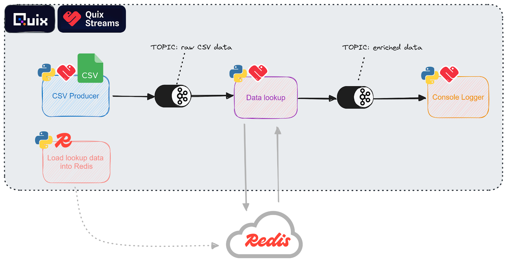
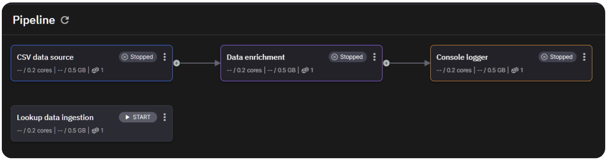
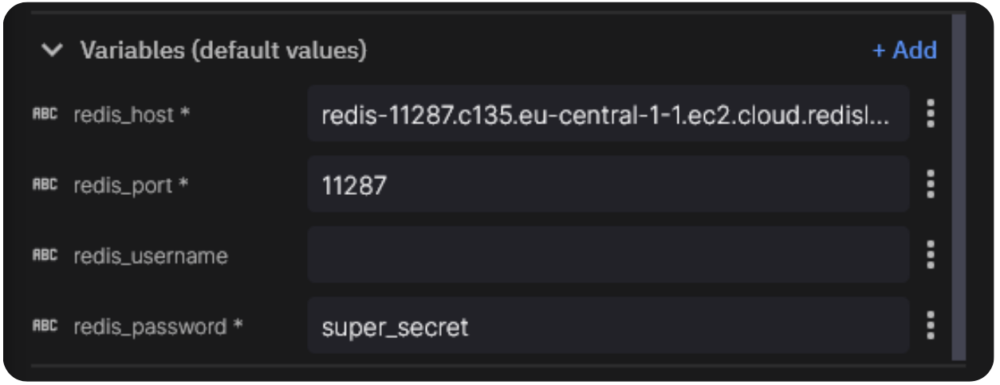
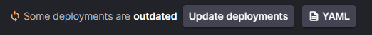
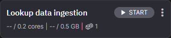
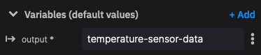
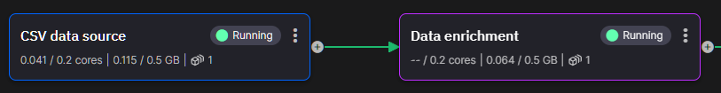

In this guide we'll take a look at how you can enrich a stream of data in real-time using Quix and Redis. But first, let's make sure we're on the same page when it comes to what we mean by data enrichment.

<div class="grid cards blog-grid-card" markdown>

- __Learn to process streaming data!__

    ---

    Quix Streams is a fast and general-purpose processing framework for streaming data. Build real-time applications and analytics systems on data streams using Python DataFrames and stateful operators, all without having to install a server-side engine.

    :fontawesome-brands-youtube:{ .youtube } [Watch on YouTube](https://www.youtube.com/watch?v=5sqegy_EPa0)

</div>

# What is data enrichment?
Capturing data is the easy part. But it's not very often that raw data by itself is all that useful. Getting the value we need from a stream of sensor readings, for example, takes some extra work.

That's where data enrichment comes in. Data enrichment is where we combine different data sources to add context and, ultimately, to make that data more useful.

Let's illustrate it with an example. Imagine you have a fleet of IoT temperature sensors monitoring industrial heating and cooling systems at a group of agricultural sites. The devices need to be simple, both to reduce power and network consumption and to reduce the need for set-up and maintenance. 

As such, each device uses a simple GPS module to determine its latitude and longitude and then uses a cellular data connection to transmit its location and a temperature reading at fixed intervals.

By itself, that data isn't especially useful to you. Latitude and longitude are just part of the story. To act on a temperature reading, you need to know which site is at that location and what the norms are for that type of facility. We can enrich the sensor readings using look-up data that matches the GPS coordinates with facility data.

## Batch vs real-time data enrichment

Before we dive into the how part of this post, let's take a moment to look at batch vs real-time enrichment.

If you have limited compute resources and your use case isn't particularly time sensitive, you could run the enrichment in batches. Once a night when other computing demands are lower, for example. 

But, thanks to tools like Quix, you can run the enrichment in real-time as the data comes in from sources such as the temperature sensors in our example. And that's exactly what we're going to do now.


## Before you get started

To follow the tutorial, you’ll need:

* A free Quix account, which you can create easily if you don’t have one already.
* A Redis Cloud account with a running database already (note the password for your default user)
Ideally you're familiar with Python, too.

The steps we're going to take are:

1. Create a new project In your Quix Cloud account using an existing project template.
2. Load our look-up enrichment data into Redis Cloud. This is a one-off step.
3. Simulate a flow of temperature sensor data.
4. Enrich the temperature sensor data by combining it with data we have in Redis.

Okay, let's get going.

## Project setup

To give you a preview of you'll end up with, here’s an architecture diagram of the resulting pipeline:



A data enrichment pipeline diagram.
To help you get set up quickly, we’ve created a GitHub repo that contains all the necessary code. It’s a simple project template that you can clone into your own Quix workspace.

If you’ve never used a project template before, follow our short guide on How to create a project from a template in Quix. In short: you log in to Quix Cloud, point it to the repo that you want to work with, and are guided through a short wizard.

* During the project creation wizard, you’ll be asked to add the password for your Redis database as an application secret, so make sure you have that handy.

Once you’ve created a project in your Quix workspace, your pipeline view should resemble the following screenshot.



The services aren’t ready to start yet, because you’ll first need to update the environment variables that define the connection to your Redis database.

Let’s start with the “Lookup data ingestion” job.

In the *Pipeline* View, click the name of the job “Lookup data ingestion”, then in the settings screen that appears, click *Edit Code*.

Update the environment variables at the bottom-left of the project:



* Now, do the same for the service titled “Data Enrichment” which also needs access to Redis (it has the same environment variables).

After you make changes to your pipeline, you should see a notification on the top right that prompts you to “Update deployments”.

* Click the Update Deployments button.



This ensures that your deployed containers are using the latest code and environment variables (including the Redis ones you just updated).

All that’s left is for you to run the lookup data ingestion job.

Before you do so, let’s first take a closer look at what the code does.

## Lookup data ingestion: loading data into Redis

The look-up data we’re using to enrich the clickstream data comes from two sources:

* Latitude
* Longitude
* Local Time: The time local to the device

### The device lookup data
When you click *Edit code* in the deployment settings window, you’ll see that the application consists of several files, including the standard `app.yaml` and `dockerfile` (you can find out more about these files [Quix application structure in our documentation](https://quix.io/docs/create/project-structure.html))

You’ll also see a CSV file that contains lookup information about the devices that are emitting the sensor data. 

This is what the lookup data looks like:

```sh
name,latitude,longitude,local_time
Greenhouse Temperature Sensor, 52.3749, -0.1278, 2024-03-27 15:54:10
Coop Temperature Sensor, 48.8566, 2.3522, 2024-03-27 15:54:10
Barn Temperature Sensor, 40.7128, -74.0059, 2024-03-27 15:54:10
Vineyard Irrigation, 34.0522, -118.2437, 2024-03-27 15:54:10
Windmill Controller, 51.1841, -1.8606, 2024-03-27 15:54:10
Rice Paddy Water Management, 31.1466, 121.4737, 2024-03-27 15:54:10
Cattle Shed Temperature Sensor, -34.9288, 138.6000, 2024-03-27 15:54:10
Chicken Coop Temperature Sensor, 50.8500, 4.3500, 2024-03-27 15:54:10
Olivine Grove Irrigation, 38.0902, 27.1475, 2024-03-27 15:54:10
Sheep Farm Shelter, 45.5188, -111.0407, 2024-03-27 15:54:10
```

You’ll also see main.py which is the entrypoint of the container and is run on startup.


### The ingestion script

Our ingestion script, main.py, connects to our Redis instance using the Redis python library and then calls the ingest_csv_data() function that loads the sensor device info into the database.

This function reads the data from the CSV file into a pandas dataframe, and then writes each row as a separate entry to our redis database:

```py
import pandas as pd
import os
import time
import redis

# Define the Redis connection
r = redis.Redis(
    host=os.environ['redis_host'],
    port=int(os.environ['redis_port']),
    password=os.environ['redis_password'],
    username=os.environ['redis_username'] if 'redis_username' in os.environ else None,
    decode_responses=True)

# Function to ingest data from a CSV file
def ingest_csv_data():
    csv_file_path = './sensor-data.csv'

    # Read the CSV data into a DataFrame
    df = pd.read_csv(csv_file_path)
    pipe = r.pipeline()

  # Itrate through the file
    for index, row in df.iterrows():
        # Convert row to a dictionary
        entry = row.to_dict()
        entry["timestamp"] = int(time.time_ns())  # Add a timestamp
        # Write the entry to Redis
        key = f'sensor:{row["name"]}'
        pipe.delete(key)
        pipe.hset(key, 'lat', row['latitude'])
        pipe.hset(key, 'long', row['longitude'])
        pipe.hset(key, 'local_time', row['local_time'])
        print(pipe.execute(), row, entry)
        print(row["name"]);

    print("CSV data ingested successfully.")
# Run the main function
if __name__ == '__main__':
    ingest_csv_data()
```

To run the ingestion job, click the Start button on on the top right of the jobs panel in the pipeline view



‍Note: This is a one-time operation. Once the data is in Redis, you don’t need to ingest it again.

## Streaming sensor data into a topic

For this tutorial, we don’t have a source of real sensor data. Instead, the ''Stream Temperature Sensor Data'' service will simulate one for us. It does that by taking a raw log file and streaming the data over a realistic timeframe in an endless loop. This data is then written to the temperature-sensor-data topic in Quix.

To view the code and application files, click the “CSV Data source” deployment (in the Pipeline view), and click *Edit code* as before.

### The stream temperature sensor data code

In the application files, you’ll find another demo-data.csv file with the following pregenerated data:

```sh
Timestamp,Device Name,Temperature,Humidity,Mode,Fan,Heater,Cooler
2024-04-12 13:26:00,Greenhouse Temperature Sensor,28,59,Cool,Off,On Low,On Low
2024-04-12 2:40:00,Windmill Controller,-,-,Off,Off,Off,Off
2024-04-12 17:48:00,Olivine Grove Irrigation,-,-,Auto,On High,Off,Off
2024-04-12 23:3:00,Coop Temperature Sensor,12,68,Off,On High,Off,Off
2024-04-12 19:21:00,Windmill Controller,-,-,Auto,On Low,Off,Off
2024-04-12 10:11:00,Coop Temperature Sensor,31,60,Cool,Off,On Low,On Low
2024-04-12 22:15:00,Barn Temperature Sensor,14,83,Auto,On Low,Off,Off
2024-04-12 3:47:00,Barn Temperature Sensor,21,55,Auto,On Low,Off,Off
2024-04-12 4:38:00,Greenhouse Temperature Sensor,22,80,Cool,On High,On Low,On Low
2024-04-12 14:42:00,Vineyard Irrigation,-,-,Auto,On Low,Off,Off
2024-04-12 8:29:00,Greenhouse Temperature Sensor,11,62,Heat,On Low,On Low,On Low
2024-04-12 0:25:00,Rice Paddy Water Management,23,83,Heat,Off,On Low,On Low
2024-04-12 7:51:00,Coop Temperature Sensor,29,83,Cool,Off,On Low,On Low
2024-04-12 4:5:00,Cattle Shed Temperature Sensor,34,87,Auto,On High,Off,Off
2024-04-12 10:25:00,Greenhouse Temperature Sensor,22,57,Off,On Low,Off,Off
2024-04-12 22:47:00,Greenhouse Temperature Sensor,12,90,Auto,Off,Off,Off
2024-04-12 23:53:00,Cattle Shed Temperature Sensor,25,81,Auto,On High,Off,Off
2024-04-12 7:25:00,Sheep Farm Shelter,20,61,Heat,On Low,On Low,On Low
2024-04-12 19:7:00,Coop Temperature Sensor,35,68,Cool,On High,On Low,On Low
2024-04-12 10:41:00,Windmill Controller,-,-,Auto,On High,Off,Off
```

This service has a single environment variable. The output topic:



Now, let's look at the main application code that reads from the CSV and streams messages to the output topic. This and the other remaining services in the pipeline all use the [Quix Streams](https://github.com/quixio/quix-streams) Python library to interact with Apache Kafka and process streaming data.

The “CSV Data source” service performs the following tasks:

* initializes the Quix Streams client
* opens the output topic
* produces two messages per second on a never ending loop

```py
# Import the Quix Streams modules for interacting with Kafka:
from quixstreams import Application
from quixstreams.models.serializers.quix import JSONSerializer, SerializationContext

import pandas as pd
import random
import time
import os

# for local dev, load env vars from a .env file
from dotenv import load_dotenv
load_dotenv()

# Create an Application
app = Application(consumer_group="csv_sample", auto_create_topics=True)

# Define the topic using the "output" environment variable
topic = app.topic(name=os.environ["output"], value_serializer="json")

# Get the directory of the current script and construct the path to the CSV file
script_dir = os.path.dirname(os.path.realpath(__file__))
csv_file_path = os.path.join(script_dir, "demo-data.csv")

# this function loads the file and sends each row to the publisher
def read_csv_file(file_path: str):
    """
    Code truncated for brevity. The "read_csv_file" function is covered in more detail in the next section.
    ....
    """


def main():
    """
    Create a pre-configured Producer object.
    Producer is already setup to use Quix brokers.
    It will also ensure that the topics exist before producing to them if
    Application() is initialized with "auto_create_topics=True".
    """
    
    with app.get_producer() as producer:
        # Iterate over the data from CSV file
        # read_csv_file will be implemented further down
        for message_key, row_data in read_csv_file(file_path=csv_file_path):
            # Serialize row value to bytes
            serialized_value = serializer(
                value=row_data, ctx=SerializationContext(topic=topic.name)
            )

            # publish the data to the topic
            producer.produce(
                topic=topic.name,
                key=message_key,
                value=serialized_value,
            )


if __name__ == "__main__":
    try:
        main()
    except KeyboardInterrupt:
        print("Exiting.")

```

The read_csv_file function iterates over two rows of the CSV per second, and sends that to the Quix publisher

```py
def read_csv_file(file_path: str):
	"""
	A function to read data from a CSV file in an endless manner.
	It returns a generator with stream_id and rows
	"""

	# Read the CSV file into a pandas.DataFrame
       print("CSV file loading.")
	df = pd.read_csv(file_path)
	print("File loaded.")

	# Get the number of rows in the dataFrame for printing out later
	row_count = len(df)

	# Generate a unique ID for this data stream.
	# It will be used as a message key in Kafka
	stream_id = f"CSV_DATA_{str(random.randint(1, 100)).zfill(3)}"

	# Get the column headers as a list
	headers = df.columns.tolist()

	# Continuously loop over the data
	while True:
    		# Print a message to the console for each iteration
    		print(f"Publishing {row_count} rows.")

    		# Iterate over the rows and convert them to
    		for _, row in df.iterrows():
        		# Create a dictionary that includes both column headers and row values
        		row_data = {header: row[header] for header in headers}

        		# add a new timestamp column with the current data and time
        		row_data["Timestamp"] = time.time_ns()

        		# Yield the stream ID and the row data
        		yield stream_id, row_data
       	 
        		# Wait a moment before outputting more data.
        		time.sleep(0.5)

    		print("All rows published")
```

Now that you understand how it works it’s time to run it. As before, go back to the pipeline view and click the *Start* button (in the top-right corner of the “CSV Data source” panel)

You should see the arrow between the “CSV Data source” deployment and the “Data enrichment” service turn green.



This indicates that data is being streamed to and from temperature-sensor-data topic

Click the green arrow to open the message viewer for the  temperature-sensor-data topic. If you don’t see any messages coming through, change the “offset” dropdown to “Newest”.

Now that our data is streaming into the _temperature-sensor-data topic_, you’ll read it and enrich it using the device info that you are storing in Redis.

## Enriching the data

The code takes the device identifiers and then appends the static longitude and latitude data to the sensor stream. The result is then published to the enriched-data topic.

### The enrichment code
To view the code, click the “Data enrichment” deployment (in the Pipeline view), and click *Edit code* as before.

If it’s not open already, open main.py in the Quix IDE.

The script initializes a Quix application, and a Redis connection. Upon receiving data from on the input topic, it enriches it with the lookup information from Redis.

Contents of main.py:

```py

import os
from quixstreams import Application
import redis

# Initialize Quix application
app = Application(consumer_group="transformation-v1", auto_offset_reset="earliest")

# Get input and output topics from environment variables
input_topic = app.topic(os.environ["input"])
output_topic = app.topic(os.environ["output"])

# Create a Redis connection
r = redis.Redis(
	host=os.environ['redis_host'],
	port=int(os.environ['redis_port']),
	password=os.environ['redis_password'],
	username=os.environ['redis_username'] if 'redis_username' in os.environ else None,
	decode_responses=True)

def enrich_data(row):
   # Function truncated for brevity (covered separately in the next section)
   ####
   
sdf = app.dataframe(input_topic)

# The enrich_data function will be implemented below
sdf = sdf.apply(enrich_data)

# Send enriched data to the output topic
sdf = sdf.to_topic(output_topic)

if __name__ == "__main__":
	app.run(sdf)
```

The enrich_data function is called for each individual message from the input topic, and looks up the equivalent temperature sensor by name, and enrich that data with the latitude and longitude of the sensor:

```py
def enrich_data(row):
	device_name = row["Device Name"]
	try:
    	# Attempt to retrieve enriched data from Redis
    	device_info = r.hgetall(f'sensor:{device_name}')
    	if device_info:
        	# Extract desired information from Redis hash (handle potential errors)
        	latitude = device_info.get("lat")
        	longitude = device_info.get("long")

        	# Add enriched data to the row if retrieved successfully
        	if latitude:
            		row["lat"] = latitude
        	if longitude:
            		row["long"] = longitude
	except redis.exceptions.RedisError as e:
    		print(f"Error retrieving data from Redis for {device_name}: {e}")

	return row
```

Let’s run this final piece of the puzzle. Return to the pipeline view and click the *Start button* for the “Data enrichment” deployment (in the top-right corner of the “Data enrichment” panel)

As before, you should see the arrow between the “CSV Data source” deployment and the “Data enrichment” service turn green. 

Again, click the green arrow to open the message viewer for the  enriched-data topic and confirm that messages are coming through.

You’ll notice that there's a final “Console output” deployment in the pipeline. This runs a placeholder service that consumes data from the enriched-data topic and simply outputs the message contents to the deployment’s logging console. It’s there to make it easier for you to write to the sink of your choice. You can update the publish_to_destination function to include your own code.

* For inspiration, you can study this [code sample](https://github.com/quixio/quix-samples/blob/develop/python/destinations/influxdb_3/main.py) which includes a function to write data from Quix back into InfluxDB.
‍

So you’ve now learned how to enrich streaming data using Redis as a lookup source. But what are the practical applications of this pattern?

## Data enrichment use cases

Data enrichment allows us to transform raw data by integrating it with additional data sources, making it more valuable and actionable. Tools like Quix enable real-time data enrichment by ingesting data from multiple sources and applying transformations as the data flows to its destination.

Here are just some of the ways that data enrichment can help in different industries:

* Ecommerce: Analyzing shopper behavior in real-time makes it possible to identify potential fraud before it takes place. But that depends on understanding what is "normal" for a particular customer and being able to compare that with what they're doing in the moment. In this scenario, you can enrich clickstream data with historical purchase patterns, geolocation data, and device usage history to accurately detect anomalies and prevent fraudulent transactions.
* Advertising: Advertising brokers deliver highly targeted ads to people with just milliseconds to analyze that individual's preferences. Data enrichment enables the brokers to combine multiple sources of information, such as browsing history, social media activity, and demographic data, to create highly personalized and effective ad campaigns.
* Insurance: Insurers often operate on razor-thin margins, meaning there's great pressure to price policies accurately. But comparison websites demand that insurers generate quotes as quickly as possible. Real-time data enrichment enables insurers to combine multiple data sources such as driving records, claims history, and vehicle telematics, to provide precise and rapid quotes.

As a pure Python library, with integrations with Redis, Kafka, Redpanda, and others, Quix helps you to build streaming data pipelines into your existing architecture. If you want to explore the Quix Streams python library further, [check out the Quix Streams GitHub repository](https://github.com/quixio/quix-streams?tab=readme-ov-file#getting-started-) — and while you’re there, why not give it a star? 

Thanks for reading and happy coding.