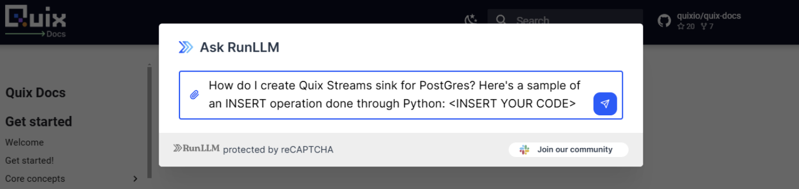

<!-- more -->

<div class="grid cards blog-grid-card" markdown>

- __Learn to process streaming data!__

    ---

    Quix Streams is a fast and general-purpose processing framework for streaming data. Build real-time applications and analytics systems on data streams using Python DataFrames and stateful operators, all without having to install a server-side engine.

    :fontawesome-brands-youtube:{ .youtube } [Watch on YouTube](https://www.youtube.com/watch?v=5sqegy_EPa0)

</div>

# **Streaming Game Telemetry to DuckDB using Quix Streams**

Real-time data plays a crucial role for online gaming. Every player action, every match result, and every in-game event can be mined for insights. For example, the data can be analyzed to detect cheaters, personalize the game for individual players, and uncover issues with the game. For game developers and data scientists in the gaming industry, the challenge lies in efficiently capturing, storing, and analyzing this massive stream of information.

This tutorial will guide you through the process of streaming game telemetry data from a Kafka topic to DuckDB using Quix Streams. We'll be using real telemetry data from Counter-Strike: Global Offensive (CS:GO) as our example, demonstrating how to handle the high-volume, rapid-fire data typical in gaming scenarios.

### What You'll Learn

1. The structure and components of the Quix Streams sink API  
2. How to implement a custom sink using the `BaseSink` and `BatchingSink` classes  
3. Strategies for handling streaming data efficiently, including batching and backpressure management  
4. How to apply these concepts to create a DuckDB sink, or any other sink that you have in mind.  
   

## Understanding the Data

Before we dive into the implementation, let's take a look at the kind of data we're dealing with. Here's a sample of the CS:GO telemetry data you’ll process in this tutorial:

```py
{"inventory": ["knife_ursus", "Glock-18", "Smoke Grenade", "Flashbang"], "accuracy_penalty": 0.0, "zoom_lvl": null, "is_bomb_planted": false, "ping": 42, "health": 100, "has_defuser": false, "has_helmet": false, "flash_duration": 0.0, "last_place_name": "TSpawn", "which_bomb_zone": 0, "armor_value": 0, "current_equip_value": 900, "team_name": "TERRORIST", "team_clan_name": "team_brnz4n", "game_time": 254.78125, "pitch": 46.6839904785, "yaw": 96.8022460938, "X": 1142.8328857422, "Y": 195.0701446533, "Z": -122.8704223633, "tick": 5924, "steamid": "76561198055011045", "name": "gbk-_-gbk", "round": 1}
{"inventory": ["knife_skeleton", "Glock-18"], "accuracy_penalty": 0.0, "zoom_lvl": null, "is_bomb_planted": false, "ping": 39, "health": 100, "has_defuser": false, "has_helmet": false, "flash_duration": 0.0, "last_place_name": "TSpawn", "which_bomb_zone": 0, "armor_value": 100, "current_equip_value": 850, "team_name": "TERRORIST", "team_clan_name": "team_brnz4n", "game_time": 254.78125, "pitch": 5.3482818604, "yaw": 139.6358947754, "X": 1206.0417480469, "Y": 148.3354797363, "Z": -159.96875, "tick": 5924, "steamid": "76561198998266210", "name": "xelxe", "round": 1}
{"inventory": ["knife_widowmaker", "USP-S"], "accuracy_penalty": 0.0, "zoom_lvl": null, "is_bomb_planted": false, "ping": 33, "health": 100, "has_defuser": false, "has_helmet": false, "flash_duration": 0.0, "last_place_name": "CTSpawn", "which_bomb_zone": 0, "armor_value": 100, "current_equip_value": 850, "team_name": "CT", "team_clan_name": "team_DagThePimple", "game_time": 254.78125, "pitch": 3.9797973633, "yaw": -52.2468566895, "X": -1493.05859375, "Y": -2185.2907714844, "Z": -246.8928222656, "tick": 5924, "steamid": "76561198262334449", "name": "Chowm1nt", "round": 1}
{"inventory": ["knife_t", "Glock-18"], "accuracy_penalty": 0.0, "zoom_lvl": null, "is_bomb_planted": false, "ping": 37, "health": 100, "has_defuser": false, "has_helmet": false, "flash_duration": 0.0, "last_place_name": "TSpawn", "which_bomb_zone": 0, "armor_value": 100, "current_equip_value": 850, "team_name": "TERRORIST", "team_clan_name": "team_brnz4n", "game_time": 254.78125, "pitch": 52.2087402344, "yaw": 91.8591003418, "X": 1121.9647216797, "Y": 111.4104385376, "Z": -164.827331543, "tick": 5924, "steamid": "76561199203043663", "name": "-ryuunosuke", "round": 1}

```

This data represents individual game ticks, providing a snapshot of the game state and player information at each moment. Each row corresponds to a player's state at a specific tick, with detailed information about their position, inventory, health, and more.

Key fields include:

- `tick`: The game tick number  
- `steamid`: Player's unique Steam ID  
- `name`: Player's username  
- `inventory`: List of items the player is carrying  
- `health`: Player's current health  
- `team_name`: The team the player is on (CT or TERRORIST)  
- `X`, `Y`, `Z`: Player's position coordinates  
- `round`: The current round number

This data comes from in the demo (`*.dem`) format. If you’re feeling ambitious, you can download the file (186 MB approx) using [this Google Drive link](https://drive.google.com/file/d/1K8rkcyptsZIhDPGOfR8GscdC5cH-U3pQ/view?usp=drive_link).

The data comes from this [professional esports match](https://www.faceit.com/en/cs2/room/1-7f613672-b937-4544-a8cc-0f12dee5a151) hosted by faceit.com.  

However, you don’t need the entire match telemetry, I’ll be providing a JSON Lines file in the tutorial repo which we’ll get to in a minute. This just a tiny subsection of the data in the \*.dem file. But I’ve linked to the whole thing anyway in case you want to explore it and see what else is in there (you can use the [awpy library](https://awpy.readthedocs.io/en/latest/) to explore it, and I’ve included an extra code sample in the tutorial repo).

## Major Steps

To set expectations, here are the major steps that I’ll be guiding you through. Most of the work is in designing the sink, and remaining steps should only take a minute:

1. **Set Up the Environment**  
   * Install the Quix CLI to which will enable you quickly spin up a local Redpanda broker  
   * Clone the project files  
2. **Design the DuckDB Sink**  
   * Review the base classes in the Quix Sink API  
   * Implement a custom sink extending BatchingSink  
   * Define the database schema  
   * Handle data transformation and batching  
   * Manage database connections and transactions  
3. **Run  the DuckDB Sink**  
   * Set up a consumer application with appropriate configurations  
   * Run the pre-prepared producer script  
   * Execute the Quix Streams consume application with the DuckDB sink  
4. **Review tips on creating sinks for other destinations**  
   * Look at batch sizes and commit frequencies  
   * Handle back pressure and error scenarios

## Setting Up the Local Environment

Before we dive into producing and consuming game telemetry data, we need to set up our local environment. The Quix CLI provides a straightforward way to initialize our project and spin up a local Redpanda broker, which we'll use as our Kafka-compatible message queue.

**Note**: You need to have [Docker installed](https://docs.docker.com/engine/install/) on your system to run the following steps.

### Installing the Quix CLI

First, let's install the Quix CLI. Open your terminal and run one of the following commands based on your operating system:

For macOS and Linux:

```
curl -fsSL https://github.com/quixio/quix-cli/raw/main/install.sh | bash
```

For Windows (run in PowerShell):

```
iwr https://github.com/quixio/quix-cli/raw/main/install.sh -useb | iex
```

### Clone the tutorial repo:

```
git clone https://github.com/quixio/tutorial-code
cd tutorial-code/duck-db-sink
```

### Spin Up a Local Message Broker

With the Quix CLI installed, we can now start the local Redpanda broker. Open a terminal window and execute these commands from within the tutorial-code folder.

```
quix init
quix local pipeline up
```

This command does several things:

1. It uses Docker Compose to spin up a local Redpanda broker.  
2. It sets up the necessary topics for your pipeline.  
3. It prepares the local environment for running your Quix Streams application.

You should see output indicating that the Redpanda broker is up and running.

Now let's get to work and create the sink (but if you’re in a hurry and just want to see it working you can skip straight to the next section “Running the DuckDB sink”).

## Designing the DuckDB Sink

In this section you’ll learn how to design a sink for DuckDB or any other database.   
Before we get into the specifics of DuckDB, it helps to understand how the Quix Stream Sink API works in general.

### Understanding the Quix Streams Sink API

The Quix Streams sink API provides a framework for writing processed data to external destinations. It's designed to handle the complexities of stream processing, such as batching and backpressure.

### Key Components of the Sink API

1. **BaseSink**: The parent interface for all sinks.  
2. **BatchingSink**: A base class for sinks that need to batch data before writing.

These components are necessary to address the challenges inherent in stream processing and data persistence. In a streaming context, data arrives continuously and often at high volumes. Writing each piece of data individually to a destination (like a database) as it arrives would be inefficient and could overwhelm the destination system. 

The [**BaseSink**](https://github.com/quixio/quix-streams/blob/main/quixstreams/sinks/base/sink.py) provides a standard interface for all sinks, ensuring consistent behavior across different implementations. 

The **BatchingSink** extends this to allow for the accumulation of data into batches before writing, which can significantly improve performance and reduce load on the destination system. This batching capability is particularly crucial when dealing with high-throughput streams, like game telemetry data, where the rate of data generation can far exceed the write capacity of many storage systems.

You can find more information about these components in the [Quix Streams documentation.](https://quix.io/docs/quix-streams/connectors/sinks/custom-sinks.html?h=batchingsink#sinks-workflow)

### Implementing a Custom Sink for DuckDB

Now that we understand the structure, let's implement a custom sink for DuckDB. We'll use the `BatchingSink` as our base class.

#### Setting Up the DuckDB Sink Class

```py
import duckdb
import logging
from datetime import datetime
import time
from quixstreams.sinks.base import BatchingSink, SinkBatch
from quixstreams.sinks.exceptions import SinkBackpressureError

logging.basicConfig(level=logging.DEBUG)
logger = logging.getLogger(__name__)

class DuckDBSink(BatchingSink):
    def __init__(self, database_path, table_name, schema, batch_size=100):
        super().__init__()
        self.database_path = database_path
        self.table_name = table_name
        self.schema = schema
        self.batch_size = batch_size
        self._ensure_table_exists()

    def _ensure_table_exists(self):
        conn = duckdb.connect(self.database_path)
        columns = ", ".join([f"{key} {dtype}" for key, dtype in self.schema.items()])
        create_table_query = f"CREATE TABLE IF NOT EXISTS {self.table_name} ({columns})"
        conn.execute(create_table_query)
        conn.close()
```

In this setup, we're initializing our sink with database connection details and schema information. The `_ensure_table_exists` function is simply a helper function to create the table under a configured name if it doesn't exist.

#### Implementing the write function

```py
    def write(self, batch: SinkBatch):
        conn = duckdb.connect(self.database_path)
        try:
            conn.execute("BEGIN TRANSACTION")
            
            for write_batch in batch.iter_chunks(n=self.batch_size):
                records = []
                min_timestamp = None
                max_timestamp = None

                for item in write_batch:
                    value = item.value
                    if 'timestamp' not in value:
                        value['timestamp'] = datetime.utcnow().isoformat()
                    else:
                        value['timestamp'] = datetime.fromisoformat(value['timestamp']).isoformat()
                    records.append(value)
                    if min_timestamp is None or value['timestamp'] < min_timestamp:
                        min_timestamp = value['timestamp']
                    if max_timestamp is None or value['timestamp'] > max_timestamp:
                        max_timestamp = value['timestamp']

                columns = ", ".join(records[0].keys())
                placeholders = ", ".join(['?' for _ in records[0].keys()])
                query = f"INSERT INTO {self.table_name} ({columns}) VALUES ({placeholders})"
                values = [list(record.values()) for record in records]

                try:
                    _start = time.monotonic()
                    conn.executemany(query, values)
			conn.execute("COMMIT")
                    elapsed = round(time.monotonic() - _start, 2)
                    logger.info(
                        f"Sent data to DuckDB; "
                        f"total_records={len(records)} "
                        f"min_timestamp={min_timestamp} "
                        f"max_timestamp={max_timestamp} "
                        f"time_elapsed={elapsed}s"
                    )
                except duckdb.Error as exc:
                    logger.error("Error writing to DuckDB: %s", exc)
                     raise SinkBackpressureError(
                         retry_after=60,# hardcoded at a minute
                         topic=batch.topic,
                         partition=batch.partition,
                     ) 
                    
            
        except duckdb.Error as exc:
            logger.error("Transaction failed, rolling back. Error: %s", exc)
            conn.execute("ROLLBACK")
            raise
        finally:
            conn.close()
```

This `write` function is where the bulk of our sink's work happens. Let's break it down:

1. We open a connection to DuckDB and start a transaction.  
2. We iterate over the batch in chunks of size `self.batch_size`.  
3. For each chunk, we prepare the data for insertion, keeping track of timestamps for logging.  
4. We construct an SQL INSERT query and execute it using `executemany` for efficiency.  
5. We log information about the write operation.  
6. If we encounter an error, we raise a `SinkBackpressureError` (note that DuckDB may time out rather than returning an error on large data volumes).  
7. We commit the transaction if everything succeeds, or roll back if there's an error.

#### Understanding Transactions in the DuckDB Sink

In our DuckDB sink implementation, you might have noticed the use of `BEGIN TRANSACTION` and `COMMIT` statements. Let's look at why these are crucial, especially in the context of DuckDB.

```py
def write(self, batch: SinkBatch):
    conn = duckdb.connect(self.database_path)
    try:
        conn.execute("BEGIN TRANSACTION")
        
        # ... (batch processing and writing logic) ...

        conn.execute("COMMIT")
    except duckdb.Error as exc:
        logger.error("Transaction failed, rolling back. Error: %s", exc)
        conn.execute("ROLLBACK")
        raise
    finally:
        conn.close()
```

##### Why Use Transactions?

Transactions ensure that all operations within the transaction are treated as a single unit. Either all of them succeed, or none of them do. This is crucial for maintaining data consistency, especially when dealing with streaming data where we're inserting multiple records at once.

For DuckDB specifically, using transactions can significantly improve write performance. This is because DuckDB is an analytical database optimized for read-heavy workloads, and individual INSERT statements can be relatively slow. 

By wrapping our batch inserts in a transaction, we're telling DuckDB to treat all these inserts as a single operation. Instead of committing after every insert, DuckDB can optimize the entire batch of inserts as a single unit.

##### **A caveat about memory consumption**

While using transactions generally improves performance for bulk inserts in DuckDB, bear in mind that this can increase memory usage. Larger transactions will use more memory, as DuckDB needs to keep track of all changes within the transaction.

#### Tuning Batches and Transaction Size

The optimal transaction size (which in our case corresponds to the batch size) will depend on your specific use case. You'll want to find a balance between write performance and memory usage.

You may need to experiment with different settings to find the optimal balance for your specific use case.

The main settings you’ll want to tune are the polling and commit settings in the Quix application.

```py
app = Application(
     # ...other parameters...
    consumer_extra_config={
        'max.poll.interval.ms': 300000, # Adjust this value
    },
    commit_every=250  # Adjust this value
)
```

As well as the size of the batches that you’re writing to your sink.

```py
duckdb_sink = DuckDBSink(
    # ...other parameters...
    batch_size=50
)
```

Understanding how these parameters interact is crucial for optimizing stream processing performance and reliability.

1. `max.poll.interval.ms` (Consumer Setting):  
   * This setting determines the maximum time between consecutive calls to poll() when using consumer group management.  
   * If this interval is exceeded, the consumer is considered failed and the group will rebalance to reassign partitions.  
   * Default is 300000 (5 minutes).  
2. `commit_every` (Quix Application Setting):  
   * This setting determines how often the application commits offsets to Kafka.  
   * It can be set as a number of messages or a time interval.  
3. `batch_size` (Sink Setting):  
   * This setting determines how many records the sink processes in a single batch.

Now, let's discuss their interplay:

1. `max.poll.interval.ms` vs `commit_every` and `batch_size`:  
   * If your processing (including batching in the sink) takes longer than `max.poll.interval.ms`, the consumer group will think the consumer has died and trigger a rebalance.  
   * Therefore, `max.poll.interval.ms` should be set higher than the expected time to process `commit_every` messages, which includes the time to process `batch_size` records in the sink.  
2. `commit_every` vs `batch_size`:  
   * Ideally, `commit_every` should be a multiple of `batch_size` for efficient processing.  
   * If `commit_every` is smaller than `batch_size`, you might commit more frequently than you batch, which could lead to partial batch commits.  
   * If `commit_every` is much larger than `batch_size`, you process multiple batches before committing, which could lead to longer processing times between commits.

Balancing these settings:

1. Start with `batch_size`: Set this based on your sink's optimal performance. For DuckDB, this might be in the hundreds or thousands, depending on your schema complexity.  
2. Set `commit_every`: Make this a multiple of `batch_size`. For example, if `batch_size` is 1000, you might set `commit_every` to 5000 or 10000\.  
3. Adjust `max.poll.interval.ms`: Set this higher than the expected time to process `commit_every` messages. For example, if processing 10000 messages typically takes 5 minutes, you might set this to 480000 (8 minutes) to give some buffer.

By understanding these DuckDB-specific considerations and leveraging transactions appropriately, we can create a more efficient and reliable sink for our streaming data, despite DuckDB's orientation towards analytical rather than transactional workloads.

## Running the DuckDB Sink

Now that we've implemented our sink, let's see how to use it in a Quix Streams application

In the tutorial repo, navigate into the `duck-db-sink`” folder and place your DuckDB sink file in to the sinks folder like so 

```py
duck-db-tutorial/
├── completed_code/
├── sinks/
│   ├── __init__.py
│   └── duckdbsink.py
├── .env
├── consumer.py
├── producer.py
├── csgo_telemetry_sample.jsonl
```

It includes an empty `__init__.p`y so that Python knows it’s a module that we want to import.

If you skipped straight to this section because you just want to run this sink, just copy the “duckdbsink.py” file from the “completed\_code” folder into the “sinks” folder.

The file `consumer.py` is what you’ll create now, using a standard Quix application. Here’s the code.

```py
from quixstreams import Application
from sinks.duckdbsink import DuckDBSink
import os
from dotenv import load_dotenv
load_dotenv()

# Define a processing function to stop the Application after processing a certain amount of messages.
TOTAL_PROCESSED = 0
def on_message_processed(topic:str, partition: int, offset: int):
    """
    Stop application and/or print status after processing {X} number of messages.
    """
    global TOTAL_PROCESSED
    TOTAL_PROCESSED += 1
    ### Check if processing limit is exceeded.
    # Note: Jsonl file only contains 1000 records anyway
    # Keeping this check regardless, in case you want to work with a larger dataset.
    if TOTAL_PROCESSED == 1000:
        print("1000 messages processed")
        # app.stop()


app = Application(
    consumer_group="sink_consumer_v1",
    auto_offset_reset="earliest",
    consumer_extra_config={'max.poll.interval.ms': 300000},
    commit_every=250,
    on_message_processed=on_message_processed,

)
topic = app.topic(os.getenv("input", "raw_data"))

# Initialize DuckDBSink
duckdb_sink = DuckDBSink(
    database_path="csgo_data_v1.db",
    table_name="tick_metadata",
    batch_size=50,

    schema={
        "timestamp": "TIMESTAMP",
        "tick": "INTEGER",
        "inventory": "TEXT",
        # Other fields...
    }  
)

# Create a StreamingDataFrame from the topic
sdf = app.dataframe(topic)
sdf = sdf.update(lambda message: print(f"Received message for tick: {message['tick']}, message count {TOTAL_PROCESSED}"))

# Sink data to InfluxDB
sdf.sink(duckdb_sink)

app.run(sdf)
```

* There’s also a copy of this file in the “completed\_code” folder. If you just want to run it “as-is”, move it to the root of the “duck-db-sink” folder first.

This setup creates a Quix Streams application that reads from a Kafka topic and writes to DuckDB using our custom sink. Since a DuckDB database doesn’t yet exist in the file system, it will create one called “`csgo_data_v1.db`” along with a table called “`tick_metadata`”.

Now that we have our environment set up, our producer script ready, and our DuckDB sink implemented, let's put it all together to run our complete game telemetry pipeline.

### Starting the producer

1. Start the producer:

```
python producer.py
```

   This will start sending CS:GO telemetry data to the message broker (Redpanda).

   It reads from `csgo_telemetry_sample.jsonl` (1000 lines of telemetry data) and sends them to a topic in Repanda

   

2. In a new terminal, run your Quix Streams application with the DuckDB sink:

```
python consumer.py
```

   This will start consuming the telemetry data from Redpanda and writing it to DuckDB.

   

3. You can monitor the pipeline using the Quix CLI:

```
quix local pipeline logs
```

   This will show you the logs from both the Redpanda broker and your application.

Remember, you can stop the pipeline at any time using:

```
quix local pipeline down
```

This will shut down the Redpanda broker and clean up the Docker containers.

If you want to double check the integrity of the data, you can use the [DuckDB CLI](https://duckdb.org/docs/api/cli/overview.html) or an SQL IDE like [DBeaver](https://duckdb.org/docs/guides/sql_editors/dbeaver.html) to query the database.

## Tips on creating sinks for other destinations

It’s highly likely that you might want to sink data into another destination besides DuckDB. For example, into BigQuery, Snowflake or Redshift. 

When creating a custom sink for your specific database or storage system, there a few main tasks that you’ll need to plan for each time :

1. **Authentication and Connection**

    Update your sink class to handle the connection credentials for your database. For example here’s what we pass to our [InfluxDB sink](https://github.com/quixio/quix-streams/blob/main/quixstreams/sinks/influxdb3.py):

    ```py
    # Initialize InfluxDB3Sink
    influx_sink = InfluxDB3Sink(
        token="<influxdb-access-token>",
        host="<influxdb-host>",
        organization_id="<influxdb-org>",
        database="<influxdb-database>",
        measurement="numbers",
        # ... other parameters
    )
    ```

2. **Schema and Data Structure**  
     
   Some databases expect data in a certain format. For example, InfluxDB expects data values to be labeled as [tags or fields](https://docs.influxdata.com/influxdb/cloud-serverless/write-data/best-practices/schema-design/) which is why we pass it special parameters such as:  
     
    `fields_keys=["number"],`  
    `tags_keys=["tag"]`

   

3. **Write Operations**  
   As we’ve seen with DuckDB, every database has its own recommendations for writing large batches of data efficiently. You’ll need to check the documentation for your own database to determine the most important function.

   

4. **Backpressure Handling**  
   In many cases, the database will return a specific error to indicate that it is overwhelmed, and that the write operation needs to back off. For example, InfluxDB returns the error 429, so we can handle it like this.

    ```py
    except influxdb_client_3.InfluxDBError as exc:
        if exc.response and exc.response.status == 429 and exc.retry_after:
            # The write limit is exceeded, raise a SinkBackpressureError
            # to pause the partition for a certain period of time.
            raise SinkBackpressureError(
                retry_after=int(exc.retry_after),
                topic=batch.topic,
                partition=batch.partition,
            ) from exc
        raise
    ```

   

By considering these points when implementing your custom sink, you'll be well-prepared to handle the complexities of writing streaming data to your specific database or storage system.

### Bonus Tip: Ask AI

On the [Quix documentation portal](https://quix.io/docs/quix-streams/introduction.html), we have an “**AskAI”** widget powered by RunLLM that you can click in the bottom right corner. This is better than asking for a general purpose AI tool because it has been configured to use our codebase and documentation as its main knowledge source.



You can get a head start by asking it to generate some sink code for you, and giving it an example of how you normally write to your database using a single query in Python. It won’t be perfect and you’ll likely need to clean it up, but should give you the basics.

## Conclusion

Creating a custom sink allows you to tailor your data writing process to the specific needs of your destination database. By understanding the components of the Quix Streams sink API and following the patterns we've explored, you can create efficient, reliable sinks for a wide variety of data stores.

Remember, the key to a good sink is balancing efficiency (through batching and transaction management) with reliability (through error handling and backpressure management). As you develop your own sinks, you'll likely need to tune these aspects based on the characteristics of your data and the capabilities of your destination system.  

