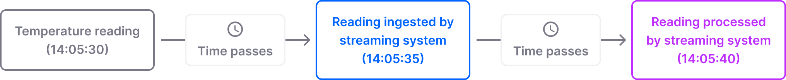
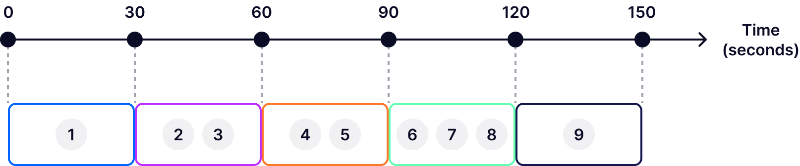
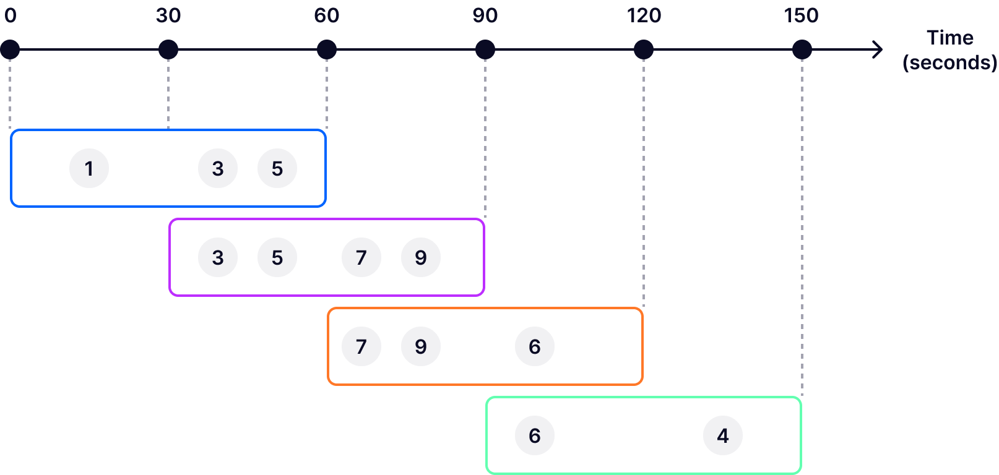
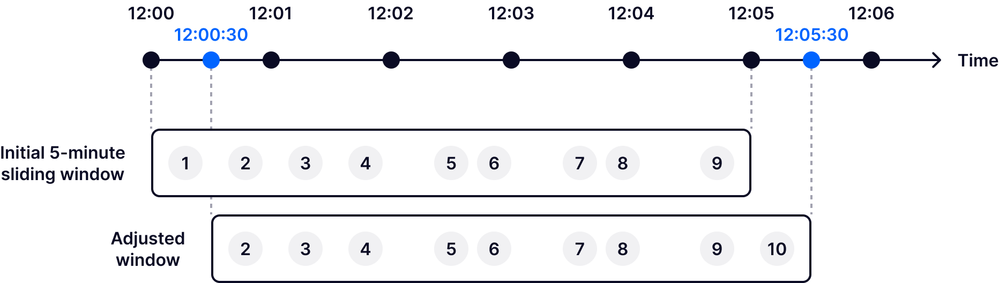
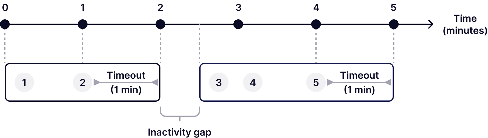

<!-- more -->

## What is windowing?

At its core, windowing is a technique associated with stream processing
(especially [stateful stream processing](https://quix.io/blog/navigating-
stateful-stream-processing)). It's used to divide a continuous data stream
into smaller, finite chunks called streaming windows.

To make an analogy, imagine you're driving down a highway, passing through
various landscapes, towns, and weather conditions. Your windshield provides a
limited, immediate view of your surroundings at any given time, segmenting
your continuous journey into visible snapshots. As you move forward, what you
see through the windshield changes, offering a new "window" into the
environment around you. You can't see the entire journey at once, but the
series of changing views through your windshield gives you a real-time,
manageable understanding of your progress and the terrain you're traversing.
Windowing works in a similar way, providing manageable, real-time snapshots of
continuous data streams.

Dividing a stream into windows happens based on certain criteria. These
criteria can be time-based (for example, 5-minute intervals), count-based
(e.g., every 1000 messages) or even based on data characteristics (for
instance, changes in data value). Among them, time windows are by far the most
commonly used.

You can apply various computations to the data contained in streaming windows,
such as aggregations (sum, average, count, etc) and transformations (map,
filter, join). This is useful, for example, if you want to:

  * Calculate the average speed of a vehicle over the last 20 minutes.
  * Count the number of mentions of a specific keyword on social media platforms every 10 minutes to track trending topics.
  * Calculate the rate of error messages in a system log file every 5 minutes to quickly identify failure spikes. 
  * Filter out error logs from a stream of application logs every minute.
  * Join incoming data from two sensors to calculate the difference in their readings every 10 seconds.

### The notion of time in streaming windows

In streaming windows, time is crucial because it determines how data is
segmented, ordered, and analyzed, directly affecting the accuracy and
relevance of insights derived from real-time data streams. It's worth bearing
in mind that there are different types of time involved when working with
[streaming data](https://quix.io/blog/data-streaming-faq):

  * **Event time**. The actual time when the event occurs. 
  * **Ingestion time**. Indicates the time when the streaming system ingests the event. 
  * **Processing time**. Specifies the exact moment when the streaming system processes the event.

Let's look at a fictional example to better understand these differences.
Imagine we have a sensor that records temperature at 14:05:30 (the event
time). It usually takes a few seconds for the data to travel from the sensor
to the streaming system. Let's say the data reaches the system at 14:05:35 —
this is the ingestion time. A few more seconds might go by until the system
analyzes the event; for the sake of our example, let's assume this happens at
14:05:40 (the processing time). As we can see, there is a 5-second delay
between each type of time, and a 10-second delay between the event time and
the processing time.  



Prioritizing event time over ingestion or processing time ensures that
streaming windows reflect the true sequence of events (regardless of when they
are ingested or processed), which is critical for accurate analysis and
insights. However, this approach is not without challenges. Handling event
time requires managing out-of-order events and dealing with potential latency
in data arrival, which can add complexity to system design.

In contrast, ingestion time and processing time might be suitable for
scenarios where real-time monitoring and responsiveness are more important
than precise event ordering. For example, in operational monitoring, where the
focus is on the current state of the system, processing time could provide the
most relevant insights.

### Benefits and applications of streaming windows

Streaming windows offer significant benefits for anyone working with streaming
data:

  * They provide a way to process unbounded data incrementally, by breaking the stream into manageable, finite chunks. 
  * The structured nature of streaming windows makes it easier to identify and rectify errors or anomalies within specific time frames, enhancing data quality and reliability.
  * By limiting the data volume that needs to be processed at any given time, streaming windows can help reduce computational load, leading to faster processing times and more efficient use of system resources.

Additionally, streaming windows have numerous applications across various
industries. For example, we can leverage them to:

  * Detect patterns indicative of financial fraud.
  * Monitor equipment performance to predict maintenance needs before failures occur.
  * Streamline traffic flow by analyzing vehicle data streams for congestion patterns.
  * Personalize online shopping experiences by recommending products based on real-time purchasing and clickstream data.
  * Provide real-time statistics and performance metrics during live sports events.
  * Analyze surveillance footage in real time to detect and respond to emergencies or public disturbances.

## Streaming window types

I'll now discuss the main types of streaming windows you can use when working with streaming data: tumbling windows, hopping windows, sliding windows, and session windows. I'll explain how each works, mention what kind of use cases they are suitable for, and highlight their related challenges. 

### Tumbling windows

Tumbling windows allow for data processing in fixed-size, contiguous, non-overlapping chunks. For example, if you define a tumbling window of 30 seconds, the stream will be divided into 30-second intervals: 0–30 seconds, 30–60 seconds, 60–90 seconds, and so on. 



All tumbling windows are the same size and adjacent to each other. Whenever the previous window ends, a new one starts. Since tumbling windows don't overlap, each event is uniquely assigned to a single tumbling window. In other words, each event is processed precisely once. 

Tumbling windows are particularly advantageous in scenarios where data needs to be analyzed in uniform, isolated segments to derive insights or metrics that are easily comparable over time. For instance, they can be used to generate minute-by-minute metrics of website traffic, providing immediate insights into user behavior patterns. Another prime example is financial trading platforms, where tumbling windows can be employed to calculate moving averages over fixed sized time intervals.

A big challenge when working with tumbling windows is selecting the appropriate window size, which is crucial for effective data analysis. If the window is too large, it may obscure finer-grained insights. Conversely, if it's too small, it might result in an overwhelming amount of windows to process, each with sparse data, making it challenging to discern meaningful patterns or trends.


### Hopping windows

Hopping windows allow you to process data in fixed-size segments that overlap and “hop” (advance) forward in time at a specified interval. For example, in the following diagram, we can see that each hopping window is one minute long, while the hop interval is 30 seconds.



Since hopping windows overlap, an event can be included in one or more windows. This characteristic is a major difference between hopping windows and tumbling windows (where events are uniquely assigned to a single, non-overlapping window). It's also worth pointing out that the hop interval is shorter than the duration of a hopping window. If the hop interval were longer than the window duration, it would result in non-continuous windows with gaps between them. This configuration would lead to periods of time where events are not captured or analyzed at all, creating blind spots in data analysis.

Hopping windows are particularly useful for use cases that require continuous, detailed analysis with overlap to smooth out data variability and ensure no event is missed. For instance, hopping windows are a good choice for systems that monitor real-time data for anomalies, spikes, or drops (such as network traffic, financial transactions, or social media activity) because they enable the detection of such events more reliably by analyzing data across overlapping periods. This reduces the risk of missing critical events that could occur if you were using non-overlapping windows (e.g., tumbling windows). 


**Challenges of working with hopping windows**

  * Increased computational overhead (due to potentially processing the same data in multiple windows).

  * Finding the optimal balance between window size and hop interval can be difficult, as it directly affects performance and accuracy.

### Sliding windows

Sliding windows in [stream processing](https://quix.io/blog/what-is-stream-processing) allow you to group events within an interval that slides over time. Note that sliding windows dynamically adjust based on the arrival of new events.

For instance, let's assume you have a sliding window with a 5-minute duration.
The window starts at 12:00:00 and lasts until 12:05:00. If a new event comes
at 12:05:30, the window will slide forward to incorporate it, covering a
period between 12:00:30 and 12:05:30 (with events that occurred before
12:00:30 being dropped from the window). This approach ensures that analysis
is up-to-date by focusing on the most recent data within the specified
duration leading up to each new event, without waiting for a fixed step
interval to pass.



Sliding windows are best suited for use cases that demand continuous, real-time analysis. For example, you could leverage sliding windows to aggregate sensor data from machinery components, such as temperature, vibration or pressure. In this context, sliding windows allow for continuous monitoring over time, enabling the identification of patterns or trends that may precede
equipment failure.  

**Challenges of working with sliding windows**

  * This window type demands significant computational resources (for continuous adjustment with each new event).
  * Finding the optimal balance between window size and slide interval is challenging yet essential for effective analysis. It requires careful tuning based on specific application requirements.
  * Efficient memory allocation and utilization are crucial to handle potentially large data volumes within sliding windows.
  * Dynamic adjustment of window boundaries requires sophisticated event ordering and timestamp management.

### Session windows

Session windows group events into dynamic intervals based on activity, filtering out periods of time when there is no activity. A session window starts with an event that signifies the beginning of a period of activity. As long as subsequent events continue to arrive within a predefined timeout period (e.g., 1 minute), the window keeps extending. If no additional events arrive within the specified timeout threshold, the session window is considered closed due to an inactivity gap. Any new event arriving after this point will trigger a new session window.



Session windows are a great choice for scenarios where you need to analyze user activity. For instance, you could use a session window function to analyze player activity in a video game to understand gameplay duration and engagement. Or you could use session windows to analyze browsing sessions to identify paths to purchase and optimize the online shopping experience for an online shop.

**Challenges of working with session windows**

  * Determining the optimal timeout period for inactivity can be tricky. If it's too short, related events might be split into separate sessions; if it's too long, unrelated events could be grouped into the same session. Balancing this timeout is crucial for meaningful session analysis.
  * Session windows require maintaining state information across potentially long and variable durations, which can increase memory usage and management complexity, especially in high-volume data streams.
  * Ensuring events are processed in the correct order to accurately define session boundaries is crucial, particularly when dealing with out-of-order events or network latency, which can distort session window calculations.

## Tools for working with streaming windows

The following table presents technologies developers commonly use to work with
streaming windows.


|Type of technology                     |About                                                                                                          |Examples                                                                                                                                                                                                                  |
|---------------------------------------|---------------------------------------------------------------------------------------------------------------|--------------------------------------------------------------------------------------------------------------------------------------------------------------------------------------------------------------------------|
|Event streaming platforms              |Useful for ingesting and handling high-velocity, high-volume data streams.                                     |Apache Kafka, Amazon Kinesis, Redpanda, Apache Pulsar. Learn how some of them compare: Kafka vs Kinesis Kafka vs Redpanda Kafka vs Pulsar                                                                                 |
|Open source stream processing libraries|Free-to-use libraries offering diverse stream processing capabilities, including support for streaming windows.|Apache Spark, Apache Flink, Apache Beam, Kafka Streams, Quix Streams, Bytewax, Faust. Learn how some of them compare: Kafka Streams vs Spark Structured Streaming Beam vs Spark Spark vs Flink vs Quix Streams performance|
|Managed stream processors              |Cloud services providing stream processing capabilities with built-in support for windowing.                   |Google Cloud Dataflow, Azure Stream Analytics, Amazon Kinesis Data Analytics.                                                                                                                                             |
|Streaming databases                    |Systems supporting queries over data streams, including window functions for temporal queries and aggregations.|ksqlDB, RisingWave, Materialize.                                                                                                                                                                                          |
## Windowing with Quix Streams

[Quix Streams](https://quix.io/docs/quix-streams/quix-streams-intro.html) is
an open source, cloud native library for processing data in Kafka using pure
Python. It's designed to give you the power of a distributed system in a
lightweight library by combining the low-level scalability and resiliency
features of Kafka with an easy-to-use Python interface. Here are its main
benefits:

  * No JVM, no orchestrator, no server-side engine.
  * Easily integrates with the entire Python ecosystem (pandas, scikit-learn, TensorFlow, PyTorch, etc).
  * Designed to run and scale resiliently via container orchestration (like Kubernetes).
  * Support for stateful operations using RocksDB.
  * Pandas-like interface to ease newcomers to streaming.

At the time of writing, Quix Streams enables you to implement time-based
hopping and tumbling windows (sliding windows are on the roadmap). This is how you define a hopping window over a **StreamingDataFrame** with Quix Streams:

```py
from quixstreams import Application
from datetime import timedelta

app = Application(broker_address='localhost:9092')
topic = app.topic('input-topic')
sdf = app.dataframe(topic)

# Create a hopping window of 1 hour with a 10-minute step 
# and emit results only when the window is closed
sdf = (
    sdf.hopping_window(duration_ms=timedelta(hours=1), step_ms=timedelta(minutes=10))
    .sum()
    .final()
)

# Same hopping window, but emitting results for each incoming message
sdf = (
    sdf.hopping_window(duration_ms=timedelta(hours=1), step_ms=timedelta(minutes=10))
    .sum()
    .current()
)
```
‍
And here's how you define a tumbling window over a **StreamingDataFrame** with
Quix Streams:


```py
from quixstreams import Application
from datetime import timedelta

app = Application(broker_address='localhost:9092')
topic = app.topic('input-topic')
sdf = app.dataframe(topic)

# Create a tumbling window of 1 hour and emit results only when the window is closed
sdf = (
    sdf.tumbling_window(duration_ms=timedelta(hours=1))
    .sum()
    .final()
)

# Same tumbling window, but emitting results for each incoming message
sdf = (
    sdf.tumbling_window(duration_ms=timedelta(hours=1))
    .sum()
    .current()
)
```

**Key Quix Streams windowing capabilities**

  * Windows always use event time, which is obtained from the timestamps of Kafka messages. 
  * You can specify a grace period for each window. By doing so, you “tell” a window to wait for a certain period before it closes. This is helpful when dealing with late, out-of-order messages.
  * Windows support various aggregation functions (reduce, min, max, sum, count, etc).
  * Two ways of emitting results: after each processed message in the window or after the window expires.

To learn more, check out the [windowing
documentation](https://quix.io/docs/quix-streams/v2-0-latest/windowing.html).
And if you want to test Quix Streams yourself, [this is how you get
started](https://github.com/quixio/quix-streams?tab=readme-ov-file#getting-
started-).

## Check out the repo
Our Python client library is open source, and brings DataFrames and the Python ecosystem to stream processing.

[Read more and star us on GitHub](https://github.com/quixio/quix-streams)


