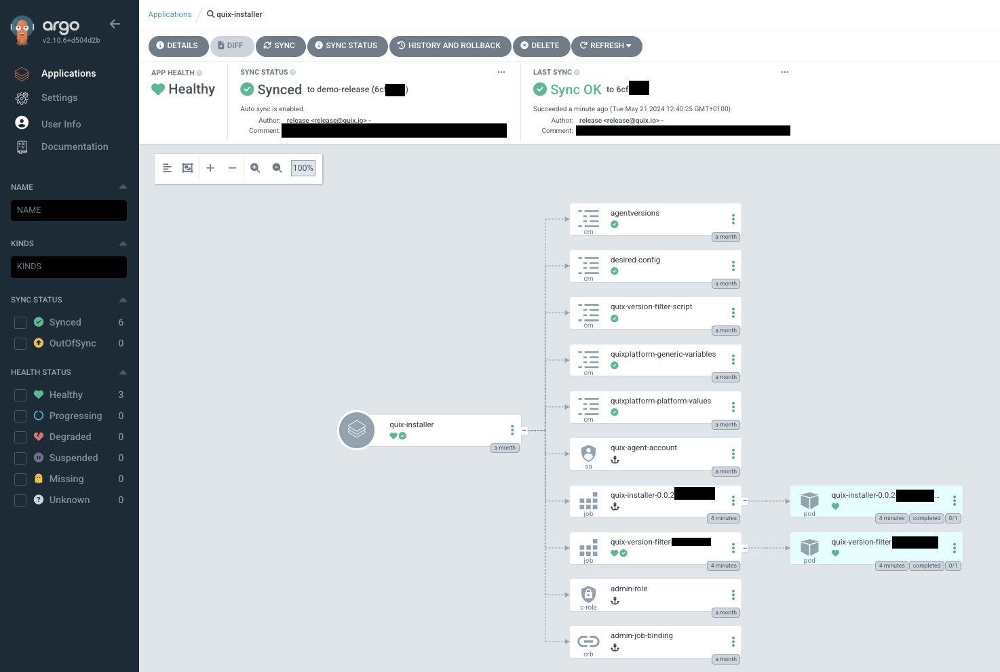

# How to install BYOC

The summary of the deployment procedure is as follows:

1. Create a [Kubernetes cluster](#1-create-a-kubernetes-cluster)
2. Obtain a Quix Container Registry [API key](#2-obtain-an-api-key-to-pull-quix-platform-containers) to pull Quix Platform containers
3. Obtain a copy of the Quix Platform [BYOC installer](#3-obtain-a-copy-of-the-quix-platform-byoc-installer)
4. Configure Platform Values <ol type="a">
    <li> Prepare [Helm Values](#4a-prepare-helm-values-file) file (secrets and platform configuration)</li>
    <li> Prepare [ArgoCD](#4b-prepare-argocd)</li>
</ol>
5. Install the Platform! <ol type="a">
    <li> Run the [Helm Installer](#5a-run-the-helm-installer)</li>
    <li> Initialize [ArgoCD](#5b-optional-initialize-argocd)</li>
</ol>

This is explained in more detail in the following step-by-step guide.

## 1. Create a Kubernetes cluster

This step is where you have the most freedom of choice. The assumption this guide works with is that you have an operational Kubernetes cluster ready to schedule pods and create the required dependencies. Any Kubernetes installation should work as long as it clears the requirements in the [Requirements](requirements.md) section.

In short, if your Kubernetes cluster configuration isn't _particularly_ niche, it should work without any extra configuration.

Quix recommends a production ready Kubernetes cluster, with HA control plane and multiple worker nodes, as this makes maintenance and scaling easier.

Quix BYOC has been developed to work on a variety of Kubernetes distributions from GCP, AWS EKS, Azure AKS, K3S running on virtual machines on our own on-premises Type 2 KVM hypervisors. We have operated Quix on clusters ranging from v1.24 to v1.29 on a dozen different storage classes and providers. Anything that can run an x86_64 Kubernetes cluster has a good chance of being able to run Quix, granted the minimum requirements are met.

## 2. Obtain an API key to pull Quix Platform containers

In this step you will be receiving a username / API token and docker registry URL. Quix will provide you with these before you start the installation process.

&nbsp;&nbsp;&nbsp;&nbsp;[Contact sales](https://share.hsforms.com/1iW0TmZzKQMChk0lxd_tGiw4yjw2)

## 3. Obtain a copy of the Quix Platform BYOC installer

We offer multiple installation methods for the Quix Platform. We recommend either ArgoCD or the Quix Platform Manager Helm chart. We prefer ArgoCD due to the auditability and automated experience of the GitOps release methodology.

A custom CI/CD pipeline wrapping the Helm chart gives a similarly robust ownership experience. The Quix Platform Manager helm chart installs the Quix Platform on your Kubernetes cluster. Running the installer many times will not change the platform state, as it is idempotent based on declaratively set secrets and variables.

## 4a. Prepare Helm Values File

The platform may be installed using Helm. The Helm chart supplied with the Quix Platform release is designed to declaratively transform your Quix Platform installation into the desired state described in your values and secrets file.

The helm values file is a combination of platform secrets (some randomly generated by Helm on first initialization) and platform variables. The platform variables are the tunables that you can use to tailor the platform to your needs.

To prepare the helm values file, copy charts/quixplatform-manager/values.yaml to the Quix Platform release folder and edit the file to suit your needs.

Once done, follow the instructions in Readme.md in the charts/quixplatform-manager folder to install the Quix Platform on your Kubernetes cluster. This document guides you through setting custom certificates and intricacies of Namespace management.

## 4b. Prepare ArgoCD

Our Quix Platform distribution contains shims for initializing ArgoCD. Following the readme in the init-scripts/ directory will guide you through the process of setting up ArgoCD to manage the Quix Platform.

Simply create a repository or a folder in an existing one, and tell ArgoCD to subscribe to it. When you install the platform with ArgoCD, you don't need to install anything by hand; simply configure values and secrets, then let ArgoCD "heal" the environment into the desried state.

ArgoCD depends on a ConfigMap and a Secret. The ConfigMap represents your preferences, settings and choices for tunables. The defaults provided are a safe starting point, but you can tailor Quix BYOC Enterprise Edition to run well on a wide variety of Kubernetes clusters.

The Secret contains a combination of random, strong passwords used for internal services as well as API keys for external services, such as SMTP or the authentication provider.

## 5a. Run the Helm Installer

Following the Readme file in the chart folder, run `helm upgrade --install quixplatform-manager charts/quixplatform-manager --namespace quix --values vars/values.yaml` (and other optional values set on the command line) to install the Quix Platform on your Kubernetes cluster.

Given a correct values file, this installs Quix in about 5 minutes. Executing the command again will update the platform to the desired state, as described in the values file.

!!! tip
    As with other methods of installation, when installing Quix Platform Enterprise Edition, we will guide you through setting up the necessary components.


## 5b. Optional: Initialize ArgoCD

Initialize ArgoCD by running the init script in init-scripts/ directory. This will create the Quix application and start automatically syncing the platform to the desired state described in the repository. Ensure you have platform variables and secrets set in your cluster, as per step 4b.

```bash
argo_namespace=argo
quix_namespace=quix
init-scripts/init.sh ${argo_namespace} ${quix_namespace}
```

This will initialize ArgoCD and create the Quix application in the namespace you specify. If you do not specify a namespace, it will default to `argocd` and `quix`.

!!! tip
    Any software package we release for the BYOC offering will have been put through our QA process and validated. When using ArgoCD, you will be able to specify what versions of the software package you wish to run. You also control the release cadence by owning the repository and controlling it via your own merge strategy.
{width=80%}
