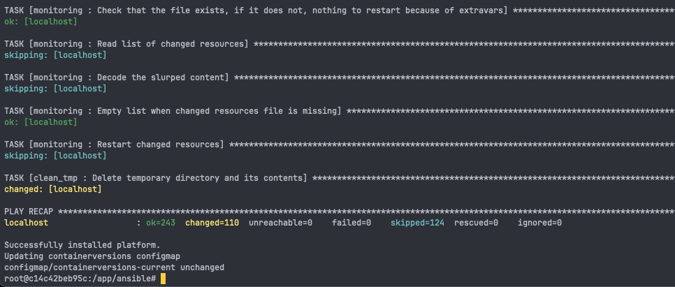

# How to install BYOC

The summary of the deployment procedure is as follows:

1. Create a [Kubernetes cluster](#1-create-a-kubernetes-cluster)
2. Obtain a Quix Container Registry [API key](#2-obtain-an-api-key-to-pull-quix-platform-containers) to pull Quix Platform containers
3. Obtain a copy of the Quix Platform [BYOC installer](#3-obtain-a-copy-of-the-quix-platform-byoc-installer-ansible-recipe--docker-image)
4. <ol type="a">
    <li> Prepare Helm Values file (secrets and platform configuration) [Helm Values](#4a-prepare-helm-values-file) </li>
    <li> Prepare ArgoCD [ArgoCD](#4b-prepare-argocd)  </li>
</ol>
5. <ol type="a">
    <li> Run the Helm Installer [Helm Installer](#5a-run-the-helm-installer) </li>
    <li> Initialize ArgoCD [ArgoCD](#5b-optional-initialize-argocd) </li>
</ol>
6. Miscellaneous [Miscellaneous](#6-miscellaneous)

This is explained in more detail in the following step-by-step guide.

## 1. Create a Kubernetes cluster

This step is where you have the most freedom of choice. The assumption this guide works with is that you have an operational Kubernetes cluster ready to schedule pods and create the required dependencies. Any Kubernetes installation should work as long as it clears the requirements in the [Requirements](requirements.md) section.

In short, if your Kubernetes cluster configuration isn't _particularly_ niche, it should work without any extra configuration.

Quix recommends a production ready Kubernetes cluster, with HA control plane and multiple worker nodes, as this makes maintenance and scaling easier.

Quix BYOC has been developed to work on a variety of Kubernetes distributions from GCP, AWS EKS, Azure AKS, K3S running on virtual machines on our own on-premises Type 2 KVM hypervisors. We have operated Quix on clusters ranging from v1.24 to v1.29 on a dozen different storage classes and providers. Anything that can run an x86_64 Kubernetes cluster has a good chance of being able to run Quix, granted the minimum requirements are met.

## 2. Obtain an API key to pull Quix Platform containers

In this step you will be receiving a username / API token and docker registry URL. Quix will provide you with these before you start the installation process.

&nbsp;&nbsp;&nbsp;&nbsp;[Contact sales](https://share.hsforms.com/1iW0TmZzKQMChk0lxd_tGiw4yjw2)

## 3. Obtain a copy of the Quix Platform BYOC installer

We offer the Quix Platform in multiple formats. Our recommended method is either ArgoCD + a manually prepared secret and variables file, or the Quix Platform Manager Helm chart. We prefer ArgoCD due to the auditability and smooth experience of the GitOps release methodology. A custom CI/CD pipeline wrapping the Helm chart gives a similarly pleasant ownership experience. The Quix Platform Manager helm chart is a wrapper around the Quix Platform Installer, which is an Ansible playbook that installs the Quix Platform on your Kubernetes cluster, defined in a declarative manner. Running the installer many times will not change the state of the platform, as it is idempotent.

## 4a. Prepare Helm Values File

The platform may be installed using Helm. The Helm chart supplied with the Quix Platform release is a wrapper on the Quix Platform installer. It is an Ansible playbook that is designed to declaratively transform your Quix Platform installation into the desired state described in your values file.

The helm values file is a combination of platform secrets (some randomly generated by Helm helper functions on first initialization) and platform variables. The platform variables are the tunables that you can use to tailor the platform to your needs.

To prepare the helm values file, copy charts/quixplatform-manager/values.yaml to the Quix Platform release folder and edit the file to suit your needs.

Once done, follow the instructions in Readme.md in the charts/quixplatform-manager folder to install the Quix Platform on your Kubernetes cluster. This document guides you through setting custom certificates and intricacies of Namespace management.

## 4b. Prepare ArgoCD

Our Quix Platform distribution contains shims for initializing ArgoCD. Following the readme in the init-scripts/ directory will guide you through the process of setting up ArgoCD to manage the Quix Platform. You may choose to point ArgoCD at your own repository, or use the private one we provide with various tags published representing various maturity levels of the platform (stable, latest etc.).

When you install the platform with ArgoCD, you don't need to install anything by hand; simply configure values and secrets, then let ArgoCD "heal" the environment into the desried state.

ArgoCD depends on a ConfigMap and a Secret. The ConfigMap represents your preferences, settings and choices for tunables. The defaults provided are a safe starting point, but you can tailor Quix BYOC Enterprise Edition to run well on a wide variety of Kubernetes clusters.

The Secret contains a combination of random, strong passwords used for internal services as well as API keys for external services, such as SMTP or the authentication provider.

## 5a. Run the Helm Installer

Following the Readme file in the chart folder, run `helm upgrade --install quixplatform-manager charts/quixplatform-manager --namespace quix --values vars/values.yaml` (and other optional values set on the command line) to install the Quix Platform on your Kubernetes cluster.

Given a correct values file, this installs Quix in about 5 minutes. Executing the command again will update the platform to the desired state, as described in the values file.

!!! tip
    As with other methods of installation, when installing Quix Platform Enterprise Edition, we will guide you through setting up the necessary components.


## 5b. Optional: Initialize ArgoCD

Any software package we release for the BYOC offering will have been put through our QA process and validated. That said, we operate multiple external branches to facilitate testing leading-edge features on your test environments before we add them to the stable branch.

Initialize ArgoCD by running the init script in init-scripts/ directory. This will create the Quix application and start automatically syncing the platform to the desired state described in the repository. Ensure you have platform variables and secrets set in your cluster, as per step 4b.

```bash
argo_namespace=argo
quix_namespace=quix
init-scripts/init.sh ${argo_namespace} ${quix_namespace}
```

This will initialize ArgoCD and create the Quix application in the namespace you specify. If you do not specify a namespace, it will default to `argocd` and `quix`.

!!! tip
    You may host your own release repository to subscribe to with ArgoCD. This allows you to be in ultimate control of the entire release process and all asset versions being released, including the time of release.

{width=80%}

## 6. Miscellaneous

It is possible to use a local container to run the Ansible playbook without triggering ArgoCD. The requirements are the same as those of ArgoCD. Fill the platform-variables file, fill the secrets file. Push both to the cluster, then run the following command from the root of the Quix Platform release:

```bash
# Run the Quix Platform installer container in Docker, using bash, yq and kubectl
./quixplatform container quix -V 1.3.3 # 
# inside the container:
./quixplatform install
```

{width=80%}

or if ArgoCD is installed, but you want to manually trigger the installation:

```bash
./quixplatform install --context=<your_kubectl_context_name>
```

This installs Quix on your Kubernetes cluster. The installation process will take three to five minutes. 

The progress of the installation is displayed as Ansible roles initialize and set up the various components and then the Quix Platform itself, as shown in the following screenshot:

{width=80%}


Another way to install the Quix Platform is to run an installer pod inside your cluster. This allows you to run the installer without needing helm, yq or docker engine. All you will need is bash, kubectl.
This method is recommended for testing and development environments. We recommend either Helm or ArgoCD for production environments, due to their auditability and ease of integration into enterprise-ready release pipelines.
```bash
# fill and push the platform-variables and platform-secrets files to the cluster, follow readme.md in the root folder
QUIXPLATFORM_REGISTRY_USERNAME=quix_private_repo_username \
QUIXPLATFORM_REGISTRY_PASSWORD=quix_private_repo_password \
NAMESPACE=quix \
source init-scripts/start-pod.sh
# This copies the contents of the current folder to the pod.
# Inside the pod run
./quixplatform install
```