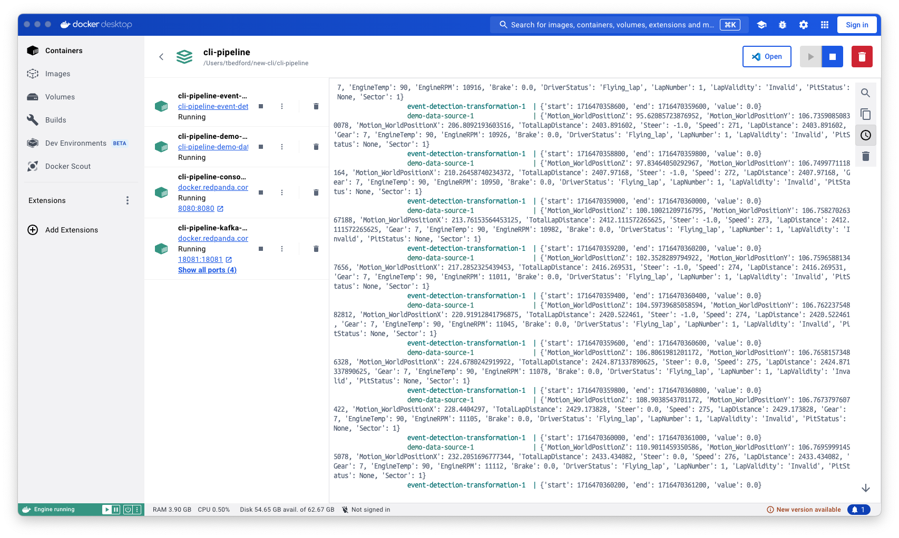

# Quix CLI Quickstart

In this guide you use the Quix CLI to create a simple pipeline on the command line, and test it locally by running it in Docker.

## Prerequisites

This guide assumes you have the following installed:

* [Docker Desktop](https://docs.docker.com/engine/install/){target=_blank}
* [Git](https://git-scm.com/book/en/v2/Getting-Started-Installing-Git){target=_blank}

## Step 1: Install Quix CLI

To install Quix CLI:

```
curl -fsSL https://github.com/quixio/quix-cli/raw/main/install.sh | bash
```

For further details on installation, including instructions for Microsoft Windows, see the [install guide](https://github.com/quixio/quix-cli?tab=readme-ov-file#installation-of-quix-cli){target=_blank}.

!!! tip

    To update Quix CLI just run `quix update` to get the latest version.

## Step 2: Verify dependencies

This guide requires you to have certain dependencies installed. These include [Docker or Docker Desktop](https://docs.docker.com/engine/install/){target=_blank} and [Git](https://git-scm.com/book/en/v2/Getting-Started-Installing-Git){target=_blank}.

To verify you have the dependencies installed, run the following command:

```
quix status
```

This produces output similar to the following:

```
✗ Not logged in
  User:                 ! Not logged in to Quix Cloud
  Current context:      default (https://portal-api.platform.quix.io)
  Default environment:  ! Not set
  Local Broker:         ! Not set
  Local Broker enabled? ✗ No
✗ No git root detected
✓ VS Code installed
! PyCharm not installed
✓ Docker installed
✓ Git installed
```

View the output carefully to confirm you have Git and Docker installed:

```
✓ Docker installed
✓ Git installed
```

## Step 3: Create a GitHub repository

Create a Git repo in GitHub, where you are going to store your project files. Create a repo initialized with a `README.md` file, so it can be cloned more easily.

See also the [GitHub documentation](https://docs.github.com/en/repositories/creating-and-managing-repositories/quickstart-for-repositories){target=_blank}.

## Step 4: Clone your GitHub repo into your local project directory

Copy your GitHub repository URL.

Now, clone the repository using the URL. For example:

```
git clone https://github.com/<your-username>/<your-repository>
```

!!! tip

    Replace `<your-username>` and `<your-repository>` with your actual username and repository name. 

See also the [GitHub documentation](https://docs.github.com/en/repositories/creating-and-managing-repositories/cloning-a-repository){target=_blank}.

## Step 5: Navigate to your project folder

Change into your project directory:

```
cd <your-repository>
```

!!! tip

    Replace `<your-repository>` with your repository name. 

## Step 6: Initialize your project as a Quix project

In your Git project directory, enter:

```
quix local init
```

This initializes your Quix project with a `quix.yaml` file, which describes your Quix project. As a convenience a `.gitignore` file is also created for you, or if one is present it is updated to ignore files such as virtual environment files, `.env` files, and so on.

If you look at the initial `quix.yaml` file you'll see the following:

``` yaml
# Quix Project Descriptor
# This file describes the data pipeline and configuration of resources of a Quix Project.

metadata:
  version: 1.0

# This section describes the Deployments of the data pipeline
deployments: []

# This section describes the Topics of the data pipeline
topics: []
```

You can see there are currently no applications (deployments) or topics. 

!!! note

    The `quix.yaml` file defines the project pipeline in its entirety.

## Step 7: Create a source application

Now create a source application:

```
quix local app create demo-data-source
```

When prompted, assign it a name of `demo-data-source`.

This creates a demo data source for you. A directory has been created for this application, along with all the necessary files. You can explore the files created with `ls`.

## Step 8: Create a transform application

Now create a transform application:

```
quix local app create event-detection-transformation
```

When prompted, assign it a name of `event-detection-transformation`.

This creates the transform for you. A directory has been created for this application, along with all the necessary files. You can explore the files created with `ls`.

## Step 9: Update your pipeline

Update your pipeline with the newly created applications of the project:

```
quix local pipeline update
```

Now, view your `quix.yaml` file again to see how the applications have been added:

``` yaml
# Quix Project Descriptor
# This file describes the data pipeline and configuration of resources of a Quix Project.

metadata:
  version: 1.0

# This section describes the Deployments of the data pipeline
deployments:
  - name: demo-data-source
    application: demo-data-source
    deploymentType: Service
    version: latest
    resources:
      cpu: 200
      memory: 500
      replicas: 1
    variables:
      - name: output
        inputType: OutputTopic
        description: Name of the output topic to write into
        required: true
        value: f1-data
  - name: event-detection-transformation
    application: event-detection-transformation
    deploymentType: Service
    version: latest
    resources:
      cpu: 200
      memory: 500
      replicas: 1
    variables:
      - name: input
        inputType: InputTopic
        description: This is the input topic for f1 data
        required: true
        value: f1-data
      - name: output
        inputType: OutputTopic
        description: This is the output topic for hard braking events
        required: true
        value: hard-braking

# This section describes the Topics of the data pipeline
topics: []
```

You can see here the applications that are going to be deployed as part of the pipeline.

## Step 10: View your pipeline

View a graph representation of your local pipeline:

```
quix local pipeline view
```

If you have VSCode installed, the pipeline is displayed in the IDE for you, otherwise the pipeline is displayed on your default browser:


When you update your `quix.yaml` using the command `quix local pipeline update`, the visualization is updated for you.

## Step 11: Run your pipeline

Run your pipeline in Docker based on your `quix.yaml` file:

```
quix local pipeline up
```

You'll see various console messages displayed in your terminal. When these have finished, then your deployed services are running in Docker. 

## Step 12: View your pipeline running in Docker

Now switch to Docker Desktop and view the container:



You can also click on a deployed application and check its logging:


You can see that hard braking has been detected.

!!! tip

    A detailed explanation of the applications is beyond the scope of this Quickstart, but you can read more about the application code used in the [Quix Streams documentation](https://quix.io/docs/quix-streams/introduction.html).

## Step 13: Stop your pipeline running

You can stop your pipeline with the following command:

```
quix local pipeline down
```

If you switch to Docker Desktop, you'll see your container has been halted and removed.

## Step 14: Push and sync your local pipeline to Quix Cloud

To push your changes to Git and sync your application to Quix Cloud, enter:

```
quix local pipeline sync
```

This pushes all changes to your Git repository. If you view your repository in your Git provider (for example GitHub), you'll see your files have been pushed.

This command also synchronizes your Git repository with Quix Cloud. But, at this stage you do not have Quix Cloud available, so you receive the following error message:

```
You're not connected to Quix Cloud
```

## Next step

<div class="grid cards" markdown>

- __Time to level up!__

    ---

    Deploy your complete pipeline to the cloud, for scalability, observability, and even more Quix magic.

    [Deploy to Quix Cloud :octicons-arrow-right-24:](../quix-cloud/quickstart.md)

</div>
