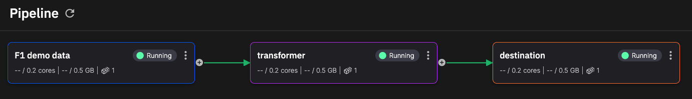

# Sync to Quix Cloud

In this section you sync your local project with Quix Cloud.

## Log in using the CLI

Log into Quix Cloud using the CLI using the following command:

```
quix login
```

If you're not logged into Cloud, you'll be prompted to log in.

## Check your context

The context for the CLI is the combination of the portal URL being used, and the environment you're connecting to. You can check this information with the following command:

```
quix context list
```

You should be connected to the default context with the Portal URL `https://portal-api.platform.quix.io`. You can have multiple contexts to enable you to have connections for production and development brokers, and potentially local brokers. See the [reference guide](cli-reference.md) for further informatin on more complex setups.

## Sync your application

To sync your application, change into the `F1 demo data` directory and enter:

```
quix local pipeline sync --update
```

The `sync` command pushes all changes to your Git repository (it is similar to git add, git commit, git push), and synchronization it with Quix Cloud. You can also add a commit message with the `--commit-message`, or `-m` option if you want. The `--update` option ensures your `quix.yaml` project file is updated as required, based on changes to your applications.

!!! important

    Although you are running this command in an application directory, the command notes any changes outside of the directory, and interactively prompts you to include those changes in the push or not.

## See your pipeline running

In Quix Cloud, go to pipeline view, and see your pipeline running, with your F1 demo data source running.



## Next step

* [Read the CLI reference guide](./cli-reference.md)
