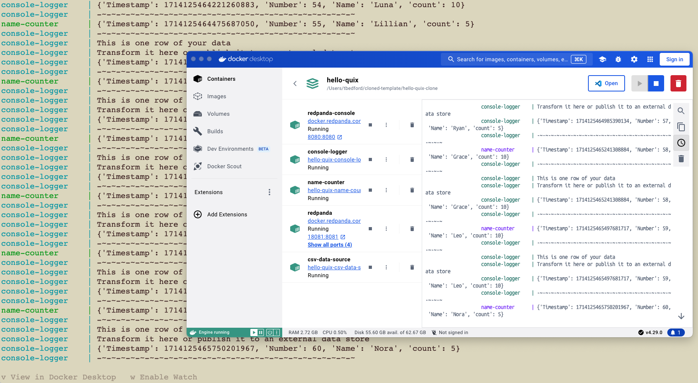

# Using the CLI with a template

In this tutorial you'll step through copying a template project into your Quix account, and then working with it locally using the Quix CLI and docker. You'll also run the Redpanda broker locally using docker, and test out your Quix services coded in Python, using the Quix Streams library.

## Prerequisites

The tutorial assumes you have:

* Docker Desktop (and a docker CLI)
* Quix CLI
* Quix Cloud account

## Step 1: Copy the template

1. Navigate to the templates page and locate the Hello Quix template. 

2. Select the Hello Quix panel and click the `Clone this project` button. 

3. Use the single-click option to create your project in Quix.

4. Navigate into the project environment.

## Step 2: Get your Gitea Git credentials

1. Click on your profile picture, and select `Manage Git credentials`.

2. Make a note of your Gitea username. 

3. Click `Generate new password`, and copy the generated password to your clipboard, and paste it somewhere secure, you'll need this later when you clone the repo locally.

4. Click `Settings` in the bottom left corner of the screen, and then click `Go to project settings` at the top of the panel.

5. Copy the Gitea URL for your project using the button provided.

## Step 3: Clone the project repo

You'll now clone the project repo so you can work on it locally. 

!!! tip

    You could of course work on your pipeline in [Quix Cloud](../develop/overview.md) if you so choose.

1. Create a directory for your project (for example `mkdir hello-quix`), and change into it.

2. Clone the project:

```
git clone https://gitea.platform.quix.io/your-org/hello-quix-clone.git .
```

Use your organization name. You'll be prompted for your Gitea username and password.

You now have a local clone of your project.

## Step 4: Run the project locally

There are various ways you can run your code locally. In this template you can run the entire pipeline locally using docker.

1. To run the pipeline locally:

    ```
    docker compose up --build
    ```

2. See the pipeline running in Docker Desktop by typing `v`:

    

3. Ctrl-C to quit the program whe n you are satisfied it is running correctly.

## Step 5: Modify your code

You can now modify your code in any way you wish. For example, you could edit a `main.py` file to include additional logging (this is just an example, and depends on your actual use case).

## Step 6: Push up your changes

Having worked on your code and tested it locally, you can now push up your code to deploy it in Quix Cloud. You can do this with:

```
quix local deploy --push --sync
```

This pushes (`--push`) your modified code to the Gitea repository. The `--sync` option causes the Gitea repository to be synchronized with your Quix Cloud pipeline view.

In Quix Cloud you can view the pipeline and examine it in detail.


## Next step

* [CLI Reference Guide](./cli-reference.md)
