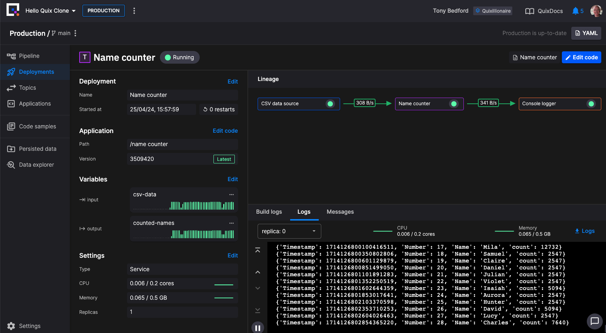

# Using the CLI with a template

In this tutorial you'll step through copying a template project into your Quix account, and then working with it locally using the Quix CLI and docker. You'll also run the Redpanda broker locally using docker, and test out your Quix services coded in Python, using the Quix Streams library.

## Prerequisites

The tutorial assumes you have:

* [Docker Desktop](https://www.docker.com/products/docker-desktop/){target=_blank} (and a docker CLI) installed.
* [Quix CLI](https://github.com/quixio/quix-cli){target=_blank} installed.
* A free [Quix Cloud](https://portal.platform.quix.io/self-sign-up){target=_blank} account. Make sure you are signed up and logged in.

## Step 1: Copy the template

To copy the project template into your Quix Cloud account:

1. Navigate to the [templates page](https://quix.io/templates){target=_blank} and locate the Hello Quix template. 

2. Click the Hello Quix panel and then click the `Clone this project` button.

    You are taken to Quix Cloud.

3. In Quix Cloud, in the `Import project` dialog, use the single-click option to create your project.

4. Navigate into the project environment.

## Step 2: Get your Gitea credentials

To obtain your Gitea credentials:

1. Click on your profile picture in Quix Cloud, and select `Manage Git credentials`.

2. Make a note of your Gitea username. 

3. Click `Generate new password`, and copy the generated password to your clipboard, and paste it somewhere secure, you'll need this later when you clone the repo locally.

4. Click `Settings` in the bottom left corner of the screen, and then click `Go to project settings` at the top of the panel.

5. Copy the Gitea URL for your project using the button provided.

## Step 3: Clone the project repo

You'll now clone the project repo so you can work on it locally. 

!!! tip

    You could of course work on your pipeline in [Quix Cloud](../develop/overview.md) if you so choose.

1. Create a directory for your project (for example `mkdir hello-quix`), and change into it.

2. Clone the project, pasting in the Gitea URL you obtained in Step 2:

    ```
    git clone https://gitea.platform.quix.io/your-org/hello-quix.git .
    ```

    Use your organization name. You'll be prompted for your Gitea username and password.

You now have a local clone of your project.

## Step 4: Run the project locally

There are various ways you can run your code locally. In this tutorial you run the entire pipeline locally using Docker.

1. To run the pipeline locally, in your terminal enter the following command:

    ```
    quix local pipeline up
    ```

    !!! tip 

        You can alternatively use `docker compose up --build`, as this template includes a `docker-compose.yml` file.

2. Switch to Docker Desktop to see the pipeline running.

3. When you are satisfied the pipeline is running correctly, use the following command to shut down the pipeline:

    ```
    quix local pipeline down
    ```

## Step 5: Modify your code

You can now modify your code in any way you wish. For example, you could edit a `main.py` file to include additional logging (this is just an example, and depends on your actual use case).

## Step 6: Push up your changes

Having worked on your code and tested it locally, you can now push up your code to deploy it in Quix Cloud. You can do this with:

```
quix local pipeline sync --update
```

This updates your `quix.yaml` and pushes your modified code to the Gitea repository and syncs with Quix Cloud.

In Quix Cloud you can view the pipeline and examine it in detail.



## Next step

* [CLI Reference Guide](./cli-reference.md)
