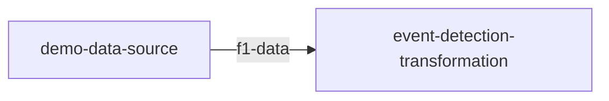

# quix local pipeline view

Update `quix.yaml` with the new local applications and update the variables of the existing deployments

**Usage:**
 
```
quix local pipeline update [options]
```

**Options:**

- `--directory <directory>`: Base directory (defaults to current directory)
- `--existing, --only-existing`: Update only existing deployments
- `--new, --only-new`: Add only the applications that are not currently deployed
- `--current, --only-current`: Update only the deployments of the current application folder. (Fails if not in an `app.yaml` is not in the current directory)
- `--reset`: Removes all deployments from the `quix.yaml` file. This operation is performed before any updates or additions to ensure a clean state
- `-v, --verbose, --verbosity`: Display the verbose output
- `-?, -h, --help`: Show help and usage information

## Example Usage

### Using VS Code

To view the pipeline documentation in VS Code, use the following command:

```
$ quix local pipeline view
✓ 'pipeline.md' was updated
✓ VS Code started
```

This command updates the `pipeline.md` file and opens it in VS Code automatically, allowing you to view and edit your pipeline documentation directly in the editor.


The `pipeline.md` file is generated with the following mermaid code to visualize your pipeline:

```markdown
%%{ init: { 'flowchart': { 'curve': 'monotoneX' } } }%%
graph LR;
demo-data-source[demo-data-source] -->|f1-data|event-detection-transformation[event-detection-transformation];
```

### Without VS Code

If you prefer not to use VS Code or it is not installed, you can still view the pipeline documentation in your browser. Use the same command:

```
$ quix local pipeline view
```

This command will attempt to open the generated `quix-pipeline.html` file in your default browser. If it does not open automatically, you will see a message with a file path like this:

```
Open file:///path/to/your/temp/quix-pipeline.html in your browser if the link didn't open in your browser.
```

Simply click the provided link to access the pipeline documentation.

The `quix-pipeline.html` file will render the following mermaid graph:



!!! tip

    Both `pipeline.md` and `quix-pipeline.html` are automatically updated every time the `quix.yaml` file is modified using the Quix CLI. This ensures that your documentation remains current with the latest configuration changes.