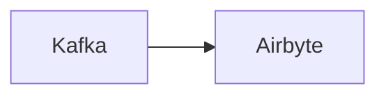

# Connect Kafka to Airbyte

Quix helps you integrate Kafka to Airbyte using pure Python.

## Airbyte

Airbyte is an open-source data integration platform that allows users to easily and efficiently transfer data from various sources to destinations. With its intuitive user interface and broad range of connectors for databases, APIs, and other data sources, Airbyte simplifies the process of extracting, transforming, and loading data for analysis and reporting. The platform supports real-time data replication, schema mapping, and monitoring capabilities, making it an essential tool for data engineers and analysts looking to streamline their data pipeline workflows. Airbyte's robust and scalable architecture ensures reliable data transfer and synchronization, helping organizations of all sizes to make better data-driven decisions.

## Integrations

Quix would be a great fit for integrating with Airbyte due to several reasons. Firstly, both Quix Streams and Quix Cloud are designed to work seamlessly with data processing tools like Kafka, providing a scalable and efficient solution for data integration.

Additionally, Quix Cloud's features such as streamlined development and deployment, enhanced collaboration, real-time monitoring, and flexible scaling perfectly complement Airbyte's capabilities. The platform's support for CI/CD processes and integration with Git providers would also streamline the deployment and management of data pipelines in Airbyte.

Furthermore, Quix Streams' cloud-native library for processing data in Kafka using Python aligns well with Airbyte's mission to simplify and automate data integration processes. The library's benefits such as Python ecosystem integration, serialization and state management, time window aggregations, and resilient scaling make it easier to work with Airbyte's data pipelines.

Overall, integrating Quix with Airbyte would enhance the efficiency, scalability, and collaboration of data integration processes, making it a perfect fit for organizations looking to streamline their data pipelines.

