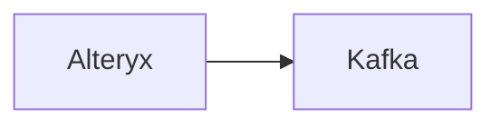

# Connect Kafka to Alteryx

Quix helps you integrate Kafka to Alteryx using pure Python.

## Alteryx

Alteryx is a data analytics platform that allows users to prepare, blend, and analyze data from various sources in a self-service manner. This technology enables businesses to easily combine different data sets, clean and transform data, and perform advanced analytics without the need for extensive programming skills. With Alteryx, organizations can streamline their data workflows, gain valuable insights, and make data-driven decisions quickly and efficiently. The platform also offers capabilities for predictive and spatial analytics, as well as workflow automation, making it a versatile tool for data professionals across industries.

## Integrations

Quix is a good fit for integrating with Alteryx because both platforms offer a comprehensive set of features that streamline the development, deployment, and management of data pipelines. 

Alteryx is a powerful data analytics platform that allows users to blend and analyze data from various sources to gain valuable insights. By integrating Alteryx with Quix, users can leverage the scalability, real-time monitoring, and flexible scaling capabilities of these platforms to enhance their data processing workflows.

Quix Cloud's features such as streamlined development and deployment, real-time monitoring, flexible scaling, and security and compliance measures align well with the requirements of integrating with a technology like Alteryx. Additionally, Quix Streams' ability to process data in Kafka using Python, together with Alteryx's support for Python scripting, ensures seamless integration and interoperability between the two platforms.

Overall, integrating Alteryx with Quix will enable organizations to optimize their data analytics workflows, enhance collaboration, and achieve more efficient and scalable data processing capabilities.

