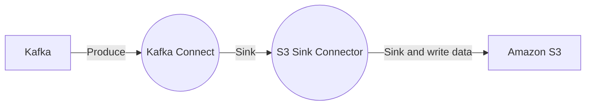

# Connect Kafka to Amazon S3

Quix helps you integrate Kafka to Amazon S3 using pure Python.

## Amazon S3

Amazon S3, also known as Amazon Simple Storage Service, is a highly scalable and reliable storage service provided by Amazon Web Services (AWS). It is designed to store and retrieve any amount of data at any time, making it a popular choice for businesses of all sizes. With Amazon S3, users can store and access their data through a web interface, command line tools, or software developer kits. The service also offers advanced features such as data encryption, versioning, and lifecycle management to ensure data security and compliance. Overall, Amazon S3 provides a cost-effective and efficient solution for storing and managing large amounts of data in the cloud.

## Integrations

Quix Streams and Quix Cloud are both well-suited for integrating with Amazon S3 due to their comprehensive development, deployment, and management capabilities. One key advantage is the support for real-time data processing and monitoring, which aligns with the need for efficient and timely data transfers between Amazon S3 and other systems. 

In particular, Quix Cloud's streamlined development and deployment features make it easy to create and deploy data pipelines that interact with Amazon S3. The platform's collaboration tools ensure that team members can work together effectively on projects involving Amazon S3 integration. Additionally, the real-time monitoring capabilities of Quix Cloud allow users to closely monitor data transfer processes between Amazon S3 and other systems.

On the other hand, Quix Streams' cloud-native architecture and Python interface make it a suitable choice for processing data in Kafka, which can also be integrated with Amazon S3. The ability to handle serialization, state management, and time window aggregations in a Python-friendly way makes it easier to work with data stored in Amazon S3.

Overall, the combination of Quix with Amazon S3 can provide a robust and efficient solution for managing and processing data in real-time, making it a good fit for organizations looking to streamline their data integration processes.

