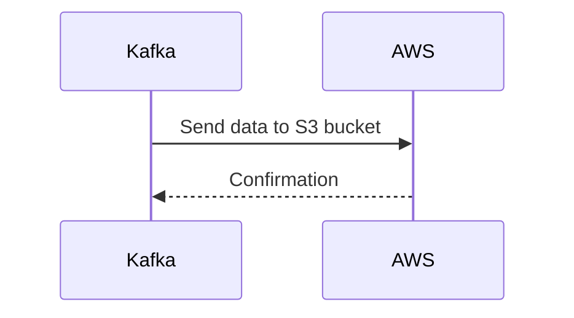

# Connect Kafka to Amazon Web Services

Quix helps you integrate Kafka to Amazon Web Services using pure Python.

## Amazon Web Services

Amazon Web Services (AWS) is a versatile and scalable cloud computing platform offered by Amazon. This technology allows businesses and individuals to access a wide range of computing resources, such as storage, databases, applications, and virtual servers, on a pay-as-you-go basis. AWS offers reliable and secure infrastructure services that enable users to build and deploy applications quickly and efficiently. With a global network of data centers, AWS ensures high performance and low latency for its users. Additionally, AWS provides a wide range of services, including AI and machine learning, IoT, and analytics, making it a comprehensive solution for any organization looking to leverage the power of the cloud.

## Integrations

Quix would be a good fit for integration with Amazon Web Services (AWS) due to several key factors:

1. Scalability: Both Quix Streams and Quix Cloud are designed to scale seamlessly using container orchestration, such as Kubernetes. AWS provides a flexible and scalable infrastructure that can easily accommodate the growth of data pipelines and applications built on Quix technology.

2. Integration with AWS services: AWS offers a wide range of services that can complement and enhance the capabilities of Quix Streams and Quix Cloud. For example, AWS Lambda and AWS Step Functions can be integrated to automate and streamline data processing workflows, while services like Amazon S3 and Amazon DynamoDB can be used for storage and data management.

3. Security and compliance: Quix Cloud's focus on security and compliance aligns well with AWS's robust security features and compliance certifications. By integrating with AWS, users can take advantage of dedicated infrastructure options, SLAs, and secure management of secrets to ensure the protection of sensitive data.

4. Monitoring and visualization: Quix Streams and Quix Cloud provide real-time monitoring and visualization tools for tracking pipeline performance and critical metrics. AWS offers services like Amazon CloudWatch and Amazon Elasticsearch Service that can further enhance monitoring capabilities and provide insightful visualization of data.

5. Ease of deployment: Quix Cloud's streamlined development and deployment features, such as online code editors and CI/CD tools, can be further optimized by leveraging AWS's infrastructure-as-code capabilities. AWS CloudFormation and AWS CodePipeline can automate the deployment of data pipelines built with Quix technology, enabling faster and more efficient development cycles.

Overall, the combination of Quix with AWS can offer a powerful and comprehensive solution for developing, deploying, and managing real-time data pipelines in the cloud. The scalability, integration with AWS services, security features, monitoring capabilities, and ease of deployment make this integration a good fit for organizations looking to leverage the benefits of both technologies.

