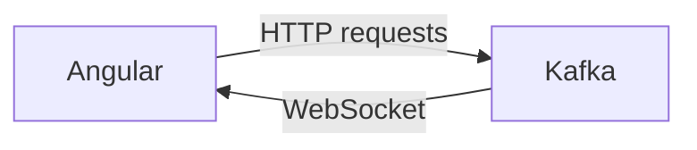

# Connect Kafka to Angular

Quix helps you integrate Kafka to Angular using pure Python.

## Angular

Angular is a popular open-source front-end web application framework developed by Google. It is designed to help developers build dynamic, single-page web applications with ease. Angular uses HTML as its template language and extends it with directives, components, and data binding to help facilitate the development process. It also provides a robust set of tools for routing, form validation, and dependency injection, making it a comprehensive solution for building modern web applications. Additionally, Angular's modular architecture allows for easy code organization and reusability, making it a favorite among developers for building complex and scalable applications.

## Integrations

Quix is a good fit for integrating with the technology called Angular because it provides a comprehensive platform for developing, deploying, and managing real-time data pipelines. Angular, being a popular front-end framework, can benefit from Quix's streamlined development and deployment capabilities, as well as its enhanced collaboration features. 

With Quix Cloud's integrated online code editors and CI/CD tools, developers can easily create and deploy data pipelines, while Angular developers can leverage the platform's YAML synchronization for defining pipelines and environment variables as code. This synchronization can help in maintaining consistency and efficiency in the development process.

Additionally, Quix Cloud's real-time monitoring tools can be useful for Angular developers to monitor pipeline performance, logs, and metrics, providing visibility into the application's behavior and performance. The platform's flexible scaling and management capabilities also allow for easy resource scaling and management, which can complement Angular's scalability requirements.

Furthermore, Quix Cloud's security and compliance features ensure secure management of secrets and adherence to compliance standards, which is crucial for Angular applications handling sensitive data. The platform's development tools, data exploration, visualization capabilities, and Kafka integration can also enhance Angular development by providing seamless workflows, enhanced data processing, and integration with Kafka.

Overall, the combination of Quix with Angular can offer a powerful solution for building, deploying, and managing real-time data pipelines and applications, providing an efficient and collaborative development experience.

