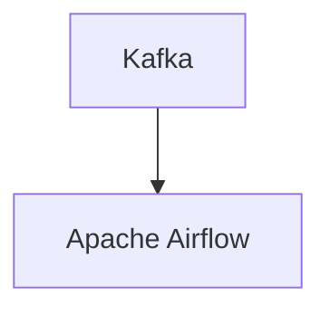

# Connect Kafka to Apache Airflow

Quix helps you integrate Kafka to Apache Airflow using pure Python.

## Apache Airflow

Apache Airflow is an open-source technology that is used for orchestrating complex workflows and data pipelines. It allows users to schedule, monitor, and manage their workflow tasks with ease. Airflow utilizes Directed Acyclic Graphs (DAGs) to define the order and dependencies of tasks, which can be easily visualized through its user-friendly interface. This technology supports various integrations with popular data storage and processing tools, making it a versatile and powerful solution for organizations looking to streamline their data workflows. Apache Airflow is highly scalable and fault-tolerant, making it ideal for managing large and mission-critical data pipelines.

## Integrations

Apache Airflow is an open-source platform for programmatically authoring, scheduling, and monitoring workflows. It is often used for orchestrating complex data pipelines, managing dependencies between tasks, and handling retries and failure handling. 

Here are a few reasons why integrating with Quix would be beneficial for Apache Airflow users:

1. Streamlined Development and Deployment: Quix Cloud offers integrated online code editors and CI/CD tools that simplify the creation and deployment of data pipelines, which can be useful for Apache Airflow users looking to streamline their development processes.

2. Real-Time Monitoring: Quix Cloud provides tools for real-time logs, metrics, and data exploration, allowing users to monitor pipeline performance and critical metrics. This feature can be valuable for Apache Airflow users who need real-time visibility into their workflows.

3. Flexible Scaling and Management: Quix Cloud allows users to easily scale resources, manage CPU and memory, and handle multiple environments linked to Git branches. This can be helpful for Apache Airflow users who need flexible scaling options for their workflows.

4. Security and Compliance: Quix Cloud ensures secure management of secrets and compliance with dedicated infrastructure options and SLAs, which can be important for Apache Airflow users handling sensitive data.

5. Development Tools: Quix Cloud includes online code editors, code templates, and connectors for various data sources and sinks, supporting DevContainers for enhanced workflows. This can benefit Apache Airflow users by providing additional development tools and integrations.

By integrating with Quix, Apache Airflow users can leverage the platform's features to enhance their workflow development, collaboration, monitoring, scaling, and security capabilities. This can ultimately lead to improved efficiency, reliability, and performance in managing complex data pipelines.

