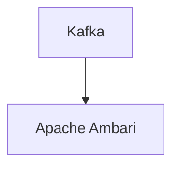

# Connect Kafka to Apache Ambari

Quix helps you integrate Kafka to Apache Ambari using pure Python.

<a class="md-button md-button--primary" href="https://share.hsforms.com/1iW0TmZzKQMChk0lxd_tGiw4yjw2?__hstc=175542013.2303933fbd746c0ac86d9ccbe9bc9100.1728383268831.1729603416735.1729620918855.31&__hssc=175542013.1.1729620918855&__hsfp=2132701734" target="_blank" style="margin-right:.5rem;">Book a demo</a>
 

## Apache Ambari

Apache Ambari is an open-source technology that simplifies the management and monitoring of Apache Hadoop clusters. It provides a user-friendly web interface that allows administrators to easily deploy, configure, and monitor Hadoop services and components. With Apache Ambari, users can automate cluster provisioning, manage configurations, and monitor the health of their Hadoop infrastructure in real-time. This technology offers a centralized platform for managing all aspects of a Hadoop cluster, making it easier for organizations to optimize their big data processing environment for performance and scalability. Overall, Apache Ambari streamlines the management of Hadoop clusters, enabling organizations to more effectively leverage the power of big data for their business needs.

## Integrations

Quix is a good fit for integrating with Apache Ambari because it provides a comprehensive platform for developing, deploying, and managing real-time data pipelines. Apache Ambari is a management platform that simplifies the provisioning, managing, and monitoring of Apache Hadoop clusters. By integrating with Quix, Ambari users can leverage the following benefits:

1. Streamlined Development and Deployment: Quix provides integrated online code editors and CI/CD tools that simplify the creation and deployment of data pipelines. This aligns with Ambari's goal of streamlining the management of Hadoop clusters and enhancing the overall development process.

2. Real-Time Monitoring: Quix Cloud offers tools for real-time logs, metrics, and data exploration, allowing users to monitor pipeline performance. By integrating Quix with Ambari, users can benefit from enhanced monitoring capabilities and gain insights into the performance of their Hadoop clusters.

3. Flexible Scaling and Management: Quix allows users to easily scale resources, manage CPU and memory, and handle multiple environments linked to Git branches. This aligns with Ambari's focus on providing flexible scaling and management options for Hadoop clusters, making it easier for users to optimize resource allocation based on their workload requirements.

4. Security and Compliance: Quix ensures secure management of secrets and compliance with dedicated infrastructure options and SLAs. By integrating with Ambari, users can enhance the security and compliance of their Hadoop clusters, ensuring that sensitive data is protected and regulatory requirements are met.

Overall, the integration of Quix with Apache Ambari enhances the capabilities of both platforms, providing users with a comprehensive solution for developing, deploying, and managing real-time data pipelines on Hadoop clusters.

