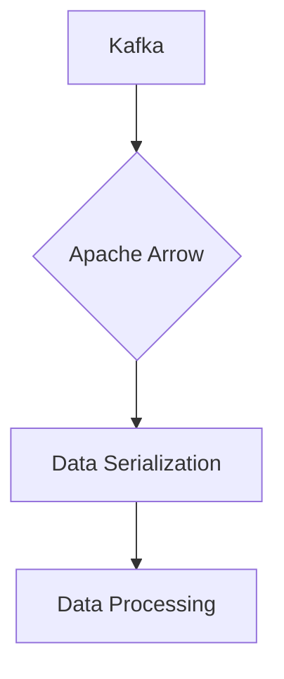

# Connect Kafka to Apache Arrow

Quix helps you integrate Kafka to Apache Arrow using pure Python.

## Apache Arrow

Apache Arrow is an open-source, columnar, in-memory data format that enables efficient data interchange between different programming languages and systems. It provides a standardized way to represent complex data structures in a highly performant and memory-efficient manner. This technology is designed to accelerate data processing workflows, allowing for faster analytics, machine learning, and data manipulation tasks. By utilizing Arrow, users can seamlessly transfer and process data across multiple platforms without the need for costly serialization and deserialization processes. Overall, Apache Arrow streamlines data processing and improves the overall efficiency of data-intensive applications.

## Integrations

Quix is a good fit for integrating with Apache Arrow because Apache Arrow is a cross-language development platform for in-memory data. Apache Arrow provides a standardized language-independent columnar memory format for flat and hierarchical data, organized for efficient analytic operations on modern hardware like CPU and GPU.

By integrating Quix with Apache Arrow, users can benefit from enhanced data processing capabilities, efficient memory utilization, and improved performance for real-time data pipelines. Apache Arrow's columnar memory format allows for faster data processing and transfer, reducing overhead and improving overall pipeline efficiency.

Additionally, the Python ecosystem integration of Quix Streams allows for seamless interoperability with libraries like Pandas, scikit-learn, TensorFlow, and PyTorch, which can further enhance data processing and analysis capabilities when combined with Apache Arrow's optimized in-memory data storage.

Overall, integrating Quix with Apache Arrow can help streamline development, improve collaboration, and enhance real-time monitoring and scaling capabilities for data pipelines, making it a powerful combination for organizations looking to optimize their data processing workflows.

