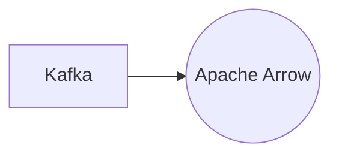

# Connect Kafka to Apache Arrow

Quix helps you integrate Kafka to Apache Arrow using pure Python.

<a class="md-button md-button--primary" href="https://share.hsforms.com/1iW0TmZzKQMChk0lxd_tGiw4yjw2?__hstc=175542013.2303933fbd746c0ac86d9ccbe9bc9100.1728383268831.1729603416735.1729620918855.31&__hssc=175542013.1.1729620918855&__hsfp=2132701734" target="_blank" style="margin-right:.5rem;">Book a demo</a>
 

## Apache Arrow

Apache Arrow is an open-source in-memory columnar data format that is designed to accelerate analytics and data processing tasks. It provides a standardized way for different data processing systems to exchange and process data efficiently, without the need for expensive data serialization and deserialization. By storing data in a columnar format, Apache Arrow reduces memory overhead and allows for faster querying and analysis. Additionally, Arrow's cross-language support allows for seamless integration with a variety of programming languages, making it a versatile and powerful tool for data processing tasks. Overall, Apache Arrow is a key technology for improving the speed and efficiency of data processing workflows.

## Integrations

Quix is a good fit for integrating with Apache Arrow because of its focus on streamlining development, enhancing collaboration, real-time monitoring, and flexible scaling capabilities. 

Apache Arrow is a data processing technology that focuses on in-memory analytics, allowing for efficient data interchange between different systems. Quix's comprehensive platform, with features such as streamlined development and deployment, real-time monitoring, and flexible scaling, align well with the goals of Apache Arrow.

Quix's integrated online code editors and CI/CD tools can easily incorporate Apache Arrow into data pipelines, simplifying the development process. Enhanced collaboration features and organization management in Quix can facilitate the integration of Apache Arrow by providing visibility and control over the data processes.

Real-time monitoring tools in Quix can effectively track the performance of Apache Arrow-based data pipelines, ensuring efficient operations. Additionally, Quix's flexible scaling and management capabilities can easily accommodate the resource needs of Apache Arrow, allowing for seamless scaling of data processing tasks.

With Quix's focus on security and compliance, integrating with Apache Arrow ensures that data processing tasks are secure and compliant with regulations. The development tools and data exploration features in Quix can enhance the integration with Apache Arrow by providing additional capabilities for analyzing and visualizing data processed through Apache Arrow technology.

In addition, Quix Streams, a cloud-native library that works seamlessly with Apache Kafka using Python, can further enhance the integration with Apache Arrow. The serialization, state management, and time window aggregations supported by Quix Streams complement the capabilities of Apache Arrow, providing a robust and scalable solution for processing and analyzing data in real-time.

