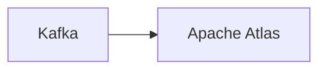

# Connect Kafka to Apache Atlas

Quix helps you integrate Kafka to Apache Atlas using pure Python.

## Apache Atlas

Apache Atlas is an open-source metadata management and governance tool that provides a comprehensive platform for metadata management, data governance, and data lineage. It allows organizations to catalog, search, and understand their data assets across multiple systems and platforms. Apache Atlas enables users to define and capture metadata, create custom taxonomies, and establish policies for data governance and compliance. By providing visibility into data lineage and relationships, Apache Atlas helps organizations to trace and track the flow of data across their systems, ensuring data accuracy, reliability, and compliance with regulatory requirements. This technology is essential for organizations looking to establish a robust data governance framework and ensure data quality and integrity.

## Integrations

Apache Atlas is a powerful metadata management tool that provides a comprehensive view of the data landscape within an organization. It allows users to classify, manage, and govern metadata to ensure data quality, data lineage, and compliance with regulations.

Quix is a great fit for integrating with Apache Atlas because it provides a robust platform for developing and managing real-time data pipelines. The streamlined development and deployment features of Quix Cloud make it easy to create data pipelines and manage them efficiently. By integrating with Apache Atlas, users can easily classify and tag the metadata associated with these pipelines, providing valuable context and ensuring data lineage and compliance.

Additionally, the real-time monitoring capabilities of Quix Cloud allow users to track the performance of their data pipelines and monitor critical metrics, which can be invaluable when managing data governance and compliance. The flexibility of scaling and resource management in Quix Cloud also aligns well with the governance and data management capabilities of Apache Atlas, allowing users to easily manage and scale their data pipelines while maintaining the necessary level of security and compliance.

Overall, the features and capabilities of Quix make it an ideal choice for integrating with Apache Atlas to enhance metadata management, data governance, and compliance within an organization's data landscape.

