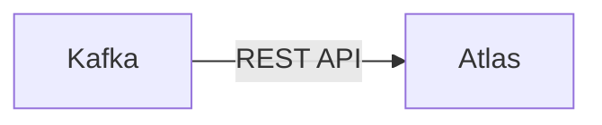

# Connect Kafka to Apache Atlas

Quix helps you integrate Kafka to Apache Atlas using pure Python.

- __Find out how we can help you integrate!__

    <a class="md-button md-button--primary" href="https://share.hsforms.com/1iW0TmZzKQMChk0lxd_tGiw4yjw2?__hstc=175542013.2303933fbd746c0ac86d9ccbe9bc9100.1728383268831.1729603416735.1729620918855.31&__hssc=175542013.1.1729620918855&__hsfp=2132701734" target="_blank" style="margin:.5rem;">Book a demo</a>

## Apache Atlas

Apache Atlas is an open-source technology that provides metadata management and governance capabilities for organizations managing large volumes of data. It allows users to classify, analyze, and manage metadata about their data assets, enabling better data management, compliance, and governance. Apache Atlas also provides a centralized platform for data governance policies, lineage tracking, and data lineage visualization, making it easier for organizations to understand the flow and usage of their data. This technology plays a crucial role in enabling organizations to achieve greater data clarity, consistency, and compliance in their data environments.

## Integrations

Quix is a good fit for integrating with Apache Atlas because it offers a comprehensive platform for developing, deploying, and managing real-time data pipelines. Apache Atlas is a technology that provides metadata management and governance capabilities for Hadoop ecosystems. By integrating Quix with Apache Atlas, organizations can enhance their metadata management, data governance, and data lineage tracking capabilities.

Quix's features such as streamlined development and deployment, enhanced collaboration, real-time monitoring, and flexible scaling align well with the goals of Apache Atlas. Quix's integration with Git providers like GitHub also facilitates seamless CI/CD processes, which can help organizations ensure the consistency and reliability of their data pipelines.

Additionally, Quix Streams, a cloud-native library for processing data in Kafka using Python, can further enhance the integration with Apache Atlas. The Python ecosystem integration of Quix Streams allows for seamless integration with various data processing libraries, making it easier for organizations to work with their data in a way that aligns with their existing workflows.

Overall, the combination of Quix's features and capabilities with Apache Atlas's metadata management and governance features can provide organizations with a powerful solution for managing and optimizing their real-time data pipelines.

