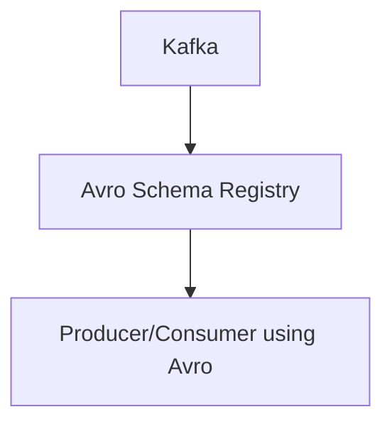

# Connect Kafka to Apache Avro

Quix helps you integrate Kafka to Apache Avro using pure Python.

## Apache Avro

Apache Avro is a data serialization system that is designed for efficient and compact data interchange. It uses a schema to define the structure of the data, allowing for flexible and dynamic data representation. Avro supports rich data types, including primitive types, arrays, maps, and records, making it ideal for complex data structures. Avro also provides features for data validation, versioning, and evolution, ensuring compatibility between different versions of data schemas. With its compact binary encoding and schema resolution capabilities, Apache Avro is a popular choice for Hadoop-based data processing systems and streaming applications.

## Integrations

Apache Avro is a popular data serialization format that is commonly used in big data processing pipelines. It provides a compact, fast, and schema-based serialization system, making it an ideal choice for integrating with real-time data processing platforms like Quix.

Here are a few reasons why Quix is a good fit for integrating with Apache Avro:

1. Schema Evolution: Apache Avro supports schema evolution, allowing developers to easily update data schemas without breaking compatibility. Quix can leverage this feature to handle changes in data structure seamlessly within the data pipelines.

2. Integration with Data Sources: Quix offers a range of connectors for various data sources and sinks, making it easy to ingest and process data in Apache Avro format. This simplifies the integration process and ensures compatibility with different data formats.

3. Real-Time Processing: Apache Avro is optimized for efficient serialization and deserialization, making it well-suited for real-time data processing. Quix's real-time monitoring and scaling capabilities complement this feature, providing a robust platform for processing and analyzing data in Apache Avro format.

4. Compatibility with Python: Quix Streams is a cloud-native library for processing data in Kafka using Python. Since Apache Avro can be easily integrated with Python libraries like Pandas, scikit-learn, and TensorFlow, the combination of Quix Streams and Apache Avro provides a seamless workflow for data processing and analysis in a Python environment.

Overall, the combination of Quix's features such as streamlined development, enhanced collaboration, real-time monitoring, and flexible scaling, along with Apache Avro's schema evolution, data serialization, and Python compatibility, makes it a good fit for integrating and processing data in Apache Avro format efficiently and effectively within a real-time data pipeline.

