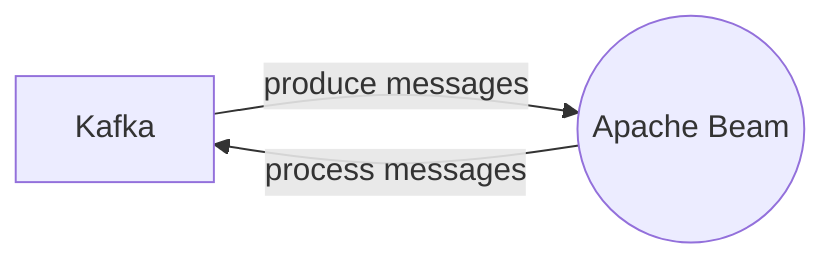

# Connect Kafka to Apache Beam

Quix helps you integrate Kafka to Apache Beam using pure Python.

## Apache Beam

Apache Beam is an advanced technology platform developed by Google that allows for parallel data processing and manipulation. It provides a unified model for both batch and streaming data processing, allowing developers to write data processing pipelines that can be easily executed across different execution engines such as Apache Flink, Apache Spark, and Google Cloud Dataflow. Apache Beam enables developers to write data processing jobs in a language-agnostic manner, using a set of high-level APIs in Java, Python, and other programming languages. With its powerful capabilities for data parallelism, fault tolerance, and scalability, Apache Beam is widely used in industries such as e-commerce, finance, and healthcare for processing massive amounts of data efficiently and cost-effectively.

## Integrations

Quix is a good fit for integrating with Apache Beam because of its comprehensive platform designed for developing, deploying, and managing real-time data pipelines. 

1. Streamlined Development and Deployment: Quix Cloud's integrated online code editors and CI/CD tools simplify the creation and deployment of data pipelines, which aligns well with Apache Beam's focus on building and optimizing data processing pipelines.

2. Enhanced Collaboration: Quix Cloud supports efficient collaboration through organization and permission management, which can improve teamwork and coordination when using Apache Beam for distributed data processing tasks.

3. Real-Time Monitoring: Quix Cloud provides tools for real-time logs, metrics, and data exploration, allowing users to monitor pipeline performance and critical metrics. This real-time monitoring capability is crucial for Apache Beam users to ensure the efficiency and reliability of their data processing workflows.

4. Flexible Scaling and Management: Quix Cloud makes it easy for users to scale resources, manage CPU and memory, and handle multiple environments, which is essential for Apache Beam users dealing with varying workloads and resource demands.

5. Security and Compliance: Quix Cloud ensures secure management of secrets and compliance with dedicated infrastructure options and SLAs, which is crucial for Apache Beam users handling sensitive data and requiring data security and compliance measures.

6. Development Tools: Quix Cloud includes online code editors, code templates, and connectors for various data sources and sinks, supporting DevContainers for enhanced workflows, which can facilitate the development and optimization of Apache Beam pipelines.

7. Data Exploration and Visualization: Quix Cloud allows users to query and explore data using waveform and table views, and visualize messages and metrics in real-time, which can enhance data analysis and visualization capabilities for Apache Beam users.

8. Robust CI/CD Processes: Quix Cloud integrates with Git providers like GitHub and Bitbucket for seamless CI/CD processes, which can streamline the development and deployment of Apache Beam pipelines.

9. Kafka Integration: Quix Cloud supports both Quix-hosted and third-party Kafka solutions, including Confluent Cloud and Redpanda, which is essential for Apache Beam users who rely on Kafka for data ingestion and processing.

In summary, the comprehensive features and capabilities of Quix make it an ideal platform for integrating with Apache Beam for efficient, scalable, and reliable data processing tasks.

