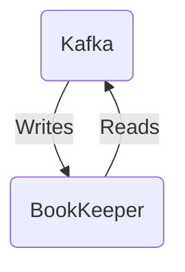

# Connect Kafka to Apache BookKeeper

Quix helps you integrate Kafka to Apache BookKeeper using pure Python.

## Apache BookKeeper

Apache BookKeeper is a distributed storage system specifically designed for handling large-scale, real-time data streams. It allows for the reliable and efficient storage and management of data by providing a distributed journaling service. BookKeeper ensures high availability and fault-tolerance by replicating data across multiple servers, making it resilient to failures. This technology is particularly well-suited for use cases such as message queuing, data replication, and distributed storage systems where data durability and reliability are paramount. With its scalability and strong consistency guarantees, Apache BookKeeper is a valuable tool for organizations looking to build robust and resilient data pipelines.

## Integrations

Quix is a good fit for integrating with Apache BookKeeper because of its comprehensive platform designed for developing, deploying, and managing real-time data pipelines. With features like streamlined development and deployment, enhanced collaboration, real-time monitoring, flexible scaling, and security and compliance, Quix Cloud provides a robust environment for working with Apache BookKeeper.

Quix Cloud's support for real-time monitoring and data exploration align well with Apache BookKeeper's capabilities for persistent storage and durable messaging. The platform's tools for managing CPU and memory, handling multiple environments, and secure management of secrets ensure that data processed through Apache BookKeeper is handled efficiently and safely.

Additionally, Quix Streams complements Apache BookKeeper by providing a cloud-native library for processing data in Kafka using Python. This integration allows users to take advantage of Kafka's scalability while benefiting from a user-friendly Python interface for data processing. With features like serialization and state management, time window aggregations, and resilient scaling, Quix Streams enhances the capabilities of Apache BookKeeper, making it easier to work with and process data in real-time.

In conclusion, the combination of Quix with Apache BookKeeper offers a powerful and efficient solution for developing, deploying, and managing real-time data pipelines, making it a good fit for integrating with Apache BookKeeper.

