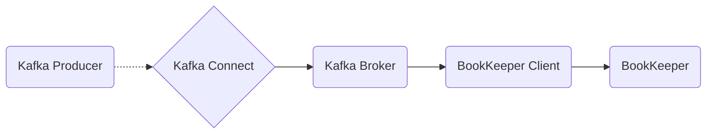

# Connect Kafka to Apache BookKeeper

Quix helps you integrate Kafka to Apache BookKeeper using pure Python.

<a class="md-button md-button--primary" href="https://share.hsforms.com/1iW0TmZzKQMChk0lxd_tGiw4yjw2?__hstc=175542013.2303933fbd746c0ac86d9ccbe9bc9100.1728383268831.1729603416735.1729620918855.31&__hssc=175542013.1.1729620918855&__hsfp=2132701734" target="_blank" style="margin-right:.5rem;">Book a demo</a>
 

Here is a simple Mermaid diagram for integrating Kafka with Apache BookKeeper:

## Apache BookKeeper

Apache BookKeeper is a reliable and durable distributed log storage tool that is built to handle high-throughput and low-latency data streams. It is designed to efficiently store and replicate write-ahead logs across multiple servers, ensuring data durability and fault tolerance. BookKeeper is widely used in distributed systems for tasks such as distributed messaging, replication, and data storage. It is built for scalability, making it easy to add new nodes to the cluster as data volumes grow. With its efficient storage and replication mechanisms, Apache BookKeeper is a powerful tool for managing large-scale distributed data streams effectively.

## Integrations

Quix is a good fit for integrating with Apache BookKeeper because it offers a comprehensive platform for developing, deploying, and managing real-time data pipelines. Apache BookKeeper is a distributed storage system specifically designed for storing streams of data. By integrating Quix with Apache BookKeeper, organizations can benefit from streamlined development and deployment processes, enhanced collaboration capabilities, real-time monitoring and scaling capabilities, and robust CI/CD processes.

With Quix's streamlined development and deployment features, organizations can easily create and deploy data pipelines, making it easier to work with Apache BookKeeper's data streams. The platform's enhanced collaboration tools also enable efficient teamwork, allowing multiple team members to work together on data pipeline projects.

Additionally, Quix's real-time monitoring capabilities are well-suited for monitoring the performance of data pipelines stored in Apache BookKeeper, providing users with valuable insights into pipeline performance and critical metrics. The platform's flexible scaling and management options also make it easy to scale resources as needed and manage multiple environments linked to Git branches.

Quix's integration with Git providers like GitHub and Bitbucket further enhances the CI/CD processes, ensuring that changes to data pipelines stored in Apache BookKeeper can be seamlessly integrated and deployed. Overall, Quix's development tools, real-time monitoring capabilities, and robust CI/CD processes make it a strong candidate for integrating with Apache BookKeeper to streamline data processing and analytics workflows.

