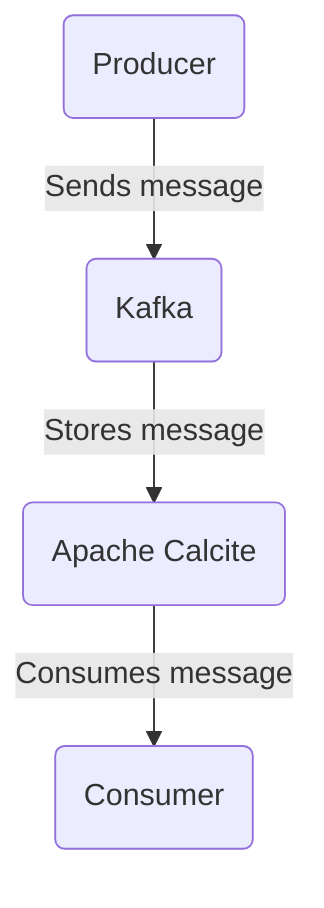

# Connect Kafka to Apache Calcite

Quix helps you integrate Kafka to Apache Calcite using pure Python.

## Apache Calcite

Apache Calcite is an open-source framework that provides a way for developers to build data management and analysis applications using a unified interface. It offers a wide range of capabilities, including query optimization, parsing, validation, and execution. With Apache Calcite, developers can easily integrate different data sources, such as SQL databases, NoSQL databases, and streaming data sources, into their applications. The framework also allows for seamless integration with popular programming languages, such as Java and Python, making it a flexible and powerful tool for building data-centric applications. Apache Calcite is actively maintained by the Apache Software Foundation and is widely used in industry for various data analytics projects.

## Integrations

Quix is a good fit for integrating with Apache Calcite because of their shared focus on streamlining development, enhancing collaboration, and providing real-time monitoring and scaling capabilities. Apache Calcite is a powerful framework for building SQL engines and optimizing query processing, making it a valuable tool for managing and analyzing data in real-time pipelines.

With Quix Streams' ability to process data in Kafka using Python and its support for time window aggregations, serialization, and state management, it can easily work alongside Apache Calcite to optimize query processing and enhance data analysis capabilities. Additionally, Quix Cloud's features such as streamlined development and deployment, real-time monitoring, and flexible scaling and management make it a convenient platform for integrating with Apache Calcite to build efficient and scalable data pipelines.

By combining the capabilities of Quix with Apache Calcite, organizations can create a comprehensive and efficient solution for managing and analyzing real-time data, improving performance, scalability, and collaboration in their data pipelines.

