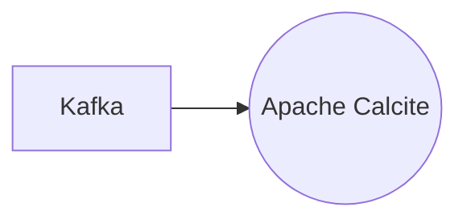

# Connect Kafka to Apache Calcite

Quix helps you integrate Kafka to Apache Calcite using pure Python.

<a class="md-button md-button--primary" href="https://share.hsforms.com/1iW0TmZzKQMChk0lxd_tGiw4yjw2?__hstc=175542013.2303933fbd746c0ac86d9ccbe9bc9100.1728383268831.1729603416735.1729620918855.31&__hssc=175542013.1.1729620918855&__hsfp=2132701734" target="_blank" style="margin-right:.5rem;">Book a demo</a>
 

## Apache Calcite

Apache Calcite is an open-source framework for building databases and data management systems. It provides a way to easily create, optimize, and execute SQL queries on a variety of data sources, including traditional databases, data lakes, and streaming data sources. Calcite uses a relational algebra and query optimization techniques to efficiently process queries and deliver fast performance. It also supports a wide range of data formats and allows for seamless integration with various data processing tools and platforms. With its flexibility and extensibility, Apache Calcite is a powerful tool for developers and data engineers looking to build scalable and high-performance data management solutions.

## Integrations

Quix is a good fit for integrating with Apache Calcite because it offers a comprehensive platform for developing, deploying, and managing real-time data pipelines. Apache Calcite is a dynamic data management framework that provides capabilities for parsing SQL queries, optimizing query plans, and executing queries against various data sources.

Quix's features such as streamlined development and deployment, enhanced collaboration, real-time monitoring, flexible scaling and management, security and compliance, development tools, data exploration and visualization, robust CI/CD processes, and Kafka integration align well with the functionalities provided by Apache Calcite. 

Quix Cloud's support for real-time logs, metrics, and data exploration complements Apache Calcite's capabilities in optimizing query plans and monitoring query performance. Additionally, Quix Streams, a cloud-native library for processing data in Kafka using Python, can work seamlessly with Apache Calcite's ability to execute queries against Kafka data sources.

Furthermore, Quix's focus on scalable and resilient operations, integration with Python ecosystems, support for serialization and state management, and container orchestration capabilities make it well-suited for leveraging Apache Calcite's strengths in query optimization and data processing. The compatibility of Quix with Apache Calcite can enhance the development and deployment of real-time data pipelines and enable efficient data management and processing workflows.

