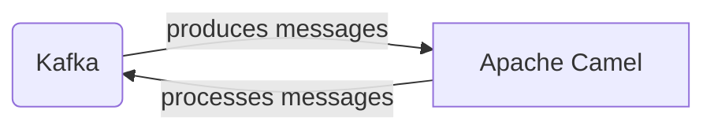

# Connect Kafka to Apache Camel

Quix helps you integrate Kafka to Apache Camel using pure Python.

- __Find out how we can help you integrate!__

    <a class="md-button md-button--primary" href="https://share.hsforms.com/1iW0TmZzKQMChk0lxd_tGiw4yjw2?__hstc=175542013.2303933fbd746c0ac86d9ccbe9bc9100.1728383268831.1729603416735.1729620918855.31&__hssc=175542013.1.1729620918855&__hsfp=2132701734" target="_blank" style="margin:.5rem;">Book a demo</a>

## Apache Camel

Apache Camel is an open-source integration framework that helps developers build and manage applications by providing a powerful set of capabilities for routing, transformation, and mediation of data between different systems. It allows for the seamless integration of various software components regardless of the technologies they are built with, making it a versatile tool for connecting disparate systems and applications. With a rich library of components and connectors, Apache Camel simplifies the process of creating complex routing and messaging patterns, enabling developers to focus on the business logic of their applications rather than the intricate details of integration. Its lightweight and modular architecture make it easy to deploy and scale, making Apache Camel a popular choice for building scalable and resilient applications in today's interconnected digital landscape.

## Integrations

Quix is a good fit for integrating with Apache Camel because Quix Cloud offers a comprehensive platform for developing, deploying, and managing real-time data pipelines, which aligns well with Apache Camel's capabilities for integrating various systems and applications. 

Some of the key components of Quix Cloud, such as streamlined development and deployment, enhanced collaboration, real-time monitoring, flexible scaling and management, and security and compliance, complement Apache Camel's functionalities by providing a robust and efficient environment for building and managing data pipelines. 

Additionally, Quix Streams, a cloud-native library for processing data in Kafka using Python, integrates seamlessly with Apache Camel's support for Apache Kafka. Quix Streams' features such as Python ecosystem integration, serialization and state management, time window aggregations, resilient scaling, and local and Jupyter notebook support can enhance the capabilities of Apache Camel in processing and handling data streams. 

Overall, Quix's focus on real-time data processing, scalability, and collaboration makes it a suitable choice for integrating with Apache Camel to build reliable and efficient data integration and processing solutions.

