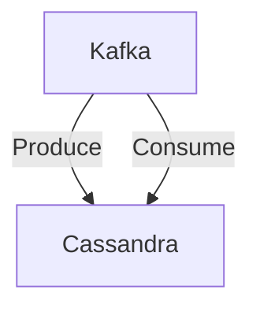

# Connect Kafka to Apache Cassandra

Quix helps you integrate Kafka to Apache Cassandra using pure Python.

## Apache Cassandra

Apache Cassandra is a highly scalable and decentralized open-source distributed database management system that is designed to handle large amounts of data spread across multiple servers. It is known for its fault tolerance, allowing for uninterrupted operation even in the case of server failures. Cassandra uses a masterless architecture that allows for high availability and low latency, making it a popular choice for applications requiring real-time analytics and high performance. Its flexible data model allows for easy scaling and replication, making it an ideal option for organizations with rapidly growing data requirements. Overall, Apache Cassandra is a powerful and efficient technology that is well-suited for managing large-scale data sets in a reliable and efficient manner.

## Integrations

Quix is a good fit for integrating with Apache Cassandra due to several reasons:

1. Real-Time Data Processing: Both Quix Streams and Quix Cloud are designed for real-time data processing, which aligns well with Apache Cassandra's capabilities in handling high-velocity data. Cassandra's distributed architecture allows for scalable and low-latency data processing, making it an ideal choice for real-time applications.

2. Scalability and Flexibility: Quix Cloud's flexible scaling and management features, combined with Apache Cassandra's ability to scale horizontally, provide a robust solution for handling large volumes of data. The combination allows for seamless scalability as data volumes and processing requirements grow.

3. Integration with Kafka: Quix Cloud supports integration with Kafka, a popular distributed streaming platform. Apache Cassandra can also be integrated with Kafka for data ingestion and processing. By leveraging both platforms, users can build end-to-end data pipelines that seamlessly ingest, process, and store data in real-time.

4. Data Exploration and Visualization: Quix Cloud provides tools for data exploration and visualization, allowing users to monitor pipeline performance and metrics in real-time. Integrating with Apache Cassandra enables users to store and query large datasets efficiently, enhancing data exploration and analytics capabilities.

5. Security and Compliance: Quix Cloud ensures secure management of secrets and compliance with dedicated infrastructure options. When integrated with Apache Cassandra, users can benefit from Cassandra's built-in security features, ensuring data protection and compliance with industry regulations.

Overall, the combination of Quix with Apache Cassandra provides a comprehensive solution for building real-time data pipelines, processing high-velocity data, and enabling seamless scalability and security.

