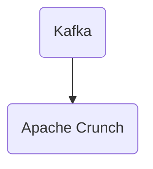

# Connect Kafka to Apache Crunch

Quix helps you integrate Kafka to Apache Crunch using pure Python.

## Apache Crunch

Apache Crunch is a technology designed for processing big data workloads in a distributed computing environment. It provides a high-level, concise API for developers to write MapReduce pipelines without having to worry about the complexities of coding directly in MapReduce. With Apache Crunch, developers can write their data processing operations in Java and execute them on various computing frameworks such as Apache Hadoop or Apache Spark. This technology streamlines the data processing workflow and improves performance by optimizing data pipelines for parallel execution. Apache Crunch is a powerful tool for handling large-scale data processing tasks efficiently and effectively.

## Integrations

Quix is a good fit for integrating with Apache Crunch because of the following reasons:

1. Enhanced Collaboration: Both Quix Streams/Quix Cloud and Apache Crunch support efficient collaboration through organization and permission management. By integrating the two technologies, teams can work together seamlessly on developing and deploying data pipelines, increasing project visibility and control.

2. Flexible Scaling and Management: Quix Cloud offers flexible scaling capabilities, allowing users to easily scale resources and manage CPU and memory. When integrated with Apache Crunch, users can take advantage of this flexibility to handle large volumes of data efficiently and effectively.

3. Real-Time Monitoring: Quix Cloud provides tools for real-time monitoring of pipeline performance and critical metrics. By integrating with Apache Crunch, users can leverage this functionality to monitor and optimize data processing in real-time, ensuring smooth and efficient data pipeline operations.

4. Data Exploration and Visualization: Quix Cloud allows users to query, explore, and visualize data in real-time. By integrating with Apache Crunch, users can enhance their data exploration and visualization capabilities, enabling them to gain valuable insights from their data more effectively.

Overall, the integration of Quix with Apache Crunch can streamline the development, deployment, and management of data pipelines, enhance collaboration, provide real-time monitoring and scaling capabilities, and improve data exploration and visualization, making it a good fit for organizations looking to leverage these technologies together.

