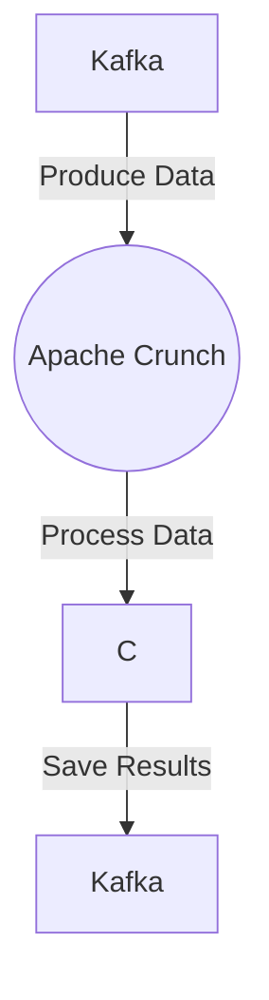

# Connect Kafka to Apache Crunch

Quix helps you integrate Kafka to Apache Crunch using pure Python.

<a class="md-button md-button--primary" href="https://share.hsforms.com/1iW0TmZzKQMChk0lxd_tGiw4yjw2?__hstc=175542013.2303933fbd746c0ac86d9ccbe9bc9100.1728383268831.1729603416735.1729620918855.31&__hssc=175542013.1.1729620918855&__hsfp=2132701734" target="_blank" style="margin-right:.5rem;">Book a demo</a>
 

## Apache Crunch

Apache Crunch is a powerful technology that provides a simple and efficient way to process and analyze large amounts of data on distributed systems, such as Hadoop. It offers a high-level API that allows users to write complex data processing pipelines using familiar programming constructs, while automatically optimizing the execution of these pipelines for maximum performance. Apache Crunch also supports various data sources and file formats, making it easy to integrate with existing data infrastructure. With its ability to handle terabytes or even petabytes of data, Apache Crunch is a valuable tool for organizations looking to extract valuable insights from their big data.

## Integrations

Quix is a good fit for integrating with Apache Crunch because it provides a comprehensive platform for developing, deploying, and managing real-time data pipelines. Quix Cloud offers features that align well with the requirements of Apache Crunch, such as streamlined development and deployment, enhanced collaboration, real-time monitoring and scaling capabilities, security and compliance measures, development tools, data exploration and visualization options, robust CI/CD processes, and Kafka integration.

Specifically, Quix Cloud's features like streamlined development and deployment, including online code editors and CI/CD tools, can help in simplifying the creation and deployment of data pipelines using Apache Crunch. The platform's support for organization and permission management promotes efficient collaboration, which is crucial for working with Apache Crunch in team environments.

Additionally, Quix Cloud's real-time monitoring tools can be beneficial for Apache Crunch users to monitor pipeline performance and critical metrics. The platform's flexibility in scaling resources and managing multiple environments can also support the scalability requirements of Apache Crunch pipelines.

Moreover, Quix Streams, a cloud-native library for processing data in Kafka using Python, complements the capabilities of Apache Crunch by offering features like serialization and state management, time window aggregations, and resilient scaling. This integration further enhances the functionality and efficiency of data processing workflows within the Apache Crunch environment.

In conclusion, Quix's comprehensive platform, along with its compatibility with Apache Crunch and Quix Streams, makes it a good fit for organizations looking to leverage the power of Apache Crunch for real-time data processing and analytics.

