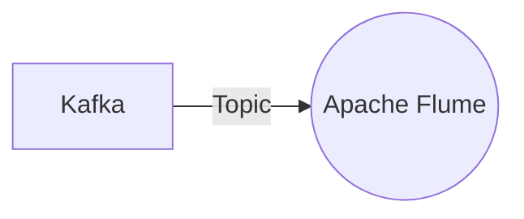

# Connect Kafka to Apache Flume

Quix helps you integrate Kafka to Apache Flume using pure Python.

<a class="md-button md-button--primary" href="https://share.hsforms.com/1iW0TmZzKQMChk0lxd_tGiw4yjw2?__hstc=175542013.2303933fbd746c0ac86d9ccbe9bc9100.1728383268831.1729603416735.1729620918855.31&__hssc=175542013.1.1729620918855&__hsfp=2132701734" target="_blank" style="margin-right:.5rem;">Book a demo</a>
 

## Apache Flume

Apache Flume is an open-source technology used for efficiently collecting, aggregating, and moving large amounts of data from various sources to a centralized storage repository. It is designed to handle streaming data such as logs, events, and clickstreams in real-time, making it a valuable tool for organizations looking to process and analyze data quickly. Flume uses a simple and flexible architecture, with the ability to scale horizontally to handle increasing data volumes. It also offers robust reliability and fault tolerance features, ensuring that data is not lost in transit. Overall, Apache Flume is a powerful and versatile solution for managing data ingestion in a distributed environment.

## Integrations

Quix is a good fit for integrating with Apache Flume because of its comprehensive platform that is designed for developing, deploying, and managing real-time data pipelines. Quix offers a range of features that align well with the capabilities of Apache Flume, including streamlined development and deployment, enhanced collaboration, real-time monitoring, flexible scaling and management, security and compliance, development tools, data exploration and visualization, robust CI/CD processes, and Kafka integration.

Quix Cloud's feature set complements Apache Flume's capabilities by providing a streamlined development and deployment process through integrated online code editors and CI/CD tools. This simplifies the creation and deployment of data pipelines, making it easier to work with Apache Flume's data ingestion and transfer capabilities. Additionally, Quix Cloud's enhanced collaboration tools, real-time monitoring capabilities, and flexible scaling and management options align well with the requirements for efficiently integrating with Apache Flume.

Moreover, Quix Streams, a cloud-native library for processing data in Kafka using Python, further enhances the integration potential with Apache Flume. Quix Streams operates without a server-side engine or orchestrator, making it ideal for integrating with Apache Flume's data processing capabilities. It also seamlessly integrates with Python libraries like Pandas, scikit-learn, TensorFlow, and PyTorch, providing a familiar programming environment for users working with Apache Flume and Quix in tandem.

Overall, the combination of Quix's comprehensive platform features, such as real-time monitoring, security and compliance, and Kafka integration, along with the capabilities of Quix Streams for processing data in Kafka using Python, make Quix a strong candidate for integrating with Apache Flume in data pipeline development and management.

