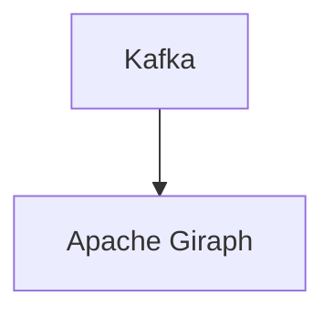

# Connect Kafka to Apache Giraph

Quix helps you integrate Kafka to Apache Giraph using pure Python.

## Apache Giraph

Apache Giraph is an open-source technology that is used for large-scale graph processing. It provides a framework for processing graph data sets in a parallel and distributed environment, allowing for efficient analysis of relationships and connections within the data. Giraph is built on top of Apache Hadoop and designed to handle complex graph algorithms with high scalability and fault tolerance. With its ability to process data in parallel across multiple machines, Apache Giraph is well-suited for analyzing social networks, web graphs, and other big data sets that can be represented as graphs. Overall, Apache Giraph is a powerful tool for handling graph processing tasks in a distributed computing environment.

## Integrations

Quix is a good fit for integrating with Apache Giraph because both platforms offer features that are essential for developing and deploying real-time data processing pipelines. 

1. Streamlined Development and Deployment: Quix Cloud provides integrated online code editors and CI/CD tools, making it easy to create and deploy data pipelines. This seamless workflow aligns with Apache Giraph's need for efficient development and deployment processes.

2. Real-Time Monitoring: Both platforms offer real-time monitoring capabilities, allowing users to easily track pipeline performance and critical metrics. This is crucial for Apache Giraph, which requires real-time insights into the data processing tasks being performed.

3. Flexible Scaling and Management: Quix Cloud supports flexible resource scaling and management options, which can be beneficial for Apache Giraph's distributed computing requirements. Users can easily manage CPU and memory resources to optimize performance.

4. Collaboration and Security: Quix Cloud enhances collaboration through organization and permission management features. This ensures project visibility and control, which is important for secure and efficient data processing tasks in Apache Giraph.

5. Integration with Apache Kafka: Quix Cloud supports integration with Kafka, which is often used as a data source in Apache Giraph. This seamless integration streamlines the data processing pipeline, making it easier to work with Apache Giraph.

In summary, the comprehensive features provided by Quix align well with the requirements of Apache Giraph, making it a suitable platform for integrating with this technology for developing and managing real-time data pipelines.

