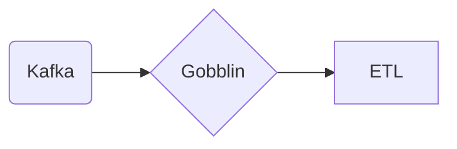

# Connect Kafka to Apache Gobblin

Quix helps you integrate Kafka to Apache Gobblin using pure Python.

## Apache Gobblin

Apache Gobblin is an open-source data integration framework that is designed to simplify the process of ingesting, transforming, and managing large volumes of data. It provides a flexible and scalable platform for extracting data from various sources, such as databases, APIs, and logs, and loading it into data lakes or data warehouses. Gobblin supports incremental data ingestion, data quality monitoring, and data lineage tracking, making it easy for organizations to manage their data pipelines and ensure the reliability of their data. With its distributed architecture and support for various data formats, Apache Gobblin is a powerful tool for organizations looking to streamline their data integration processes and manage their data more effectively.

## Integrations

Quix would be a good fit for integrating with Apache Gobblin due to its comprehensive platform designed for developing, deploying, and managing real-time data pipelines. 

1. Streamlined Development and Deployment: Quix Cloud offers integrated online code editors and CI/CD tools that simplify the creation and deployment of data pipelines. This can streamline the integration process with Apache Gobblin and make it easier to deploy and manage pipelines.

2. Enhanced Collaboration: Quix Cloud supports efficient collaboration with organization and permission management, which can enhance teamwork when integrating Apache Gobblin into your data pipelines.

3. Real-Time Monitoring: Quix Cloud provides tools for real-time logs, metrics, and data exploration, allowing users to monitor pipeline performance and critical metrics. This can help in monitoring the integration with Apache Gobblin and ensure its smooth operation.

4. Flexible Scaling and Management: With Quix Cloud, users can easily scale resources, manage CPU and memory, and handle multiple environments linked to Git branches. This flexibility can be beneficial when integrating Apache Gobblin into your data pipelines.

5. Security and Compliance: Quix Cloud ensures the secure management of secrets and compliance with dedicated infrastructure options and SLAs, providing a secure environment for integrating Apache Gobblin.

Overall, the features offered by Quix align well with the requirements of integrating with Apache Gobblin, making it a good fit for developing, deploying, and managing real-time data pipelines.

