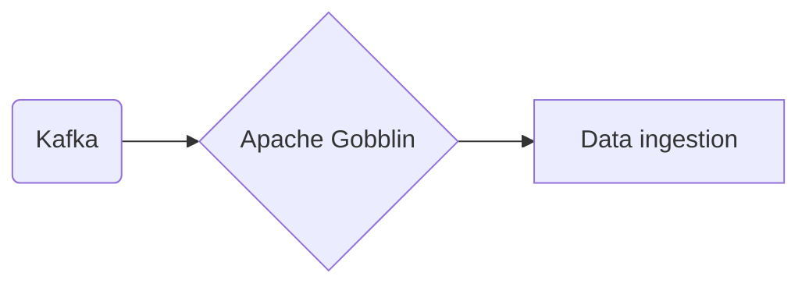

# Connect Kafka to Apache Gobblin

Quix helps you integrate Kafka to Apache Gobblin using pure Python.

- __Find out how we can help you integrate!__

    <a class="md-button md-button--primary" href="https://share.hsforms.com/1iW0TmZzKQMChk0lxd_tGiw4yjw2?__hstc=175542013.2303933fbd746c0ac86d9ccbe9bc9100.1728383268831.1729603416735.1729620918855.31&__hssc=175542013.1.1729620918855&__hsfp=2132701734" target="_blank" style="margin:.5rem;">Book a demo</a>

## Apache Gobblin

Apache Gobblin is an open-source data ingestion framework that simplifies the process of moving and processing large volumes of data across different sources and destinations. It provides a unified and flexible system for data ingestion, with features such as built-in support for different data sources and sinks, data quality checks, data publishing, and monitoring. Apache Gobblin is designed to be scalable and highly reliable, allowing for efficient data ingestion and processing workflows. Its architecture is modular and extensible, making it easy to customize and adapt to different use cases. Overall, Apache Gobblin is a powerful tool for managing complex data pipelines and ensuring the smooth transfer and processing of data in a reliable and efficient manner.

## Integrations

Quix is a good fit for integrating with Apache Gobblin because of its robust set of features that align well with the capabilities and requirements of Apache Gobblin. 

1. Streamlined Development and Deployment: Quix Cloud offers integrated online code editors and CI/CD tools that simplify the creation and deployment of data pipelines. This aligns well with Apache Gobblin's goal of providing a simple and efficient framework for data ingestion and processing.

2. Enhanced Collaboration: Quix Cloud's support for organization and permission management enhances collaboration among team members, increasing visibility and control over projects. This feature is important for Apache Gobblin users who need to work together on developing and managing data pipelines.

3. Real-Time Monitoring: Quix Cloud provides tools for real-time logs, metrics, and data exploration, allowing users to monitor pipeline performance and critical metrics. This aligns well with Apache Gobblin's focus on real-time data processing and monitoring capabilities.

4. Flexible Scaling and Management: Quix Cloud makes it easy for users to scale resources, manage CPU and memory, and handle multiple environments linked to Git branches. This flexibility is important for Apache Gobblin users who need to scale their data pipelines based on changing requirements.

5. Security and Compliance: Quix Cloud ensures secure management of secrets and compliance with dedicated infrastructure options and SLAs. This aligns well with Apache Gobblin's focus on data security and compliance requirements.

Additionally, Quix Streams, a cloud-native library for processing data in Kafka using Python, can also complement Apache Gobblin's capabilities. With features like Python ecosystem integration, serialization and state management, time window aggregations, and resilient scaling, Quix Streams can enhance the processing and analysis of data ingested by Apache Gobblin.

Overall, the comprehensive features of Quix Cloud and Quix Streams make them a good fit for integrating with Apache Gobblin, providing users with a powerful platform for developing, deploying, and managing real-time data pipelines.

