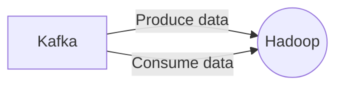

# Connect Kafka to Apache Hadoop

Quix helps you integrate Kafka to Apache Hadoop using pure Python.

## Apache Hadoop

Apache Hadoop is a powerful and widely-used open-source software framework designed for processing and analyzing large amounts of data across distributed computing environments. It utilizes a highly scalable and fault-tolerant architecture that allows users to store, process, and manage vast amounts of data efficiently. Hadoop consists of two main components: the Hadoop Distributed File System (HDFS) for storing data across multiple nodes, and the MapReduce programming model for processing and analyzing the data in parallel. This technology has revolutionized the way organizations handle big data by providing a cost-effective and reliable solution for storing, processing, and extracting valuable insights from massive datasets.

## Integrations

Quix is a good fit for integrating with Apache Hadoop because both platforms offer streamlined development and deployment processes, enhanced collaboration features, real-time monitoring capabilities, and flexible scaling and management options. 

When it comes to Apache Hadoop, which is an open-source framework for distributed storage and processing of large data sets, integration with Quix can provide a seamless and efficient way to develop and manage real-time data pipelines. 

For example, the streamlined development and deployment tools in Quix Cloud can help Apache Hadoop users create and deploy their data pipelines with ease. The platform's enhanced collaboration features can also support efficient teamwork and project management within Apache Hadoop environments. 

Additionally, the real-time monitoring capabilities of Quix Cloud can provide Apache Hadoop users with valuable insights into pipeline performance and critical metrics, helping them optimize their processes and troubleshoot any issues quickly. 

Moreover, the flexible scaling and management options in Quix Cloud can be beneficial for Apache Hadoop users who need to adjust resources, manage CPU and memory usage, and maintain multiple environments seamlessly. 

In summary, Quix can complement Apache Hadoop's capabilities by providing a comprehensive platform for developing, deploying, and managing real-time data pipelines, making it a good fit for integration with this technology.

