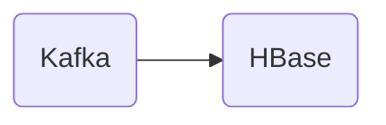

# Connect Kafka to Apache HBase

Quix helps you integrate Kafka to Apache HBase using pure Python.

## Apache HBase

Apache HBase is an open-source, distributed, non-relational database designed to handle large amounts of sparse data, particularly for real-time read/write access. It is built on top of the Apache Hadoop ecosystem and provides random, real-time read/write access to data stored in Hadoop HDFS (Hadoop Distributed File System). HBase is modeled after Google's Bigtable and is well-suited for applications that require high scalability and low-latency data access. It is known for its linear scalability and fault-tolerance, making it a popular choice for big data applications in industries such as e-commerce, advertising, social media, and finance. With its powerful data storage and retrieval capabilities, Apache HBase is a valuable technology for organizations looking to manage and analyze large volumes of data efficiently.

## Integrations

Quix Streams or Quix Cloud is a good fit for integrating with Apache HBase because of its comprehensive platform designed for developing, deploying, and managing real-time data pipelines. Here are a few reasons why it is a good fit:

1. Streamlined Development and Deployment: Quix Streams provides integrated online code editors and CI/CD tools that simplify the creation and deployment of data pipelines. This streamlined development process can help in integrating with Apache HBase quickly and efficiently.

2. Real-Time Monitoring: Quix Cloud offers tools for real-time logs, metrics, and data exploration, allowing users to monitor pipeline performance and critical metrics. This real-time monitoring capability can be crucial when integrating with Apache HBase to ensure smooth data processing and management.

3. Flexible Scaling and Management: Quix Cloud allows users to easily scale resources, manage CPU and memory, and handle multiple environments linked to Git branches. This flexibility in scaling and management can be beneficial when integrating with Apache HBase, which requires efficient resource management for handling large datasets.

4. Security and Compliance: Quix Cloud ensures secure management of secrets and compliance with dedicated infrastructure options and SLAs. This ensures that data integration with Apache HBase is done securely, meeting all compliance requirements.

5. Kafka Integration: Quix Cloud supports both Quix-hosted and third-party Kafka solutions, including Confluent Cloud and Redpanda. Since Apache HBase can utilize Kafka for data processing, this integration with Kafka can be advantageous for integrating with Apache HBase seamlessly.

In summary, the features and capabilities offered by Quix Streams or Quix Cloud make it a suitable platform for integrating with Apache HBase, providing a robust and efficient environment for developing, deploying, and managing real-time data pipelines.

