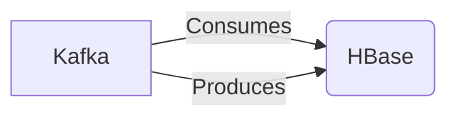

# Connect Kafka to Apache HBase

Quix helps you integrate Kafka to Apache HBase using pure Python.

<a class="md-button md-button--primary" href="https://share.hsforms.com/1iW0TmZzKQMChk0lxd_tGiw4yjw2?__hstc=175542013.2303933fbd746c0ac86d9ccbe9bc9100.1728383268831.1729603416735.1729620918855.31&__hssc=175542013.1.1729620918855&__hsfp=2132701734" target="_blank" style="margin-right:.5rem;">Book a demo</a>
 

## Apache HBase

Apache HBase is an open-source, distributed, non-relational database system built on top of the Hadoop Distributed File System (HDFS). It is designed to store and manage large amounts of sparse data, making it well-suited for applications that require real-time, random read and write access to large datasets. HBase also offers strong consistency and high availability by replicating data across multiple nodes in a cluster. This technology is commonly used in big data applications, such as social media platforms, online gaming, and e-commerce websites, where high performance and scalability are essential. With its flexible data model and integration with other Apache projects like Hadoop and Zookeeper, Apache HBase is a powerful tool for organizations looking to harness the potential of big data analytics.

## Integrations

Quix is a good fit for integrating with Apache HBase because of its comprehensive platform designed for developing, deploying, and managing real-time data pipelines. 

Firstly, Quix Cloud offers streamlined development and deployment with integrated online code editors and CI/CD tools, which can simplify the creation and deployment of data pipelines. This can be beneficial when integrating with Apache HBase, as it allows for easy development and deployment of data pipelines that interact with Apache HBase.

Secondly, Quix Cloud provides enhanced collaboration features, such as organization and permission management, which can increase project visibility and control. This can be useful when working with a team to integrate Apache HBase into data pipelines.

Additionally, Quix Cloud offers real-time monitoring tools for pipeline performance and critical metrics. This can be valuable when integrating with Apache HBase, as it allows for monitoring and optimizing the performance of data pipelines that interact with Apache HBase.

Furthermore, Quix Cloud supports flexible scaling and management of resources, which can be beneficial when integrating with Apache HBase to handle large amounts of data. The platform's security and compliance features ensure secure management of data, which is important when working with sensitive data stored in Apache HBase.

Overall, Quix's features such as streamlined development and deployment, enhanced collaboration, real-time monitoring, and flexible scaling make it a good fit for integrating with Apache HBase to develop and manage real-time data pipelines effectively.

