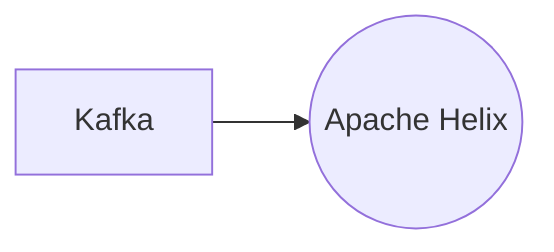

# Connect Kafka to Apache Helix

Quix helps you integrate Kafka to Apache Helix using pure Python.

## Apache Helix

Apache Helix is a powerful distributed system framework that simplifies the development and management of large-scale, high-performance, and fault-tolerant systems. It provides a set of tools and utilities for building and managing distributed systems, including automatic load balancing, partition management, and resource allocation. With Apache Helix, developers can easily create and deploy resilient and scalable applications that can easily adapt to changing conditions and handle failure scenarios gracefully. This technology enables organizations to build robust and reliable distributed systems that can handle millions of concurrent users and terabytes of data, making it an essential tool for building modern and complex applications.

## Integrations

Apache Helix is a distributed cluster management framework designed to automate the partitioning and replication of resources across a cluster of nodes. It is well-suited for managing complex distributed systems, such as real-time data pipelines that need to scale and be highly available.

Quix is a good fit for integrating with Apache Helix because it provides a comprehensive platform for developing, deploying, and managing real-time data pipelines. The key components of Quix Cloud, such as streamlined development and deployment, enhanced collaboration, real-time monitoring, flexible scaling and management, and security and compliance features, align well with the requirements of Apache Helix.

By integrating with Quix Streams, users can leverage the cloud-native library for processing data in Kafka using Python, which offers benefits such as easy integration with the Python ecosystem, support for serialization and state management, time window aggregations, resilient scaling, and local and Jupyter notebook support. This integration allows for seamless communication and coordination between Apache Helix-managed clusters and real-time data processing pipelines built using Quix Streams.

Overall, the combination of Quix with Apache Helix provides a powerful solution for developing and managing scalable, real-time data pipelines with efficient cluster management and automation. This integration can help organizations streamline their data processing workflows, improve resource utilization, and achieve high levels of availability and performance for their distributed systems.

