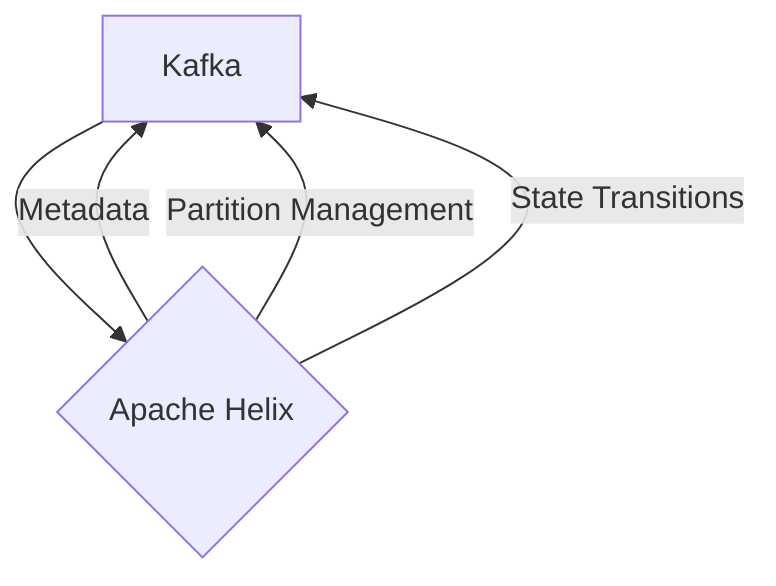

# Connect Kafka to Apache Helix

Quix helps you integrate Kafka to Apache Helix using pure Python.

<a class="md-button md-button--primary" href="https://share.hsforms.com/1iW0TmZzKQMChk0lxd_tGiw4yjw2?__hstc=175542013.2303933fbd746c0ac86d9ccbe9bc9100.1728383268831.1729603416735.1729620918855.31&__hssc=175542013.1.1729620918855&__hsfp=2132701734" target="_blank" style="margin-right:.5rem;">Book a demo</a>
 

## Apache Helix

Apache Helix is a distributed cluster management framework designed to automate the partitioning and replication of data across a cluster of nodes. It provides a centralized platform for managing and scaling large-scale distributed systems, ensuring high availability and fault tolerance. Helix uses a flexible architecture that can be easily customized to suit different types of applications and workloads. By automating the process of load balancing and failover, Helix helps to reduce operational complexity and improve the overall efficiency of distributed systems. This technology is particularly useful for managing real-time, mission-critical applications that require constant uptime and scalability.

## Integrations

Quix is a good fit for integrating with Apache Helix because it offers a comprehensive platform for developing, deploying, and managing real-time data pipelines. Apache Helix provides a framework for building and managing distributed systems, such as data pipelines, and with Quix's streamlined development and deployment features, users can easily create and deploy pipelines using Helix.

Additionally, Quix's real-time monitoring capabilities align well with Apache Helix's aim to provide robust monitoring and scaling capabilities for distributed systems. Quix Cloud's tools for monitoring pipeline performance and critical metrics can complement Helix's monitoring features, allowing users to easily track and optimize their data pipelines.

Moreover, Quix's support for Kafka integration is beneficial for Apache Helix users who rely on Kafka for messaging and event streaming. Quix Streams, a cloud-native library for processing data in Kafka using Python, can enhance the scalability and usability of Kafka within the Helix framework.

Overall, Quix's features such as enhanced collaboration, flexible scaling and management, security and compliance measures, and support for CI/CD processes make it a strong candidate for integration with Apache Helix, providing users with a comprehensive solution for building and managing distributed data pipelines.

