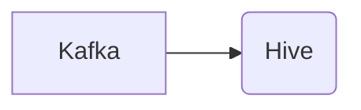

# Connect Kafka to Apache Hive

Quix helps you integrate Kafka to Apache Hive using pure Python.

## Apache Hive

Apache Hive is an open-source data warehouse software built on top of Hadoop for providing data query and analysis. It allows users to analyze large datasets stored in Hadoop using a SQL-like query language � HiveQL. Hive translates these queries into Hadoop MapReduce jobs, enabling users to easily query and analyze their data without needing to write complex MapReduce programs. With Hive, users can also create and manage databases, tables, and partitions, making it a powerful tool for data warehousing and analysis in big data environments.

## Integrations

Quix is a good fit for integrating with Apache Hive because of its comprehensive features that complement Apache Hive's capabilities. 

1. Streamlined Development and Deployment: Quix Cloud offers integrated online code editors and CI/CD tools that make it easy to develop and deploy data pipelines. This can streamline the process of integrating with Apache Hive and running queries on large datasets stored in Hive.

2. Enhanced Collaboration: Quix Cloud supports efficient collaboration with organization and permission management, which can help teams working with Apache Hive to better manage and work with their data pipelines.

3. Real-Time Monitoring: Quix Cloud provides tools for real-time logs, metrics, and data exploration, allowing users to monitor the performance of their data pipelines. This can be useful when working with Apache Hive to ensure that queries are running efficiently and providing the expected results.

4. Flexible Scaling and Management: With Quix Cloud's ability to easily scale resources and manage environments, users can efficiently handle large datasets stored in Apache Hive and ensure that they have the necessary resources for running complex queries.

5. Security and Compliance: Quix Cloud ensures secure management of secrets and compliance with dedicated infrastructure options and SLAs, which can be important when integrating with Apache Hive for handling sensitive data.

Overall, Quix's features like streamlined development, real-time monitoring, and enhanced collaboration make it a good fit for integrating with Apache Hive and working with large datasets in a scalable and efficient manner.

