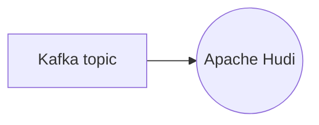

# Connect Kafka to Apache Hudi

Quix helps you integrate Kafka to Apache Hudi using pure Python.

## Apache Hudi

Apache Hudi is an open-source data management framework that provides efficient and scalable data ingestion, storage, and management capabilities for large-scale data processing workloads. It is designed to simplify the process of writing and managing big data pipelines by allowing users to work with data in a more efficient and flexible manner. Apache Hudi supports features such as schema evolution, incremental processing, and efficient data indexing, making it ideal for applications that require real-time data ingestion and processing. With its support for various storage systems like HDFS, S3, and others, Apache Hudi enables users to easily integrate with existing data infrastructure and leverage the benefits of distributed computing for their data management needs.

## Integrations

Quix is a good fit for integrating with Apache Hudi because both platforms offer streamlined development and deployment capabilities. By using Quix Streams for processing data in Kafka using Python, users can easily integrate Apache Hudi into their data pipelines without the need for a server-side engine or orchestrator.

Additionally, Quix Cloud provides real-time monitoring and scaling capabilities, making it easier to manage and monitor Apache Hudi workflows in a scalable and efficient manner. The platform also supports data exploration and visualization, allowing users to query and explore data processed by Apache Hudi in real-time.

Furthermore, Quix Cloud's enhanced collaboration features enable efficient teamwork and organization management, ensuring that all team members have visibility and control over Apache Hudi pipelines. The platform also supports robust CI/CD processes, making it easy to integrate Apache Hudi workflows into existing development pipelines.

Overall, by integrating with Quix, users can leverage their comprehensive features and capabilities to enhance the performance, scalability, and manageability of Apache Hudi workflows.

