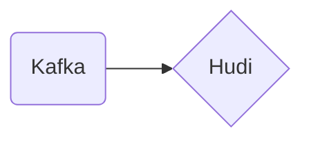

# Connect Kafka to Apache Hudi

Quix helps you integrate Kafka to Apache Hudi using pure Python.

<a class="md-button md-button--primary" href="https://share.hsforms.com/1iW0TmZzKQMChk0lxd_tGiw4yjw2?__hstc=175542013.2303933fbd746c0ac86d9ccbe9bc9100.1728383268831.1729603416735.1729620918855.31&__hssc=175542013.1.1729620918855&__hsfp=2132701734" target="_blank" style="margin-right:.5rem;">Book a demo</a>
 

## Apache Hudi

Apache Hudi is an open-source data management framework that provides a unique way to manage large datasets on distributed storage systems like Apache Hadoop and Apache Spark. It incorporates features such as record-level insert, updates, and deletes, along with efficient change data capture and incremental processing capabilities. With Apache Hudi, users can easily track the history of changes made to their data, ensuring data integrity and consistency. Additionally, the framework offers out-of-the-box support for querying data using SQL and provides powerful tools for managing complex data pipelines. Overall, Apache Hudi is a versatile technology that simplifies the process of managing and processing large-scale data sets in a distributed environment.

## Integrations

Quix is a good fit for integrating with Apache Hudi due to its comprehensive platform designed for developing, deploying, and managing real-time data pipelines. Apache Hudi is a data management framework that provides record-level insert, update, and delete capabilities for large analytical datasets stored in distributed storage systems. By integrating with Quix, Apache Hudi can benefit from the following key features of the platform:

1. Streamlined Development and Deployment: Quix's integrated online code editors and CI/CD tools simplify the creation and deployment of data pipelines, making it easier to develop and manage pipelines that interact with Apache Hudi.

2. Real-Time Monitoring: Quix Cloud's tools for real-time logs, metrics, and data exploration can be leveraged to monitor the performance of pipelines using Apache Hudi, helping users track critical metrics and ensure data integrity.

3. Flexible Scaling and Management: Quix allows users to easily scale resources, manage CPU and memory, and handle multiple environments linked to Git branches, providing the flexibility needed for deploying and scaling Apache Hudi applications.

4. Security and Compliance: Quix's secure management of secrets and compliance features ensure that data processed by Apache Hudi pipelines remains secure and compliant with industry regulations.

Additionally, Quix Streams, a cloud-native library for processing data in Kafka using Python, can further enhance the integration with Apache Hudi by providing a user-friendly Python interface for processing data streams. This enables seamless integration with Apache Hudi's data management capabilities and facilitates efficient data processing and analysis. With Quix Streams, users can take advantage of features such as time window aggregations, serialization and state management, and resilient scaling to optimize the performance of Apache Hudi pipelines. Overall, the combination of Quix's development, collaboration, monitoring, and scaling capabilities with Quix Streams' data processing features makes it a strong fit for integrating with Apache Hudi.

