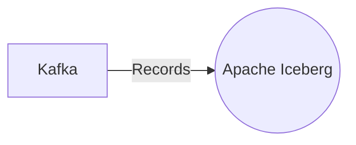

# Connect Kafka to Apache Iceberg

Quix helps you integrate Kafka to Apache Iceberg using pure Python.

## Apache Iceberg

Apache Iceberg is an open-source table format for large-scale data storage and processing. Designed for scalability and performance, Iceberg provides a simple yet powerful way to manage tables in cloud data lakes such as Amazon S3 or HDFS. With features like ACID transactions, schema evolution, and time travel capabilities, Iceberg ensures data integrity and consistency while allowing for flexibility in data management. It also supports complex data types and nested structures, making it ideal for storing diverse datasets. Overall, Apache Iceberg offers a modern, efficient solution for companies dealing with massive amounts of data.

## Integrations

Apache Iceberg is a technology that provides a table format for big data that aims to provide the best of both worlds - the efficient storage and query performance of a columnar format and the ACID transactions and schema evolution capabilities of a row-based format. Integrating Apache Iceberg with Quix would be a good fit for the following reasons:

1. Streamlined Development and Deployment: Quix Streams and Quix Cloud provide a platform for developing and deploying real-time data pipelines with ease. Integrating with Apache Iceberg would allow users to efficiently manage and store their data in a table format, enabling fast query performance and efficient storage.

2. Real-Time Monitoring: Quix Cloud's real-time monitoring capabilities would complement Apache Iceberg's data management features, allowing users to monitor the performance of their data pipelines and the state of their data tables in real-time.

3. Flexible Scaling and Management: Quix Streams and Quix Cloud offer flexible scaling and management options for resources, which would be beneficial for handling the storage and processing of data managed by Apache Iceberg.

4. Security and Compliance: Quix Cloud ensures secure management of secrets and compliance with dedicated infrastructure options and SLAs, which is important for handling sensitive data managed by Apache Iceberg.

5. Integration with Kafka: Quix Cloud supports Kafka integration, which would be beneficial for streaming data into Apache Iceberg tables for real-time processing and analysis.

Overall, integrating Quix with Apache Iceberg would provide a comprehensive platform for developing, deploying, and managing real-time data pipelines with efficient storage and query capabilities, robust monitoring, and security features.

