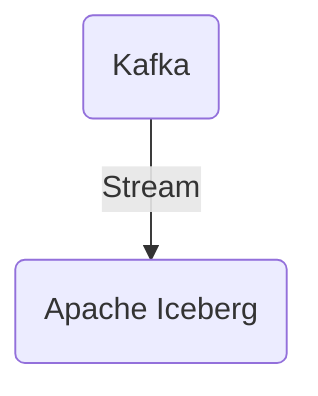

# Connect Kafka to Apache Iceberg

Quix helps you integrate Kafka to Apache Iceberg using pure Python.

<a class="md-button md-button--primary" href="https://share.hsforms.com/1iW0TmZzKQMChk0lxd_tGiw4yjw2?__hstc=175542013.2303933fbd746c0ac86d9ccbe9bc9100.1728383268831.1729603416735.1729620918855.31&__hssc=175542013.1.1729620918855&__hsfp=2132701734" target="_blank" style="margin-right:.5rem;">Book a demo</a>
 

## Apache Iceberg

Apache Iceberg is a revolutionary open-source technology that allows users to manage vast amounts of data in a scalable and efficient manner. Designed specifically for cloud data lakes, Iceberg provides a powerful way to organize, manage, and query large datasets. By using a unique table format, Iceberg provides consistent snapshots of data that can be easily queried and accessed by various analytics tools. This technology ensures data integrity and consistency while enabling users to perform complex data operations with ease. With its easy integration with Apache Spark and other big data tools, Apache Iceberg is quickly becoming a popular choice for organizations looking to optimize their data lake management.

## Integrations

Quix is a good fit for integrating with Apache Iceberg because it offers a comprehensive platform for developing, deploying, and managing real-time data pipelines. With its streamlined development and deployment features, Quix simplifies the creation and deployment of data pipelines, making it easier to work with Apache Iceberg's data management capabilities.

Quix also enhances collaboration with its organization and permission management tools, which can be valuable when working with Apache Iceberg's features for managing large datasets. The real-time monitoring capabilities of Quix Cloud are also beneficial for monitoring pipeline performance and critical metrics, which complements the data governance and versioning features provided by Apache Iceberg.

Additionally, Quix Cloud offers flexible scaling and management options, allowing users to easily scale resources and manage multiple environments linked to Git branches. This aligns well with Apache Iceberg's focus on data lifecycle management and efficient data operations.

Overall, Quix's development tools, data exploration and visualization features, robust CI/CD processes, and support for Kafka integration make it a strong candidate for integrating with Apache Iceberg and leveraging its capabilities effectively. Furthermore, Quix Streams, with its cloud-native library for processing data in Kafka using Python, can further enhance the capabilities of Apache Iceberg by providing seamless integration with Python ecosystem tools and serialization options.

