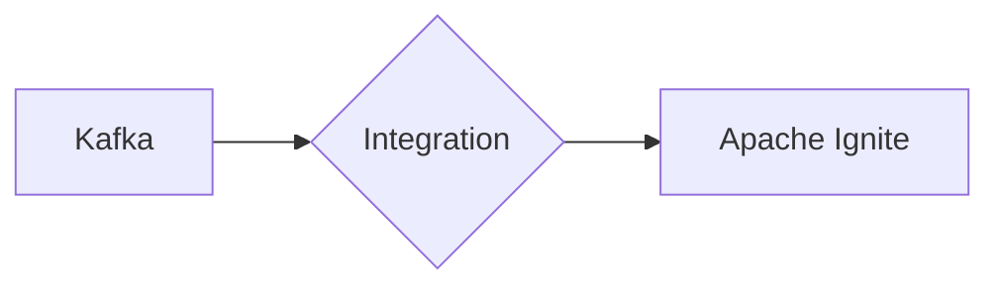

# Connect Kafka to Apache Ignite

Quix helps you integrate Kafka to Apache Ignite using pure Python.

## Apache Ignite

Apache Ignite is an in-memory computing technology that accelerates processing and analytics on large-scale data sets. It is an open-source, distributed database and caching platform that allows users to store, manage, and analyze massive amounts of data in real-time. By keeping data in-memory, Apache Ignite can deliver lightning-fast performance and low-latency access to information. It also supports distributed computing tasks, allowing for high availability and fault tolerance across multiple nodes. With its flexible and scalable architecture, Apache Ignite is a powerful tool for enterprises looking to maximize the value of their data and achieve faster insights for their applications.

## Integrations

Apache Ignite is a distributed database and computing platform that provides high performance and scalability for real-time data processing and analytics. Integrating Quix with Apache Ignite can enhance the capabilities of the platform by leveraging its advanced features and functionalities.

The key features of Quix Streams and Quix Cloud, such as streamlined development and deployment, real-time monitoring, flexible scaling, and security compliance, complement the capabilities of Apache Ignite. By utilizing Quix Streams for processing data in Kafka using Python, users can seamlessly integrate their data pipelines with Apache Ignite to achieve high scalability and performance.

Quix Streams' support for serialization formats, stateful operations, time window aggregations, and resilient scaling align well with Apache Ignite's distributed computing capabilities. The ability to run and scale via container orchestration, such as Kubernetes, also ensures seamless integration with Apache Ignite's distributed architecture.

Furthermore, the collaboration tools, data exploration and visualization capabilities, and robust CI/CD processes of Quix Cloud can enhance the development, deployment, and management of data pipelines that utilize Apache Ignite. The integration with Apache Ignite can enable users to leverage the power of distributed computing for real-time data processing, analytics, and machine learning applications.

In conclusion, Quix is a good fit for integrating with Apache Ignite due to their complementary features and functionalities that can enhance the scalability, performance, and flexibility of real-time data pipelines. This integration can provide users with a comprehensive platform for developing, deploying, and managing high-performance data processing and analytics applications.

